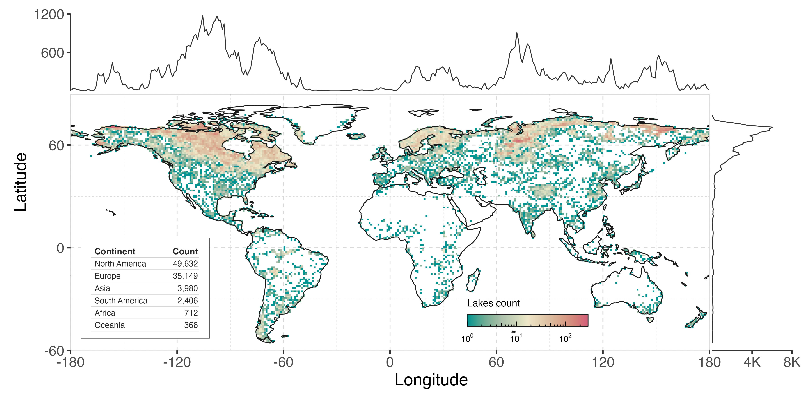
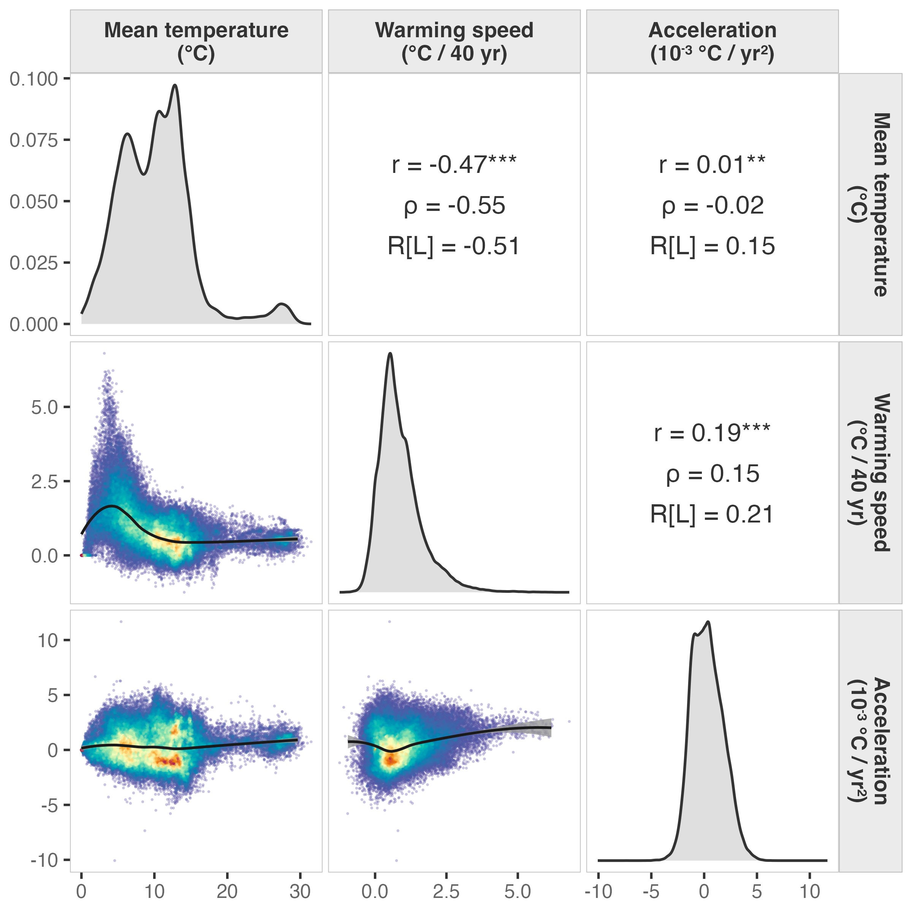
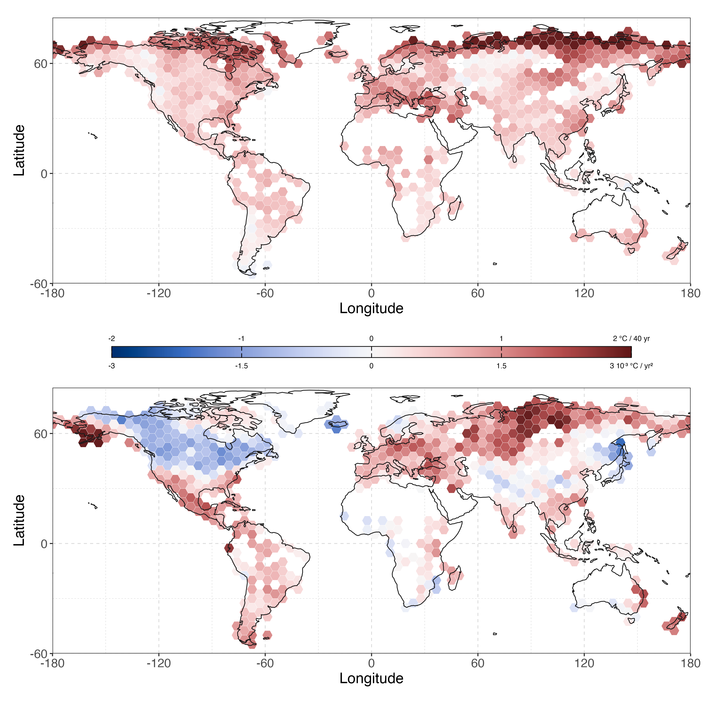

# Descriptive

## Sample coverage

GLAST: 92245 lakes, 1981–2020.

## Lake density map

Figure 1: Lake density map with 1° × 1° grid cells.

## Long-term warming && acceleration

[Table 1 (a)](#tbl-warming-summary-raw) and [Table 1 (b)](#tbl-warming-summary-stl-trend) shows the statistics of warming. Compared with the raw annual mean temperature series, the STL trend component is smoother and more stable, so it identifies warming in more lakes (91,802 / 92,245, 99.5%, versus 85,569 / 92,245, 92.8% for the raw series). It also has a smaller standard deviation and a more concentrated quartile range, although its mean is lower (0.573 versus 0.881 for the raw series).

Use Sen’s slope to determine whether a lake is warming and how is the trend like.

Though almost all the lakes are warming, the warming is not uniform. Acceleration of 51,014 (55.3%) lakes is positive. Standard deviation and quartile range are also large, indicating that the acceleration varies widely across lakes.

Here **acceleration** is measured as Sen’s slope of the annual first-differenced STL trend. Positive values mean faster warming, slower cooling, or a transition toward warming.

|                    |                  |
|:-------------------|:-----------------|
| Warming count      | 85,569 (92.8%)   |
| Mean (°C/40yr)     | 0.881 ± 0.766    |
| Quartile (°C/40yr) | 0.37, 0.73, 1.23 |

\(a\) Raw warming

|                    |                  |
|:-------------------|:-----------------|
| Warming count      | 91,802 (99.5%)   |
| Mean (°C/40yr)     | 0.573 ± 0.320    |
| Quartile (°C/40yr) | 0.34, 0.52, 0.75 |

\(b\) STL trend warming

|                    |                   |
|:-------------------|:------------------|
| Accelerating count | 51,014 (55.3%)    |
| Mean (°C/40yr)     | 0.304 ± 1.473     |
| Quartile (°C/40yr) | -0.81, 0.21, 1.31 |

\(c\) STL trend acceleration

Table 1: Summary of warming status.

The joint warming–acceleration states divide the lakes into four groups:

| State                  | n      | %     |
|------------------------|--------|-------|
| warming + accelerating | 46,614 | 50.53 |
| warming + decelerating | 38,955 | 42.23 |
| cooling + accelerating | 4,400  | 4.77  |
| cooling + decelerating | 2,276  | 2.47  |

Table 2: Joint warming and acceleration states.

Figure 2: Pairwise relationships among mean temperature, warming speed, and acceleration. Diagonal panels show probability densities; upper panels show Pearson r (with significance stars), Spearman ρ, and LOESS pseudo-R; lower panels show scatter plots with LOESS smooths.

## Spatial pattern

Figure 3: Spatial pattern of lake warming and acceleration. Hexagons aggregate lake-level metrics in 5° geographic bins containing at least five lakes. Colors use a shared divergent scale normalized to fixed rounded mapping limits; the central colorbar shows warming values on the upper axis and acceleration values on the lower axis.

| Continent | Warming | Accelerating | Warming + accelerating | Mean warming | Mean acceleration |
|----|----|----|----|----|----|
| **NA** | 94.9% | **29.2%** | **28.0%** | 0.77 °C / 40 yr | **-0.51 ×10⁻³ °C / yr²** |
| EU | 90.1% | 87.0% | 77.9% | 1.13 °C / 40 yr | 1.38 ×10⁻³ °C / yr² |
| AS | 90.2% | 72.1% | 64.0% | 0.49 °C / 40 yr | 0.59 ×10⁻³ °C / yr² |
| SA | 89.2% | 96.4% | 85.9% | 0.38 °C / 40 yr | 0.91 ×10⁻³ °C / yr² |
| AF | 99.9% | 66.6% | 66.6% | 0.50 °C / 40 yr | 0.27 ×10⁻³ °C / yr² |
| OC | 94.0% | 73.8% | 70.2% | 0.57 °C / 40 yr | 0.77 ×10⁻³ °C / yr² |

Table 3: Continent-level spatial summary

Back to top
