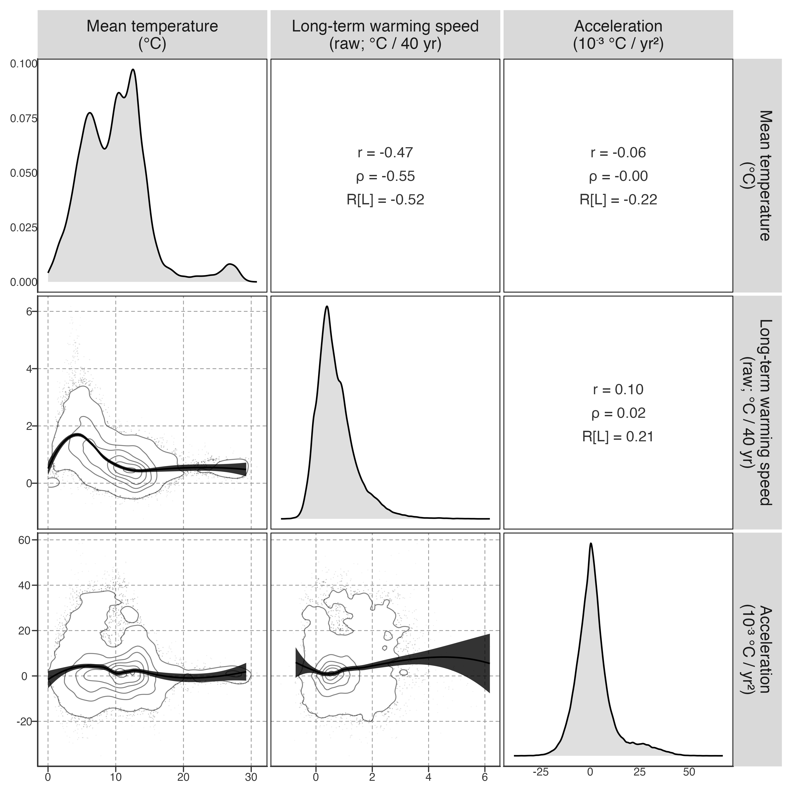
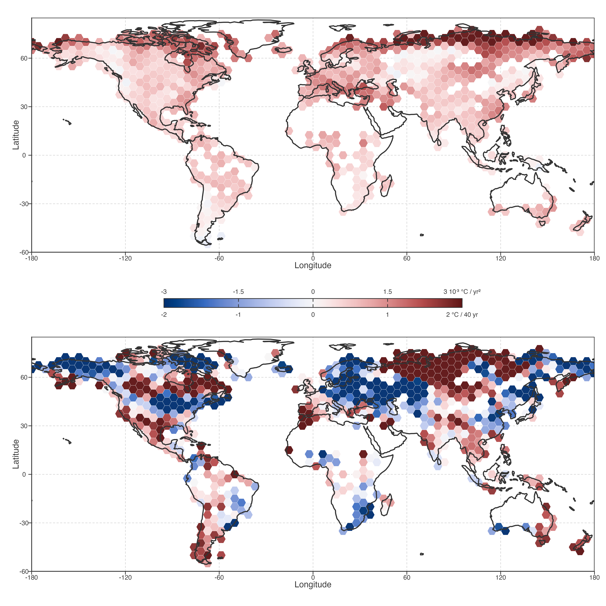

# Global Kinematics

## Sample coverage

    <environment: R_GlobalEnv>

GLAST: 92245 lakes, 1981–2020.

## Lake density map

Figure 1: Lake density map with 1° × 1° grid cells.

## Long-term warming speed and acceleration

**Long-term warming speed** is the Theil–Sen slope of annual mean lake surface water temperature (LSWT) over 1982–2020, presented as a 40-year-equivalent change in °C. **Acceleration** is the Sen slope of the annual first difference of warming speed, measured in \\10^{-3}\\ °C yr\\^{-2}\\. Both metrics are computed directly from raw annual mean temperature without seasonal decomposition, thereby retaining the full spectrum of interannual climate variability (e.g. ENSO, PDO) that may contribute to observed warming heterogeneity.

> 本章以年均 LSWT 为主要指标。**长期增温速率**为 Theil–Sen 斜率（40 年等效变化）；**加速度**为年际差分的 Sen 斜率。两者直接从原始年均温度计算，保留 ENSO/PDO 等年际变率信息。

[Table 1 (a)](#tbl-warming-summary-raw) summarizes the warming metrics computed from raw annual mean LSWT. 92.8% of lakes show positive long-term warming speed, with a median of 0.73 °C per 40 years. However, only 54.7% have positive acceleration, indicating that the direction and magnitude of long-term warming are largely decoupled from changes in warming speed.

> [Table 1 (a)](#tbl-warming-summary-raw) summarizes the warming metrics computed from raw annual mean LSWT% 湖泊呈正增温速率，但仅54.7% 呈正加速度，增温方向与速度变化基本解耦。

|                    |                  |
|:-------------------|:-----------------|
| Warming count      | 85,569 (92.8%)   |
| Mean (°C/40yr)     | 0.881 ± 0.766    |
| Quartile (°C/40yr) | 0.37, 0.73, 1.23 |

\(a\) Raw annual warming speed

|                    |                   |
|:-------------------|:------------------|
| Accelerating count | 50,486 (54.7%)    |
| Mean (°C/40yr)     | 2.033 ± 9.940     |
| Quartile (°C/40yr) | -3.66, 0.71, 5.44 |

\(b\) Acceleration

Table 1: Summary of warming status.

A sign-only classification places 50.8% of lakes in the warming and accelerating quadrant and 42.0% in the warming and decelerating quadrant. These are descriptive sign counts, not stable response types: values close to zero can switch quadrant without a meaningful change in magnitude. The continuous relationships in [Figure 2](#fig-warming-acceleration-scatterplot-matrix) are therefore the primary summary.

Figure 2: Pairwise relationships among mean temperature, long-term warming speed (raw annual Theil–Sen slope), and acceleration. Diagonal panels show probability densities; upper panels show full-sample Pearson r and Spearman ρ, plus a LOESS pseudo-R estimated from a reproducible 15,000-lake sample. Lower panels show KDE contours for the same sample above the 5th percentile of local density; lower-density observations are shown as points with opacity proportional to local density.

Mean temperature is negatively associated with long-term warming speed (\\r = -0.47\\), while the warming-speed–acceleration association is much weaker (\\r = 0.19\\). Thus, widespread long-term warming does not imply a common temporal pathway: lakes with similar 40-year-equivalent trend change can be accelerating, decelerating, or changing little in their annual warming speed.

## Spatial pattern

The hexagons in [Figure 3](#fig-spatial-warming-acceleration-hex) summarize lake-level estimates within 5° cells containing at least five lakes. Comparing the upper and lower panels separates where long-term warming speed is strongest from where annual warming speed is becoming more or less positive; the two patterns need not coincide.The hexagons in [Figure 3](#fig-spatial-warming-acceleration-hex) summarize lake-level estimates within 5° cells containing at least five lakes. Comparing the upper and lower panels separates where long-term warming speed is strongest from where annual warming speed is becoming more or less positive; the two patterns need not coincide.

> [Figure 3](#fig-spatial-warming-acceleration-hex) 用六边形汇总 5° 网格内的湖泊指标（≥5 个湖）。上下面板分别展示增温速率和加速度的空间格局，两者不必一致。

Figure 3: Spatial pattern of lake warming and acceleration. Hexagons aggregate lake-level metrics in 5° geographic bins containing at least five lakes. Colors use a shared divergent scale normalized to fixed rounded mapping limits; the central colorbar shows warming values on the upper axis and acceleration values on the lower axis.

| Continent | Warming | Accelerating | Warming + accelerating | Mean warming | Mean acceleration |
|----|----|----|----|----|----|
| **NA** | 94.9% | **50.5%** | **49.0%** | 0.77 °C / 40 yr | **-0.18 ×10⁻³ °C / yr²** |
| EU | 90.1% | 59.6% | 52.3% | 1.13 °C / 40 yr | 5.57 ×10⁻³ °C / yr² |
| AS | 90.2% | 52.4% | 49.7% | 0.49 °C / 40 yr | -0.51 ×10⁻³ °C / yr² |
| SA | 89.2% | 72.7% | 63.4% | 0.38 °C / 40 yr | 0.88 ×10⁻³ °C / yr² |
| AF | 99.9% | 48.6% | 48.6% | 0.50 °C / 40 yr | -0.22 ×10⁻³ °C / yr² |
| OC | 94.0% | 77.3% | 71.3% | 0.57 °C / 40 yr | 1.40 ×10⁻³ °C / yr² |

Table 2: Continent-level spatial summary

[Table 2](#tbl-spatial-continent-summary) reinforces this distinction. Europe combines high mean long-term warming speed with predominantly positive acceleration, whereas North America has high warming prevalence but a negative mean acceleration. Continental values are descriptive aggregates: uneven lake coverage and within-continent spatial structure mean they should not be interpreted as area-weighted climate means.@tbl-spatial-continent-summary reinforces this distinction. Europe combines high mean long-term warming speed with predominantly positive acceleration, whereas North America has high warming prevalence but a negative mean acceleration. Continental values are descriptive aggregates: uneven lake coverage and within-continent spatial structure mean they should not be interpreted as area-weighted climate means.

> [Table 2](#tbl-spatial-continent-summary) 强化了大洲差异。欧洲高增温速率+正加速度，北美高增温比例但负均值加速度。大洲统计值为描述性汇总，非面积加权气候均值。

These global metrics reduce each lake’s annual warming-speed series to a long-term slope. They show whether warming speed tends to become more or less positive, but not how the temporal pattern of warming differs among lakes or what factors drive those differences. [Warming pattern decomposition](../../../explorations/warming-acceleration/draft/02-warming-patterns.llms.md) therefore applies PCA to the full annual temperature trajectory to identify dominant modes of variation and their spatial organisation.

> 全局指标将年增温速率压缩为长期斜率，但不能揭示增温时间模式的差异。[增温模式分解](../../../explorations/warming-acceleration/draft/02-warming-patterns.llms.md)用 PCA 识别主要变异模态及其空间组织。

Back to top
