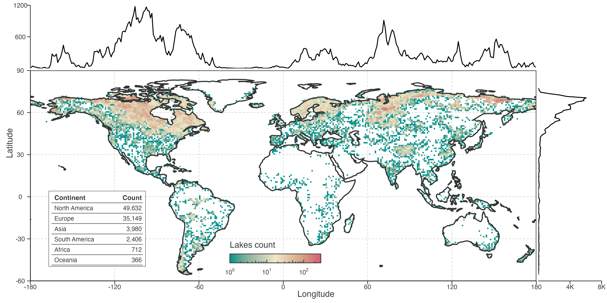
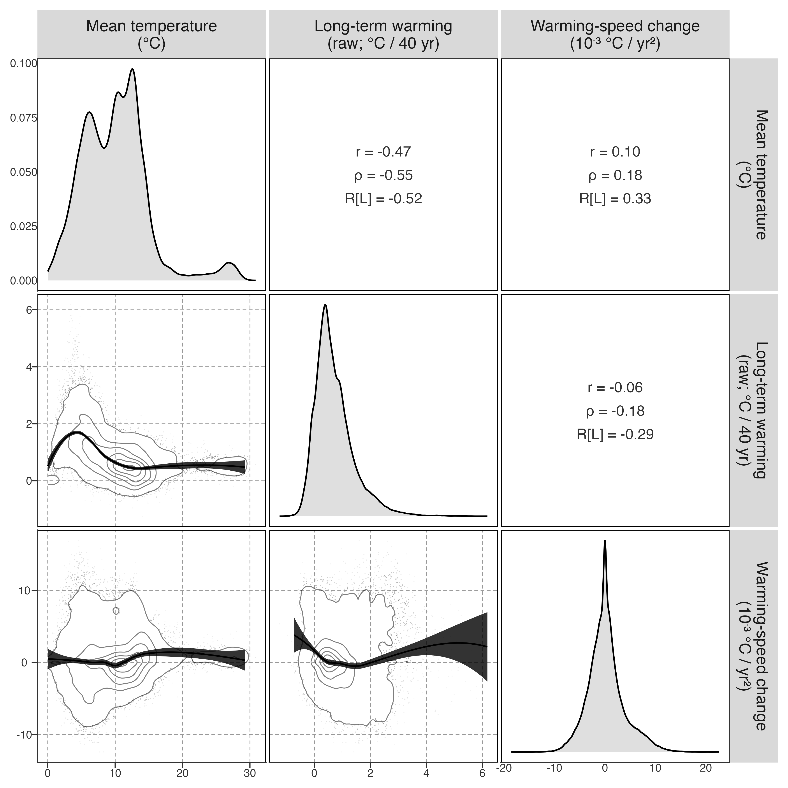
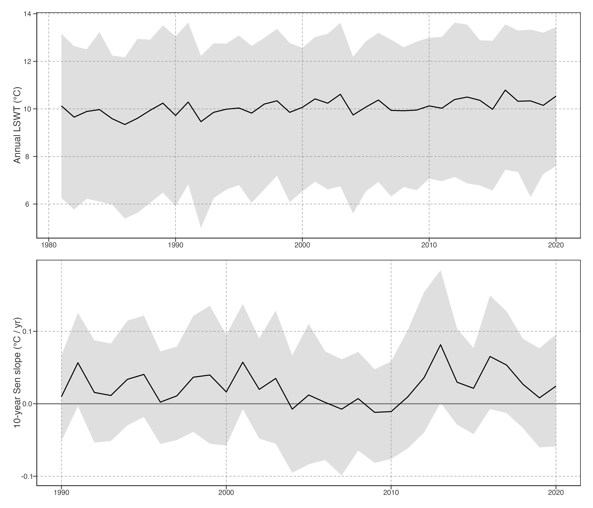
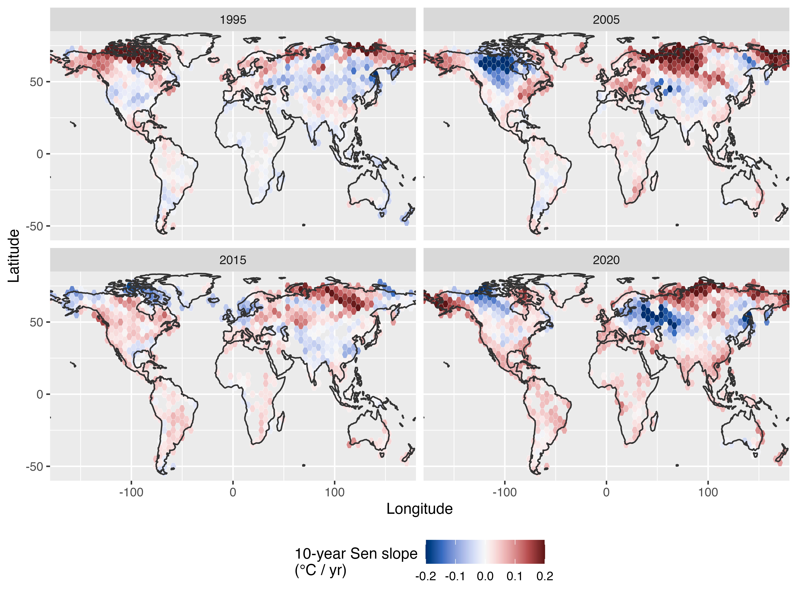

# Global Kinematics

## Sample coverage

    <environment: R_GlobalEnv>

    <environment: R_GlobalEnv>

GLAST reconstructed LSWT product: 92245 lakes, 1981–2020. It is not direct in-situ observation: station-temperature information and ERA5-Land-driven FLAKE simulations are corrected to produce the dataset. “Raw” below means un-smoothed GLAST product values.

> GLAST 是重建 LSWT 产品，不是直接站点实测；它由站点温度信息和 ERA5-Land 驱动的 FLAKE 模拟校正得到。下文 raw 指未经平滑的 GLAST 产品值。

## Lake density map

Figure 1: Lake density map with 1° × 1° grid cells.

## Long-term warming and local-speed heterogeneity

**Long-term warming** is the Theil–Sen slope of reconstructed annual mean lake surface water temperature (LSWT) over 1982–2020, presented as a 40-year-equivalent change in °C. The primary local **warming speed** is the trailing 10-year Theil–Sen slope of raw annual LSWT, indexed to its endpoint year. Its long-term Sen trend is operationally termed **warming-speed change**: it indicates whether local 10-year warming rates tend to become more or less positive, not a resolved instantaneous physical acceleration. This chapter remains in the reconstructed-temperature layer.

> 本章是重建温度层：年均 LSWT 的长期增温为主要指标；10 年滑动 Sen 为局部增温速度；其长期变化称增温速度变化，不等同于瞬时物理加速度。STL 对比保留在 prose/补充材料。

[Table 1 (a)](#tbl-warming-summary-raw) summarizes observed long-term warming and the change in trailing-10-year warming speed. 92.8% of lakes show positive long-term warming. 47.8% have a positive long-term change in local warming speed; this is an operational trajectory descriptor, not a physical instantaneous acceleration.

> [Table 1 (a)](#tbl-warming-summary-raw) 汇总 raw annual LSWT 的长期增温与局部增温速度变化。92.8% 湖泊长期增温为正，47.8% 的局部增温速度长期趋向更正。

The long-term change in local 10-year warming speed is 0.242 ± 3.608 ×10⁻³ °C yr⁻². This operational statistic summarizes whether local background warming rates tend to become more or less positive; it is not a resolved instantaneous physical acceleration.

> 此量是 10 年局部 Sen 速度序列的长期趋势；它用于描述轨迹方向，不用于判定瞬时物理加速或减速。

|                    |                  |
|:-------------------|:-----------------|
| Warming count      | 85,569 (92.8%)   |
| Mean (°C/40yr)     | 0.881 ± 0.766    |
| Quartile (°C/40yr) | 0.37, 0.73, 1.23 |

\(a\) Raw annual long-term warming

|                             |                   |
|:----------------------------|:------------------|
| Positive speed-change count | 44,107 (47.8%)    |
| Mean (10⁻³ °C/yr²)          | 0.242 ± 3.608     |
| Quartile (10⁻³ °C/yr²)      | -1.89, 0.00, 1.86 |

\(b\) Warming-speed change

Table 1: Summary of long-term warming and local-speed change.

Values close to zero should not be interpreted as categorical “acceleration” or “deceleration”. The continuous relationships in [Figure 2](#fig-warming-speed-change-scatterplot-matrix) are therefore the primary summary.

Figure 2: Pairwise relationships among mean temperature, long-term warming, and long-term change in local trailing-10-year warming speed.

Widespread long-term warming does not imply a common temporal pathway: lakes with similar 40-year-equivalent trend change can have increasing, decreasing, or near-stable local 10-year warming speeds.

Figure 3: Global distribution of local warming speeds. Each annual value is the median trailing-10-year Theil–Sen slope across lakes; ribbon shows the interquartile range.

The changing median and persistent interquartile spread in [Figure 3](#fig-global-local-speed) show temporal and spatial heterogeneity simultaneously: local warming speeds evolve through time, while lakes at the same endpoint year occupy substantially different warming and cooling regimes.

> [Figure 3](#fig-global-local-speed) 的中位数变化与持续的四分位距同时显示时间与空间异质性：局部增温速度会随时间演化，同一阶段不同湖泊可处在增温或降温状态。

[Figure 4](#fig-local-speed-endpoint-maps) makes this second pattern explicit. Each panel uses the same local 10-year speed definition, so contrast across panels is temporal change and contrast within a panel is spatial heterogeneity.

> [Figure 4](#fig-local-speed-endpoint-maps) 用相同 10 年 Sen 速度定义比较四个端点年：面板间是时间变化，面板内是同阶段的空间异质性。

Figure 4: Spatial distribution of trailing-10-year local warming speed at four endpoint years. Hexagons aggregate at least five lakes in 5° geographic bins.

## Spatial heterogeneity of local warming speed

The hexagons in [Figure 5](#fig-spatial-warming-speed-change-hex) summarize lake-level estimates within 5° cells containing at least five lakes. The lower panel maps the long-term change in local trailing-10-year warming speed, not instantaneous acceleration.

> [Figure 5](#fig-spatial-warming-speed-change-hex) 用六边形汇总 5° 网格内的湖泊指标（≥5 个湖）。上下面板分别展示长期增温与局部增温速度变化的空间格局，两者不必一致。

Figure 5: Spatial pattern of lake warming and long-term local warming-speed change. Hexagons aggregate lake-level metrics in 5° geographic bins containing at least five lakes.

These global metrics reduce each lake’s annual warming-speed series to a long-term slope. They show whether warming speed tends to become more or less positive, but not how the temporal pattern of warming differs among lakes or what factors drive those differences. [Warming pattern decomposition](../../../explorations/warming-acceleration/draft/02-warming-patterns.llms.md) therefore applies PCA to the full annual temperature trajectory to identify dominant modes of variation and their spatial organisation.

> 全局指标将年增温速率压缩为长期斜率，但不能揭示增温时间模式的差异。[增温模式分解](../../../explorations/warming-acceleration/draft/02-warming-patterns.llms.md)用 PCA 识别主要变异模态及其空间组织。

## Optional ice module

Cooling trajectories are part of the observed heterogeneity. Their seasonal and ice-duration context is maintained as a separate, optional [seasonal and ice diagnostics module](../../../explorations/warming-acceleration/prose/seasonal-ice-diagnostics.llms.md), so it can be included or omitted from a future manuscript without changing this chapter’s kinematic core.

> 降温轨迹属于观测异质性。其季节与冰期背景独立维护为可选模块；未来论文可独立决定纳入与否，不改变本章运动学核心。

Back to top
