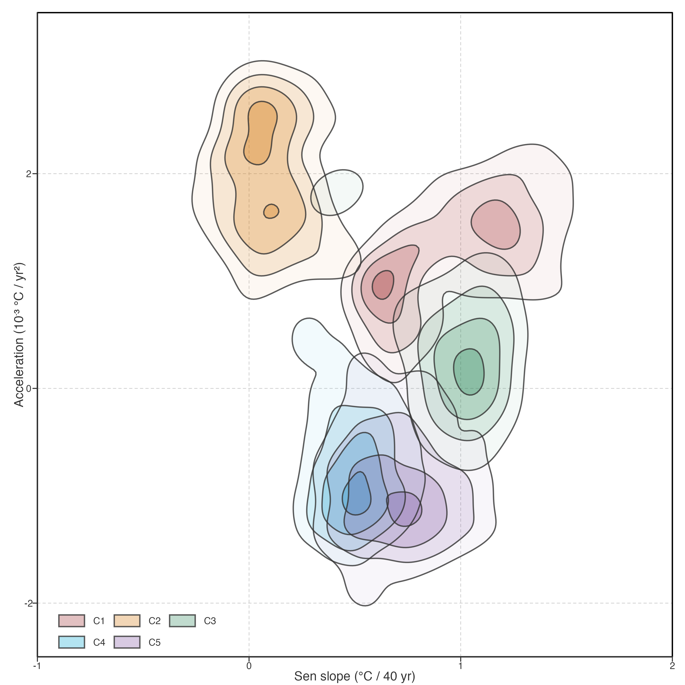

# Regional

## Temporal response types

We classify lakes by the shape of their 1981–2020 annual STL-trend response. The current canonical classification uses per-lake baseline anomalies relative to 1981–1990, PCA retaining 95% of the trajectory variance, and \\k\\-means clustering. The selected solution has five clusters (\\K = 5\\).

These clusters describe low-frequency lake-surface-temperature response types: lakes with similar STL-trend trajectories are grouped together regardless of continental labels. They complement the lake-level warming and acceleration metrics in Chapter 1: those metrics summarize overall change and its recent evolution, whereas the clusters retain the sequence of change through time.

[Figure 1](#fig-stl-cluster-map-violins) asks whether these trajectory types have geographic structure. The map and violin panels place each type in the broader distributions of mean temperature, cumulative warming, and acceleration; cluster labels should therefore be read as response descriptions rather than regional categories.

Figure 1: STL-trend response clusters and their thermal metric distributions. (A) Global spatial distribution of the five clusters. (B-D) Violin plots of mean temperature, Sen slope, and STL-trend difference slope by cluster.

| Cluster | Response type | n lakes | 2020 anomaly | Short interpretation |
|----|----|----|----|----|
| C1 | Late-accelerating moderate warming | 20,444 | +0.86 °C | Slow early change followed by stronger post-2000 warming |
| C2 | Early decline / late rebound | 12,072 | +0.67 °C | Flat or slightly negative early trajectory, then late warming rebound |
| C3 | Strong sustained warming | 8,581 | +1.15 °C | Persistent warming throughout the full 40-year record |
| C4 | Weak / near-stable warming | 29,657 | +0.15 °C | Largest low-response class, close to baseline through time |
| C5 | Early warming then plateau | 21,491 | +0.31 °C | Early warming followed by flattening or slight decline |

Table 1: Summary of STL-trend response clusters

As shown in [Table 1](#tbl-stl-cluster-summary), C4 is the largest class (29,657 lakes) and remains closest to its baseline by 2020. At the other end, C3 has the largest 2020 anomaly (+1.15 °C) and represents sustained warming. C1 and C2 concentrate the late-accelerating trajectories, while C5 captures early warming followed by a plateau. Their spatial pattern in [Figure 1](#fig-stl-cluster-map-violins) is structured rather than uniformly mixed, but the classification itself was not fitted to geography.

[Figure 2](#fig-cluster-density-contours) compares the joint distributions of warming speed and acceleration. Contours are normalized separately within each cluster, so they show where a cluster’s typical observations lie; they do not compare cluster sample sizes.

Figure 2: Two-dimensional density of warming speed and acceleration by STL-trend response cluster. Contour lines show per-cluster density; marginal panels show univariate density by cluster.

The density fields in [Figure 2](#fig-cluster-density-contours) overlap, indicating that no single pair of summary metrics fully reproduces the trajectory classification. Nevertheless, C1 and C2 occupy more positive-acceleration regions, whereas C4 and C5 extend toward negative acceleration. This separation is consistent with their contrasting late-period responses and shows why the full STL-trend trajectory adds information beyond a single Sen slope.

Back to top
