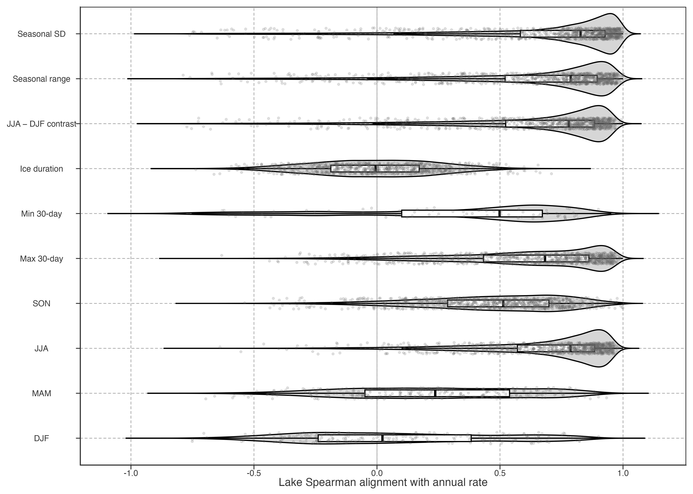

# Seasonal and Ice-State Context

Global annual warming can arise through different seasonal changes. This chapter describes those differences with endpoint-aligned trailing 10-year Sen rates for raw annual, seasonal, extreme-temperature, and ice-day series. These rates are comparable directional descriptors, not additive seasonal contributions to annual warming.

> 全球年均增温可由不同季节变化形成。本章使用 raw 年均、季节、极端温度与冰日序列的端点对齐 10 年 Sen rate 描述差异。它们可比较方向，不可相加为年均增温贡献。

## Seasonal local-rate structure

Warm-season rates are usually the most available and most directly comparable part of the annual signal. Cold-season rates must be read with the ice state: frozen `0 °C` periods are finite states, not ordinary liquid-water temperatures.

> 暖季 rate 通常最完整，也最直接对应年均信号。冷季 rate 必须结合冰状态解释：冻结 `0 °C` 是有限状态，不是普通液态水温。

Figure 1: Distribution of lake-level Spearman alignment between annual and diagnostic trailing 10-year Sen rates. Points are a deterministic visual sample of about one per 100 lakes; this is descriptive co-variation, not additive seasonal attribution.

## Ice-state context

Ice duration gives a second seasonal-state descriptor. It can co-vary differently with annual local rates among lakes; it does not establish a glacier-meltwater mechanism or explain every cooling trajectory.

> 冰期提供第二种季节状态描述。它可与年局部 rate 呈不同共变，但不证明冰川融水机制，也不解释所有降温轨迹。

Detailed diagnostics, sign-conditioned comparisons, and frozen-state limitations are in [Seasonal and Ice Diagnostics](../../../explorations/warming-acceleration/prose/seasonal-ice-diagnostics.llms.md).

> 详细诊断、按增温/降温分支的比较与冻结状态限制见 Seasonal and Ice Diagnostics。

Back to top
