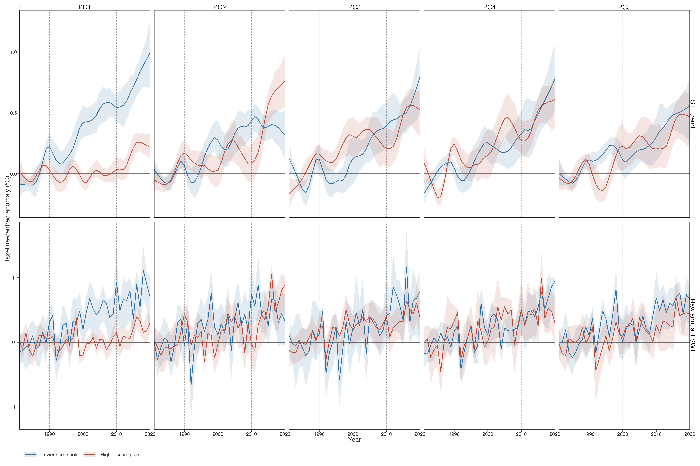
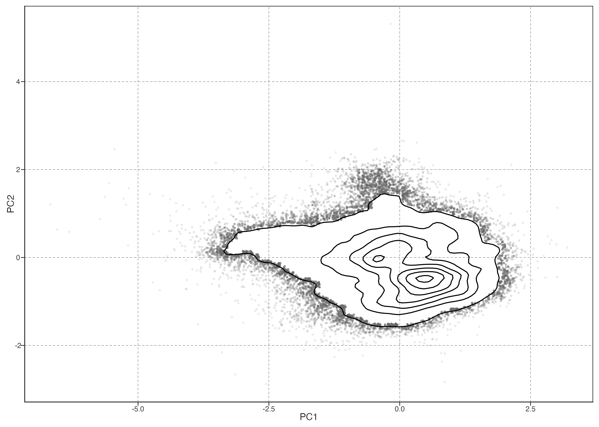

# Archived Detailed PCA Exploration

Long-term warming and warming-speed change describe trajectory direction and rate, but not when low-frequency departures occur or whether lakes share their timing. This chapter decomposes baseline-centred annual STL trajectories using spatially balanced PCA.

> 长期增温与增温速度变化描述方向和速率，不能保留低频轨迹何时偏离、湖泊间是否同步。本章对基线中心化的年 STL 轨迹做空间平衡 PCA。

## Representation and spatial estimand

Annual reconstructed LSWT is smoothed with the STL trend (nt=99), then each lake trajectory is centred on its 1981–1990 mean. Lakes are averaged within occupied equal-area spherical cells before PCA: 573 cells represent 92,245 lakes. Thus PCA estimates covariance for a typical represented spatial cell, not a typical sampled lake. Individual lake scores are projections onto fixed cell-PCA axes; no lake-equal PCA is refitted.

> 年重建 LSWT 先取 nt=99 STL 趋势，再按各湖 1981–1990 均值中心化。PCA 前在等面积球面格网内汇总：92,245 湖形成 573 个格网。它描述典型空间格网的协变；湖泊分数仅投影到固定格网 PCA 轴，不重新做湖泊等权 PCA。

Detailed construction, LOCO alignment, and projection boundary are specified in [the PCA stability contract](../../../explorations/warming-acceleration/prose/pca-stability-contract.llms.md) and [Spatially balanced PCA](../../../metrics/algorithms.llms.md#spatially-balanced-pca).

> 算法、LOCO 对齐与投影边界见 PCA stability contract 和 Spatially balanced PCA 指标页。

Figure 1: Scree plot for equal-area-cell PCA. PC1–PC5 are highlighted; later components add progressively less variance.

PC1 explains most spatial-cell trajectory variance; PC1–PC5 form the predeclared descriptive set. The 95% threshold is diagnostic, not a retention rule.

> PC1 解释最多的格网轨迹方差；PC1–PC5 是预先确定的描述集合。95% 仅作诊断，不作为保留阈值。

## Temporal covariance modes

LOCO tests reaggregate retained lakes into equal-area cells before refitting. Secondary modes recur, but their rank can exchange and PC4–PC5 can mix; fixed PC labels are temporal descriptors rather than invariant physical entities.

> LOCO 每次先对保留湖泊重新格网汇总再拟合。次级模态会重复出现，但排序可交换、PC4/PC5 可混合；PC 标签仅是时间描述，不是固定物理实体。

Figure 2: Equal-area-cell PCA loadings for PC1–PC5. Positive lake scores and positive loadings jointly indicate positive baseline-relative temperature contributions.

Each loading is a year weight and each projected lake score is the strength with which a lake expresses that temporal contrast. PCA signs are arbitrary: interpret score-loading combinations, not isolated signs.

> 载荷是年份权重，投影分数是湖泊表达该时间对比的强度。PCA 正负可整体翻转；应解释“分数×载荷”组合，而非孤立正负。

## Spatial organisation

Figure 3: Projected PC1–PC5 scores, averaged in 1° × 1° cells. Colours express arbitrary PCA signs; panels show spatial organisation of temporal contrasts.

The maps show continuous spatial organisation, not continental classes. Different temporal contrasts dominate in different neighbouring regions; this is descriptive evidence for spatial heterogeneity, while maps alone do not identify a forcing mechanism.

> 地图展示连续空间组织，而非大洲类别。不同时间对比在不同、且可能相邻的区域强弱不同；这描述空间异质性，但地图本身不识别驱动机制。

## Score-pole trajectory composites

For each component, cells in the lower and upper score quintiles are retained as two display poles; these are not classes. Their baseline-centred trajectories are composited with equal cell weight. STL trajectories reproduce the PCA representation, while raw annual LSWT trajectories test whether the displayed contrast is visible before smoothing.

> 每个 PC 取 lower / upper score 五分位作为两个展示极，不是类别。对极端格网等权复合基线中心化轨迹。STL 轨迹对应 PCA 表征；raw annual LSWT 轨迹检验该对比在平滑前是否仍可见。

Figure 4: Equal-area cell trajectory composites for lower and higher PC-score poles. Ribbons are cell interquartile ranges; poles are display quantiles, not response classes.

Read every pole pair jointly with its loading in [Figure 2](#fig-pca-loadings). PC1 supplies the primary global contrast; PC2–PC5 receive the same loading, map, and pole-composite inspection. Their placement in the result hierarchy follows observed variance and LOCO alignment: recurring matched forms can be reported prominently, whereas rank-exchanging or mixed forms are reported later as lower-stability descriptive detail. No component alone is treated as a mechanism-bearing entity.

> 每组极端轨迹都必须与 [Figure 2](#fig-pca-loadings) 的 loading 联读。PC1 是主要全球对比；PC2–PC5 都做 loading、空间图和极端复合检查。呈现层级由实测方差与 LOCO 对齐决定：重复的匹配形式可突出，排序交换或混合的形式则后置为低稳定性描述细节；任何 PC 都不单独承担机制解释。

## Stability-ranked results

At the target grid, PC1–PC5 explain 84.6% of cell-trajectory variance; PC4 and PC5 contribute 5.69% and 4.56%. Across the coarser, target, and finer equal-area grids, their shares remain 5.69–6.42% and 4.55–4.97%, respectively. Thus neither is a resolution-specific residual pattern.

> 目标格网中 PC1–PC5 共解释 84.6% 的格网轨迹方差；PC4、PC5 分别为 5.69%、4.56%。在粗、中、细三种等面积格网中，两者分别维持在 5.69–6.42% 与 4.55–4.97%，不是某一分辨率特有的残余模式。

LOCO provides the ordering rule. PC2 and PC3 recur strongly but exchange rank when North America is omitted (reference PC2 matches refitted PC3, 0.701; reference PC3 matches refitted PC2, 0.995). PC4 and PC5 also recur: their weakest best matches are 0.704 and 0.651, respectively. The limiting case is Europe omission, where PC4 is best recovered by refitted PC5 (0.710) and PC5 by refitted PC4 (0.651). We therefore report PC4–PC5 as a recurring but partially mixed secondary subspace, after the robust PC1 and the clearer PC2–PC3 contrasts.

> LOCO 决定结果层级。去北美后 PC2/PC3 强烈重现但交换排序（参考 PC2 对应新 PC3：0.701；参考 PC3 对应新 PC2：0.995）。PC4/PC5 也会重现，其最低最佳匹配分别为 0.704、0.651；限制情形是去欧洲后 PC4 最接近新 PC5（0.710），PC5 最接近新 PC4（0.651）。故 PC4/PC5 报告为可重复、但部分混合的次级子空间，置于稳健 PC1 与更清晰 PC2/PC3 对比之后。

Under the displayed sign orientation, PC1 distinguishes cells with stronger versus weaker common late warming. PC2 expresses a later-strengthening contrast, whereas PC3 expresses the opposing earlier-versus-later contrast. These timing relations persist among cells with comparable total raw warming. PC4 has a similar late-weakening association but lower stability; PC5 has no consistent warming-speed bridge. The cell-level diagnostics and their limits are shown in [the PCA–kinematics bridge](../../../explorations/warming-acceleration/prose/pca-kinematics-bridge.llms.md).

> 按当前展示的符号方向，PC1 区分共同后期增温较强／较弱的格网；PC2 表达后期增强对比，PC3 表达相反的早期／后期对比。它们在总 raw 增温相近的格网中仍存在。PC4 有相似后期减弱关联但稳定性较低；PC5 暂无一致的增温速度桥接。格网诊断及边界见 PCA–kinematics bridge。

PC2 and PC3 should be read jointly as a rank-exchanging secondary subspace, rather than as two fixed physical modes or a newly rotated component. The currently available geography, morphology, wind, and precipitation panel has no stable held-out association with this joint subspace or with parallel raw warming-speed change. The external-interpretation boundary is documented in [External Interpretation of Spatially Balanced PCA](../../../explorations/warming-acceleration/prose/pca-external-interpretation.llms.md).

> PC2、PC3 应作为可交换排序的次级子空间联读，不当作两种固定物理模态，也不另造旋转成分。现有地理、形态、风速、降水面板，对该联合子空间及平行 raw 增温速度变化均无稳定留出关联；解释边界见 External Interpretation of Spatially Balanced PCA。

A separate bounded screen gives one external consistency result. The joint PC2–PC3 scores improve held-out prediction of the spatial field of contemporaneous, detrended annual LSWT sensitivity to the correlated NAO/AO family and to PDO, beyond geography/lake morphology; this repeats across block sizes, equal-area grids, and LOCO refits. It links secondary low-frequency trajectory heterogeneity to where lakes have different interannual circulation sensitivity. It does not identify a unique index, pathway, or causal driver. Details and limits are in [Teleconnection-Sensitivity Screen](../../../explorations/warming-acceleration/prose/pca-teleconnection-screen.llms.md).

> 另一受限筛查给出一个外部一致性结果：在地理/形态之外，联合 PC2–PC3 分数可提高对同期、去趋势年 LSWT 对相关 NAO/AO family 及 PDO 敏感性空间场的留出预测；该结果在不同 block、等面积格网和 LOCO 重拟中重复。它将次级低频轨迹异质性与湖泊年际环流敏感性不同的空间位置联系起来；不识别唯一指数、路径或因果驱动。细节和限制见 Teleconnection-Sensitivity Screen。

Figure 5: Joint distribution of projected PC1 and PC2 scores. Contours show dense score-space structure; points show tails below the 5th local-density percentile.

[Figure 5](#fig-pc1-pc2-density) retains continuous score geometry. It neither defines discrete lake types nor supports a regional causal claim.

> [Figure 5](#fig-pc1-pc2-density) 保留连续分数几何；它不定义离散湖泊类型，也不支持区域因果结论。

## Association boundary

No predictor model is reported here. A future association analysis must use continuous geographic and climate-background predictors, spatially blocked evaluation, and explicit treatment of spatial autocorrelation; continent dummy variables are not admissible primary explanatory variables. Such a model can identify associations and candidate mechanisms, not causal attribution.

> 本章不报告预测因子模型。未来关联分析必须使用连续地理与气候背景变量、空间分块验证，并显式处理空间自相关；大洲虚拟变量不能作为主要解释变量。模型只能识别关联和候选机制，不能作因果归因。

Requirements are specified in [the association contract](../../../explorations/warming-acceleration/prose/era5-association-scope.llms.md). Chapter 3 remains inactive until inputs, temporal alignment, confounding structure, and held-out evaluation are implemented.

> 具体要求见 association contract。Ch3 在输入、时间对齐、混杂结构和留出评估实现前仍不启动。

Back to top
