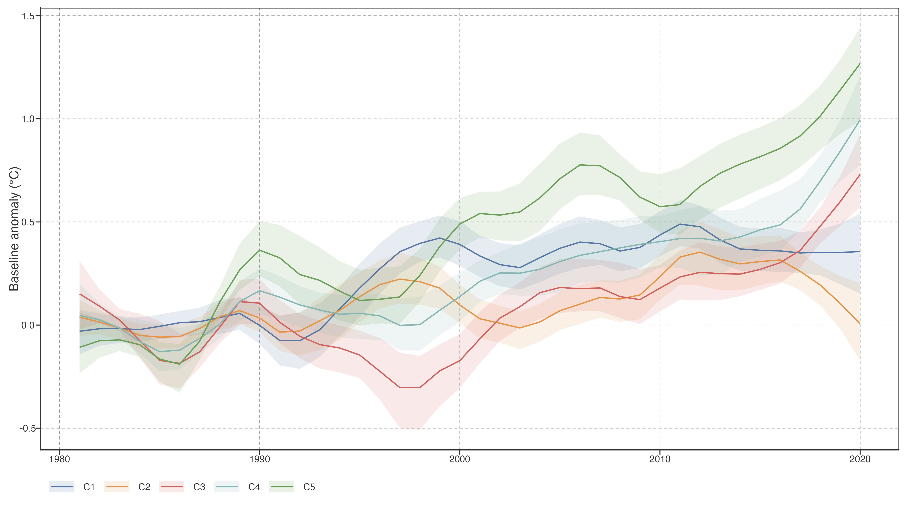
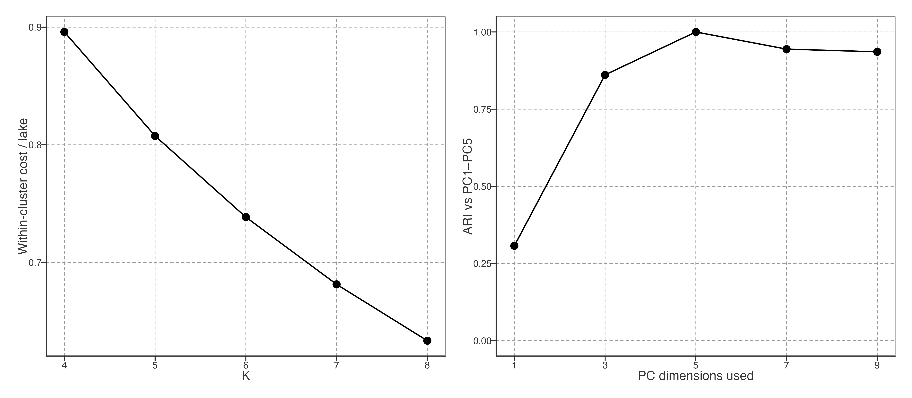

# Warming Pattern Decomposition

Long-term warming and warming-speed change compress each lake’s 40-year temperature record into two summary statistics. While these summaries capture direction and rate of change, they discard the trajectory itself—when anomalies occurred and whether their timing was shared across lakes. This chapter applies principal component analysis (PCA) to the full annual temperature anomaly trajectory, identifying dominant temporal contrasts across 92,245 lakes.

> 长期增温与增温速度变化将每个湖泊 40 年记录压缩为两个统计量。本章对完整年温度异常轨迹做 PCA，识别全球 92,245 个湖泊轨迹变异的主要模态。

## Data preparation

Annual mean reconstructed lake surface water temperature (LSWT) is derived from the GLAST reconstructed/corrected product and smoothed with an STL trend (`nt=99`) before PCA. Each lake’s low-frequency annual trajectory is expressed as a baseline anomaly relative to the 1981–1990 mean, yielding a 40-year anomaly vector. This separates the trajectory analysis from raw annual long-term warming and local-speed metrics used in Chapter 1.

> 数据来自 GLAST 重建/校正 LSWT 产品；年均序列先经 `nt=99` STL 趋势平滑，再以 1981–1990 为基线计算异常。Ch1 原始年均指标与本章低频轨迹 PCA 保持分工。

Figure 1: Scree plot showing the proportion of trajectory variance explained by each principal component. The first five components (coloured) explain `r fmt_pct(cumvar_pc5, 1)`% of total variance; components 6–14 (grey) contribute diminishing additional information.

The scree plot ([Figure 1](#fig-pca-variance)) shows that the first component alone captures 40.0% of trajectory variance, with each subsequent component contributing progressively less. PC1–PC5 together explain 82.1% and are the predefined interpretation set. Components beyond PC5 contribute less than 3% each and are not interpreted in the main text; reaching 95% cumulative variance is a diagnostic rather than a retention rule.

> 碎石图（[Figure 1](#fig-pca-variance)）显示前五个成分累计解释 82.1%。PC1–PC5 是预先确定的解释集合；95% 只作诊断，不作为保留门槛。

## Dominant modes of warming variation

Before interpretation, PCA loading stability was checked using 50 random half-samples and leave-one-continent-out refits of the same `nt=99` baseline-anomaly input. Random half-samples reproduce PC1–PC5 nearly exactly (minimum loading congruence 0.998 or higher), but continent omission separates the interpretation set: PC1 remains stable (minimum congruence 0.899), whereas PC2–PC5 can change substantially when a continent is excluded (minimum congruence 0.326, 0.362, 0.195, and 0.138).

> PCA 解释前已做 50 次随机半样本和留一大洲检验。随机抽样下 PC1–PC5 都极稳定；但留一大洲后只有 PC1 仍稳健（最低一致性 0.899），PC2–PC5 对大陆样本组成敏感。

| Component | Half-sample minimum congruence | Leave-continent-out minimum congruence | Main-text status |
|----|----|----|----|
| PC1 | 1.000 | 0.899 | Robust spatial-temporal mode |
| PC2 | 1.000 | 0.326 | Continental-composition-sensitive |
| PC3–PC5 | ≥ 0.978 | ≤ 0.362 | Descriptive only |

> PC1 可作为稳健时空模态解释；PC2 及以后成分保留描述性展示，但不能作跨大陆的强机制解释。

Each principal component has a **loading** for every year (the weight that year receives in the component) and a **score** for every lake (how strongly that lake exhibits the component’s pattern). A lake’s reconstructed anomaly at year \\t\\ is approximately:

\\ \Delta T\_{\text{lake}}(t) \approx \sum\_{k=1}^{5} \text{score}\_k \times \text{loading}\_k(t) \\

The loading time series reveals a temporal contrast; the score reveals which lakes express it. PCA signs are arbitrary: multiplying both a component’s loadings and all its scores by −1 leaves the reconstruction unchanged. Therefore, a component is identified by the score × loading pattern, not by a positive or negative score alone.

> 每个成分对每年有一个**载荷**（权重），对每个湖泊有一个**分数**（表达强度）。湖泊在某年的温度异常 ≈ 各成分的分数×载荷之和。PCA 正负号可整体翻转；应解释“分数×载荷”的组合，而非孤立的正负分数。

Figure 2: Loading time series for the first five principal components. Each panel shows how a given component weights each year’s contribution. Positive loadings indicate years where lakes with positive scores have warmer anomalies; negative loadings indicate the opposite. Colours distinguish positive (red) from negative (blue) contributions.

[Figure 2](#fig-pca-loadings) reveals the temporal structure of each component:

- **PC1 (40.0%)** contrasts early weakly positive loadings with strongly negative loadings after 2015. Under the displayed sign convention, negative scores combine with negative late loadings to produce positive late-period anomalies. PC1 is therefore an **early-versus-late trajectory contrast**, not direct evidence of acceleration; reversing the PCA sign would reverse both labels without changing the lake trajectories.

- **PC2 (20.1%)** is dominated by a late-1990s excursion. It is sensitive to continental composition under leave-one-continent-out refits, so its scores are retained as a descriptive sample pattern only.

- **PC3–PC5** are displayed as lower-variance descriptive patterns, but their leave-continent-out instability precludes strong global interpretation or driver attribution.

- **PC4 (7.6%)** shows a dip around 1989–1992 and a peak around 2010–2012, suggesting a pattern of early cooling followed by recovery.

- **PC5 (6.3%)** has a complex multi-decadal oscillation with peaks in the mid-1980s and early 2000s.

> [Figure 2](#fig-pca-loadings) 揭示各成分的时间结构：
>
> - **PC1**：早期弱正、后期强负载荷；负分数与后期负载荷相乘产生正异常。这是早—晚轨迹对比，不直接等于加速。
> - **PC2**：以 1990 年代末异常为主；不据此指定物理驱动。
> - **PC3**：以 2000 年代中期负异常为主；不赋予特定过程名称或强迫。
> - **PC4**：1989–1992 低谷 + 2010–2012 峰值 → 早期冷却后恢复
> - **PC5**：多年代际振荡

## Spatial distribution of warming modes

Figure 3: Spatial distribution of PC1–PC3 scores. Warm colours indicate positive scores and cool colours negative scores under the displayed, arbitrary PCA sign convention. PC1 is an early-versus-late trajectory contrast; PC2 is dominated by a late-1990s excursion; PC3 by a mid-2000s negative excursion.

[Figure 3](#fig-pca-score-maps) reveals clear spatial patterns:

- **PC1**: Europe and northern Asia show negative scores, whereas the Americas and tropics are more positive. Under the displayed sign convention, this maps a continental contrast in the early-versus-late trajectory; it does not establish that one region accelerated more than another.

- **PC2**: North America shows more positive scores, indicating a stronger expression of the late-1990s feature under the displayed convention. No physical driver is identified from this spatial pattern alone.

- **PC3**: The spatial pattern is diffuse, with positive and negative scores across continents. The mid-2000s feature is therefore not a coherent regional mode in these data.

> [Figure 3](#fig-pca-score-maps) 揭示清晰的空间格局：
>
> - **PC1**：欧洲和北亚偏负，美洲和热带偏正；表示早—晚轨迹对比的大陆差异，不等于相对加速。
> - **PC2**：北美偏正；表示 1990 年代末特征更强，不指认驱动。
> - **PC3**：空间更分散；2000 年代中期特征不构成一致区域模态。

Figure 4: Joint distribution of PC1 and PC2 scores, coloured by continent. Ellipses show 68% confidence regions. PC1 is an early-versus-late trajectory contrast; PC2 is dominated by a late-1990s excursion.

[Figure 4](#fig-pc1-pc2-scatter) confirms continental structure in PC space. European lakes occupy the lower-left quadrant under the displayed sign convention, while North American lakes are more dispersed and shifted toward positive PC2. This is a continuous separation in trajectory contrasts, not evidence for discrete response types or a specified climate mechanism.

> [Figure 4](#fig-pc1-pc2-scatter) 显示 PC 空间存在连续的大洲结构。正负号受 PCA 约定影响；其表示轨迹对比，不指定离散类型或气候机制。

## Predictors of warming mode expression

What factors determine which warming pattern a lake exhibits? To answer this question, we regress PC1–PC3 scores against geographic and morphometric predictors.

> 什么因素决定了湖泊表现出哪种增温模式？我们将 PC1–PC3 分数对地理和形态因子做回归。

| Predictor         | PC1 (early–late) | PC2 (late-1990s) | PC3 (mid-2000s) |
|-------------------|------------------|------------------|-----------------|
| Intercept         | +0.118\*\*\*     | -0.344\*\*\*     | -0.084\*\*\*    |
| Absolute latitude | +0.010\*\*\*     | -0.001\*\*\*     | +0.009\*\*\*    |
| Elevation (m)     | +0.000188\*\*\*  | +0.000055\*\*\*  | +0.000031\*\*\* |
| log₁₀(Depth)      | -0.168\*\*\*     | +0.055\*\*\*     | +0.004          |
| log₁₀(Area)       | -0.024\*\*\*     | +0.102\*\*\*     | -0.032\*\*\*    |
| R²                | 0.334            | 0.374            | 0.052           |

Table 1: Regression coefficients for PC1–PC3 scores. Significance: \* p\<0.05, \*\* p\<0.01, \*\*\* p\<0.001.

> [Table 1](#tbl-pca-regression-coefs) 显示各预测变量对 PC 分数的回归系数。显著性标记：\* p\<0.05，\*\* p\<0.01，\*\*\* p\<0.001。

| Continent (reference: Africa) | PC1          | PC2          | PC3          |
|-------------------------------|--------------|--------------|--------------|
| Asia                          | -0.778\*\*\* | +0.251\*\*\* | -0.376\*\*\* |
| Europe                        | -1.307\*\*\* | -0.185\*\*\* | -0.550\*\*\* |
| North America                 | -0.149\*\*\* | +0.656\*\*\* | -0.443\*\*\* |
| Oceania                       | +0.018       | -0.108\*\*   | -0.202\*\*\* |
| South America                 | +0.234\*\*\* | -0.011       | +0.087\*\*\* |

Table 2: Continent dummy coefficients for PC1–PC3 scores; Africa is the reference level.

> [Table 2](#tbl-pca-continent-effects) 显示大洲虚拟变量的回归系数（以非洲为参照）。

| Predictor group | PC1   | PC2   | PC3   |
|-----------------|-------|-------|-------|
| Latitude        | 0.006 | 0.000 | 0.030 |
| Elevation       | 0.008 | 0.001 | 0.001 |
| Depth           | 0.003 | 0.001 | 0.000 |
| Area            | 0.000 | 0.004 | 0.001 |
| Continent       | 0.309 | 0.333 | 0.040 |

Table 3: Partial R² for each predictor group in explaining PC1–PC3 scores.

> [Table 3](#tbl-partial-r2) 显示各预测变量组对 PC 分数的独立解释方差。

The regression results reveal a clear hierarchy of predictors. **Continent** is the dominant predictor group for PC1 and PC2, confirming that the broad organisation of these warming modes is continental in scale. The continent coefficients in [Table 2](#tbl-pca-continent-effects) describe differences from the African reference level; their signs are specific to the arbitrary PCA sign convention and should not be interpreted as a directional physical effect.

> 回归结果表明，**大洲**是 PC1 和 PC2 的主导预测变量组，说明这些增温模态在大洲尺度上组织。大洲系数以非洲为参照；其正负受 PCA 符号约定影响，不能直接解释为物理方向效应。

Among the non-geographic predictors, **elevation** makes the largest overall independent contribution across PC1–PC3 ([Table 3](#tbl-partial-r2)). **Depth** and **lake area** contribute less, and their relative importance varies by component: depth exceeds area for PC1, whereas area exceeds depth for PC2 and PC3. Partial R² is an unsigned increment in explained variance: it ranks the independent information contributed by each predictor group but does not give the direction of association. Direction and uncertainty must instead be read from the coefficients in [Table 1](#tbl-pca-regression-coefs).

> 在非地理因子中，跨 PC1–PC3 而言，**海拔**的总体独立贡献最大（[Table 3](#tbl-partial-r2)）。**深度**和**湖泊面积**的贡献较小，且相对重要性随成分变化：PC1 中深度高于面积，PC2 和 PC3 中面积高于深度。偏 R² 是无符号的解释方差增量，只比较独立信息量；关联方向和不确定性应见 [Table 1](#tbl-pca-regression-coefs)。

## Descriptive trajectory typology

PCA remains primary: it preserves continuous score geometry. K-means is only a readable partition. The fixed display is K=5 on PC1–PC5; clusters are descriptive labels, not natural response types or regions.

> PCA 是主分析，保留连续轨迹空间；K-means 只提供可读切分。固定展示 PC1–PC5、K=5；cluster 不是自然类型或区域。

Figure 5: Median baseline-anomaly trajectories for descriptive PC1–PC5 K=5 partition. Ribbons show within-cluster interquartile ranges.

[Figure 5](#fig-cluster-profiles-k5) describes five broad trajectory groups. Boundaries remain algorithmic: lakes near a boundary can change label when K or PC dimensions change, even if continuous scores barely change.

> [Figure 5](#fig-cluster-profiles-k5) 展示五组宽泛轨迹。边界由算法给出；K 或 PC 维数改变时，边界附近湖泊可换组，连续分数变化却很小。

Figure 6: K and PC-dimension sensitivity of descriptive clustering. Cost declines across K=4–8; adjusted Rand index compares K=5 partitions with PC1–PC5 reference.

[Figure 6](#fig-clustering-sensitivity) has no unique elbow across K=4–8. K=5 is fixed display resolution, not estimated true number of lake types. PC-dimension sensitivity is a boundary diagnostic; it does not alter PCA results.

> [Figure 6](#fig-clustering-sensitivity) 没有唯一清晰 elbow。K=5 是固定展示分辨率，不是“真实类型数”；PC 维数敏感性只检验边界，不改变 PCA 结论。

Full methods discussion: [PCA vs. Clustering](../../../explorations/warming-acceleration/prose/pca-vs-clustering.llms.md).

## Implications for future analysis

PCA stability and the association boundary are specified in [the PCA stability contract](../../../explorations/warming-acceleration/prose/pca-stability-contract.llms.md) and [the ERA5 association scope](../../../explorations/warming-acceleration/prose/era5-association-scope.llms.md). These checks are required before treating a retained mode as a robust geographic pattern; neither source supports causal attribution.

> PCA 稳定性与 ERA5 关联边界见对应说明。它们用于确认模态是否稳健，不能支持因果归因。

The PCA decomposition shows that trajectory contrasts are structured by geography and lake morphology. PC1 describes an early-versus-late contrast, while PC2 and PC3 describe localized temporal excursions. These are associations in a low-frequency temperature representation, not attribution to external climate modes.

> PCA 显示轨迹对比受地理与湖泊形态组织：PC1 为早—晚对比，PC2/PC3 为局部时间异常。它们是低频温度表征中的关联，不是对外部气候模态的归因。

PC scores can become response variables in a future model only after that model’s predictors, temporal alignment, confounding control, and interpretation limits are specified. Chapter 3 is not yet an active attribution analysis.

> PC 分数可在未来模型中作为响应变量，但须先明确预测变量、时间对齐、混杂控制与解释边界；Chapter 3 尚未进入归因分析。

Back to top
