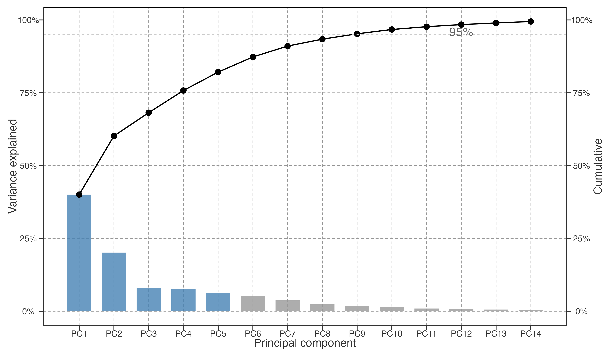
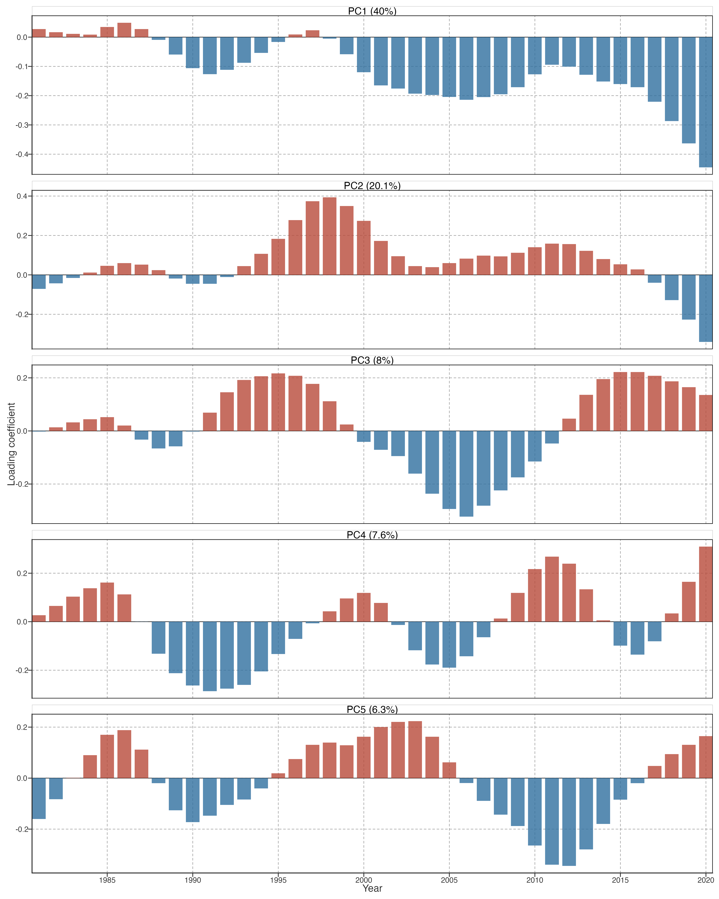
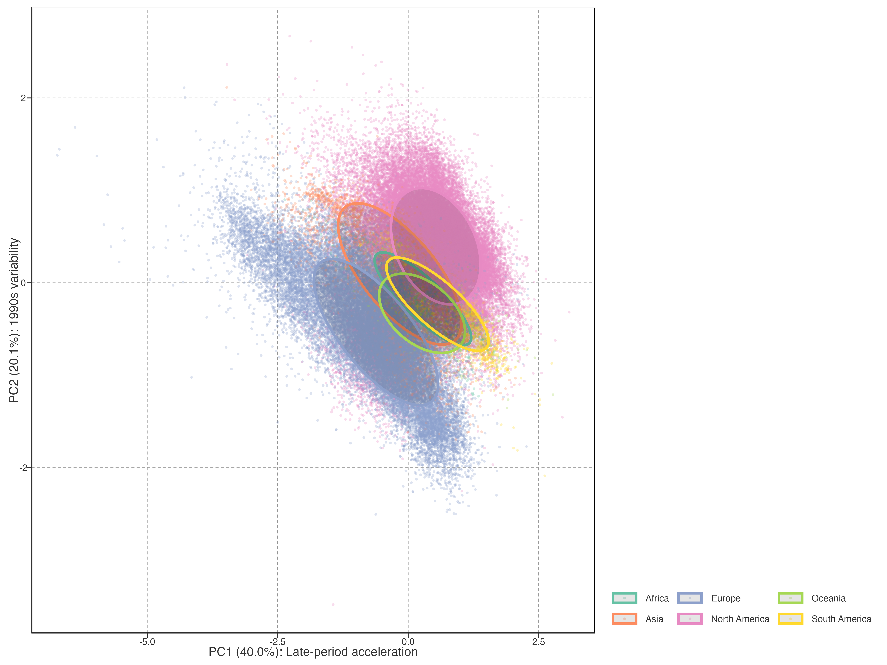

# Warming Pattern Decomposition

Long-term warming speed and acceleration compress each lake’s 40-year temperature record into two summary statistics. While these summaries capture the direction and rate of change, they discard the temporal trajectory—when warming occurred, whether it was steady or intermittent, and how it relates to known climate modes. This chapter applies principal component analysis (PCA) to the full annual temperature anomaly trajectory, identifying the dominant modes of warming variation across 92,245 lakes.

> 长期增温速率和加速度将每个湖泊 40 年的温度记录压缩为两个统计量。本章对完整的年温度异常轨迹做 PCA，识别全球 92,245 个湖泊增温变异的主要模态。

## Data preparation

Annual mean lake surface water temperature (LSWT) is computed from daily GLAST observations and smoothed with an STL trend (`nt=99`) before PCA. Each lake’s low-frequency annual trajectory is expressed as a baseline anomaly relative to the 1981–1990 mean, yielding a 40-year anomaly vector. This separates the trajectory analysis from the raw annual metrics used for warming and acceleration in Chapter 1.

> 数据来自 GLAST 日尺度 LSWT；年均序列先经 `nt=99` 的 STL 趋势平滑，再以 1981–1990 为基线计算异常。Chapter 1 的原始年均指标与本章低频轨迹 PCA 保持分工。

Figure 1: Scree plot showing the proportion of trajectory variance explained by each principal component. The first five components (coloured) explain `r fmt_pct(cumvar_pc5, 1)`% of total variance; components 6–14 (grey) contribute diminishing additional information.

The scree plot ([Figure 1](#fig-pca-variance)) shows that the first component alone captures 40.0% of trajectory variance, with each subsequent component contributing progressively less. PC1–PC5 together explain 82.1% and are the predefined interpretation set. Components beyond PC5 contribute less than 3% each and are not interpreted in the main text; reaching 95% cumulative variance is a diagnostic rather than a retention rule.

> 碎石图（[Figure 1](#fig-pca-variance)）显示前五个成分累计解释 82.1%。PC1–PC5 是预先确定的解释集合；95% 只作诊断，不作为保留门槛。

## Dominant modes of warming variation

Each principal component has a **loading** for every year (the weight that year receives in the component) and a **score** for every lake (how strongly that lake exhibits the component’s pattern). A lake’s reconstructed anomaly at year \\t\\ is approximately:

\\ \Delta T\_{\text{lake}}(t) \approx \sum\_{k=1}^{5} \text{score}\_k \times \text{loading}\_k(t) \\

The loading time series reveals what temporal pattern each component captures; the score reveals which lakes exhibit that pattern most strongly.

> 每个成分对每年有一个**载荷**（权重），对每个湖泊有一个**分数**（表达强度）。湖泊在某年的温度异常 ≈ 各成分的分数×载荷之和。载荷揭示时间模式，分数揭示空间分布。

Figure 2: Loading time series for the first five principal components. Each panel shows how a given component weights each year’s contribution. Positive loadings indicate years where lakes with positive scores have warmer anomalies; negative loadings indicate the opposite. Colours distinguish positive (red) from negative (blue) contributions.

[Figure 2](#fig-pca-loadings) reveals the temporal structure of each component:

- **PC1 (40.0%)** captures a contrast between early and late years. Loadings are weakly positive in the 1980s and strongly negative after 2015. Lakes with **negative** PC1 scores therefore have **stronger warming in recent decades** (negative score × negative loading = positive anomaly). This component represents **late-period warming acceleration**.

- **PC2 (20.1%)** peaks around 1996–1998, corresponding to the strong El Niño years. Lakes with high PC2 scores experienced unusually warm conditions in the late 1990s relative to their baseline. This component captures **interannual climate variability**, particularly ENSO-related warming.

- **PC3 (8.0%)** has a negative peak around 2005–2006, corresponding to the global warming hiatus period. Lakes with negative PC3 scores experienced a more pronounced cooling or reduced warming during this period.

- **PC4 (7.6%)** shows a dip around 1989–1992 and a peak around 2010–2012, suggesting a pattern of early cooling followed by recovery.

- **PC5 (6.3%)** has a complex multi-decadal oscillation with peaks in the mid-1980s and early 2000s.

> [Figure 2](#fig-pca-loadings) 揭示各成分的时间结构：
>
> - **PC1**：早期正载荷、后期强负载荷 → 代表**近年增温加速**
> - **PC2**：1996–1998 峰值 → 代表 **ENSO 相关的年际变率**
> - **PC3**：2005–2006 负峰 → 代表 **hiatus 期间的冷却**
> - **PC4**：1989–1992 低谷 + 2010–2012 峰值 → 早期冷却后恢复
> - **PC5**：多年代际振荡

## Spatial distribution of warming modes

Figure 3: Spatial distribution of PC1–PC3 scores. Warm colours indicate positive scores (stronger expression of the component’s pattern); cool colours indicate negative scores (opposite pattern). PC1 captures late-period acceleration; PC2 captures 1990s interannual variability; PC3 captures hiatus-period cooling.

[Figure 3](#fig-pca-score-maps) reveals clear spatial patterns:

- **PC1**: Europe and northern Asia show strongly negative scores, indicating pronounced late-period warming acceleration. The Americas and tropics show more positive scores, indicating relatively less late-period acceleration. This continental-scale contrast is the single most important mode of warming heterogeneity.

- **PC2**: North America shows strongly positive scores, reflecting the pronounced 1990s warming signal. This is consistent with the strong El Niño influence on North American lake temperatures during 1997–1998.

- **PC3**: The spatial pattern is more diffuse, with scattered positive and negative scores across continents, consistent with the hiatus being a globally heterogeneous phenomenon rather than a coherent regional signal.

> [Figure 3](#fig-pca-score-maps) 揭示清晰的空间格局：
>
> - **PC1**：欧洲和北亚强负分 → 近年加速最明显；美洲和热带正分 → 加速较弱。这是增温异质性最重要的模态。
> - **PC2**：北美强正分 → 1990 年代增温信号突出，与 El Niño 影响一致。
> - **PC3**：空间格局更分散，hiatus 冷却是全球异质性现象。

Figure 4: Joint distribution of PC1 and PC2 scores, coloured by continent. Ellipses show 68% confidence regions. PC1 captures late-period acceleration; PC2 captures 1990s interannual variability.

[Figure 4](#fig-pc1-pc2-scatter) confirms the continental clustering in PC space. European lakes occupy the lower-left quadrant (negative PC1, negative PC2), indicating late-period acceleration with moderate 1990s variability. North American lakes are more dispersed but shifted toward positive PC2, reflecting the strong 1990s warming signal. This separation in continuous PC space is more informative than discrete cluster labels: it reveals that the “European warming acceleration” and “North American 1990s peak” are not sharply distinct types but rather regions of a continuous distribution.

> [Figure 4](#fig-pc1-pc2-scatter) 确认了 PC 空间中的大洲聚类。欧洲湖泊位于左下象限（PC1 负、PC2 负），北美偏向 PC2 正方向。这种连续空间中的分离比离散聚类标签更丰富。

## Predictors of warming mode expression

What factors determine which warming pattern a lake exhibits? To answer this question, we regress PC1–PC3 scores against geographic and morphometric predictors.

> 什么因素决定了湖泊表现出哪种增温模式？我们将 PC1–PC3 分数对地理和形态因子做回归。

| Predictor         | PC1 (late accel.) | PC2 (1990s var.) | PC3 (hiatus)    |
|-------------------|-------------------|------------------|-----------------|
| Intercept         | +0.118\*\*\*      | -0.344\*\*\*     | -0.084\*\*\*    |
| Absolute latitude | +0.010\*\*\*      | -0.001\*\*\*     | +0.009\*\*\*    |
| Elevation (m)     | +0.000188\*\*\*   | +0.000055\*\*\*  | +0.000031\*\*\* |
| log₁₀(Depth)      | -0.168\*\*\*      | +0.055\*\*\*     | +0.004          |
| log₁₀(Area)       | -0.024\*\*\*      | +0.102\*\*\*     | -0.032\*\*\*    |
| R²                | 0.334             | 0.374            | 0.052           |

Table 1: Regression coefficients for PC1–PC3 scores. Significance: \* p\<0.05, \*\* p\<0.01, \*\*\* p\<0.001.

> [Table 1](#tbl-pca-regression-coefs) 显示各预测变量对 PC 分数的回归系数。显著性标记：\* p\<0.05，\*\* p\<0.01，\*\*\* p\<0.001。

| Continent (reference: Africa) | PC1          | PC2          | PC3          |
|-------------------------------|--------------|--------------|--------------|
| Asia                          | -0.778\*\*\* | +0.251\*\*\* | -0.376\*\*\* |
| Europe                        | -1.307\*\*\* | -0.185\*\*\* | -0.550\*\*\* |
| North America                 | -0.149\*\*\* | +0.656\*\*\* | -0.443\*\*\* |
| Oceania                       | +0.018       | -0.108\*\*   | -0.202\*\*\* |
| South America                 | +0.234\*\*\* | -0.011       | +0.087\*\*\* |

Table 2: Continent dummy coefficients for PC1–PC3 scores; Africa is the reference level.

> [Table 2](#tbl-pca-continent-effects) 显示大洲虚拟变量的回归系数（以非洲为参照）。

| Predictor group | PC1   | PC2   | PC3   |
|-----------------|-------|-------|-------|
| Latitude        | 0.006 | 0.000 | 0.030 |
| Elevation       | 0.008 | 0.001 | 0.001 |
| Depth           | 0.003 | 0.001 | 0.000 |
| Area            | 0.000 | 0.004 | 0.001 |
| Continent       | 0.309 | 0.333 | 0.040 |

Table 3: Partial R² for each predictor group in explaining PC1–PC3 scores.

> [Table 3](#tbl-partial-r2) 显示各预测变量组对 PC 分数的独立解释方差。

The regression results reveal a clear hierarchy of predictors. **Continent** is the dominant predictor group for PC1 and PC2, confirming that the broad organisation of these warming modes is continental in scale. The continent coefficients in [Table 2](#tbl-pca-continent-effects) describe differences from the African reference level; their signs are specific to the arbitrary PCA sign convention and should not be interpreted as a directional physical effect.

> 回归结果表明，**大洲**是 PC1 和 PC2 的主导预测变量组，说明这些增温模态在大洲尺度上组织。大洲系数以非洲为参照；其正负受 PCA 符号约定影响，不能直接解释为物理方向效应。

Among the non-geographic predictors, **elevation** makes the largest overall independent contribution across PC1–PC3 ([Table 3](#tbl-partial-r2)). **Depth** and **lake area** contribute less, and their relative importance varies by component: depth exceeds area for PC1, whereas area exceeds depth for PC2 and PC3. Partial R² is an unsigned increment in explained variance: it ranks the independent information contributed by each predictor group but does not give the direction of association. Direction and uncertainty must instead be read from the coefficients in [Table 1](#tbl-pca-regression-coefs).

> 在非地理因子中，跨 PC1–PC3 而言，**海拔**的总体独立贡献最大（[Table 3](#tbl-partial-r2)）。**深度**和**湖泊面积**的贡献较小，且相对重要性随成分变化：PC1 中深度高于面积，PC2 和 PC3 中面积高于深度。偏 R² 是无符号的解释方差增量，只比较独立信息量；关联方向和不确定性应见 [Table 1](#tbl-pca-regression-coefs)。

## Comparison with discrete clustering

An alternative approach to characterising warming heterogeneity is \\k\\-means clustering on the PCA-reduced trajectory space. We evaluated K=4–8 and selected K=5 based on spatial coherence and statistical metrics. A detailed comparison of PCA and clustering approaches, including quantitative metrics and the rationale for preferring continuous scores, is given in [PCA vs. Clustering](../../../explorations/warming-acceleration/prose/pca-vs-clustering.llms.md).

> 用 PCA 降维后的轨迹空间做 K 均值聚类是替代方案。详细比较见 [PCA vs. Clustering](../../../explorations/warming-acceleration/prose/pca-vs-clustering.llms.md)。

## Implications for attribution

The PCA decomposition reveals that lake warming patterns are not random: they are organised by geography (continent, latitude) and lake morphology (depth). The dominant mode (PC1) captures a continental-scale contrast in late-period warming acceleration, while PC2 captures interannual climate variability (likely ENSO-related).

These findings motivate the attribution analysis in Chapter 3. The continuous PC scores provide a natural response variable for regression against teleconnection indices (ENSO, PDO, AO), local climate variables (precipitation, wind speed), and lake characteristics (depth, area, ice duration). Unlike discrete cluster labels, PC scores preserve the full spectrum of warming heterogeneity and allow for continuous, quantitative attribution.

> PCA 分解揭示增温模式由地理（大洲、纬度）和湖泊形态（深度）组织。PC1 捕捉大洲尺度的近年加速对比，PC2 捕捉年际气候变率。这些发现为第 3 章的归因分析奠定基础：PC 分数可直接作为响应变量，对遥相关指数、本地气候变量和湖泊特征做回归。

Back to top
