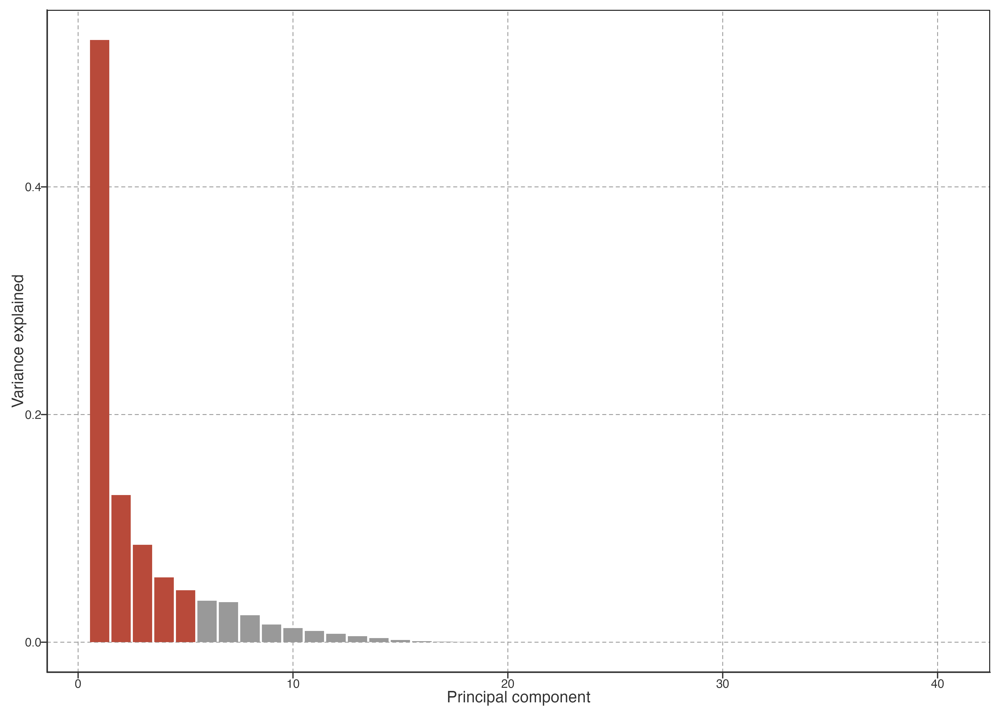
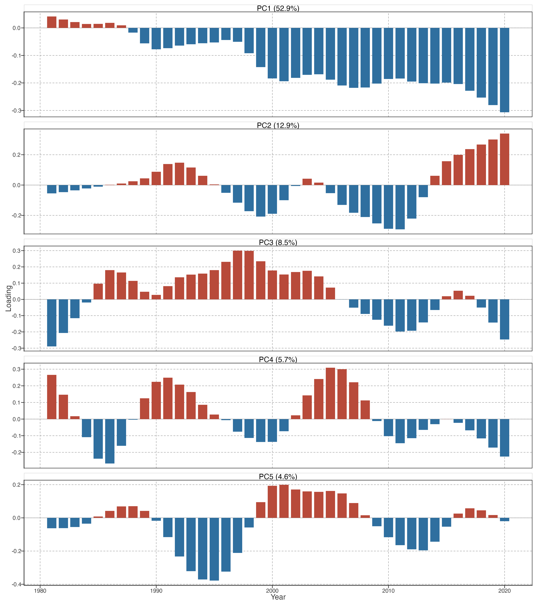
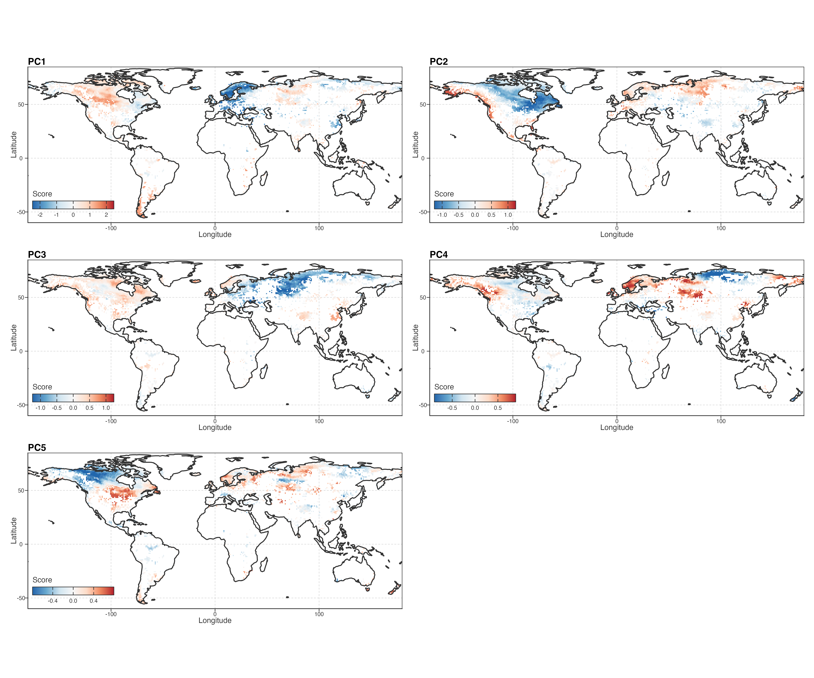

# Low-Frequency Warming Pattern Decomposition

This chapter decomposes baseline-centred annual STL trajectories after equal-area spatial aggregation. STL with `nt=99` is PCA-only low-frequency preprocessing; raw annual LSWT remains the primary warming and local-speed representation.

> 本章在等面积空间汇总后分解基线中心化年 STL 轨迹。`nt=99` STL 只用于 PCA 前低频处理；raw 年均 LSWT 仍是主要增温与局部速度表征。

## Spatially balanced trajectory space

PCA is fitted to 573 occupied equal-area cells representing 92,245 lakes. It estimates covariance for a represented spatial cell rather than for a typical sampled lake; lake scores are projections onto fixed cell axes.

> PCA 拟合于 573 个被占据的等面积格网，代表 92,245 湖。它描述代表性空间格网协变，不描述典型抽样湖泊；湖泊分数仅投影到固定格网轴。

Figure 1: Explained and cumulative variance of spatially balanced PCA.

PC1 is the robust common low-frequency background. PC2–PC3 form a recurring secondary subspace whose rank can exchange; PC4–PC5 are retained as lower-prominence, partly mixed descriptive modes.

> PC1 是稳健共同低频背景。PC2–PC3 构成可重复、但排序可交换的次级子空间；PC4–PC5 保留为呈现优先级较低、部分混合的描述模态。

## Temporal and spatial modes

Loadings identify the temporal contrast expressed by a score. PCA signs are arbitrary; interpretation always concerns the score-loading combination. PC1 captures the dominant common late-period contrast. PC2 and PC3 describe secondary changes in the timing and persistence of low-frequency warming, rather than two fixed physical mechanisms.

> loading 给出分数所表达的时间对比。PCA 符号可整体翻转，必须解释“分数—loading”组合。PC1 捕捉主要共同后期对比；PC2、PC3 描述低频增温时间和持续性的次级差异，不是两个固定物理机制。

Figure 2: Equal-area PCA loadings for PC1–PC5.

Figure 3: Spatial organisation of projected PC scores, averaged in 1° cells.

The score maps show continuous spatial organisation. They do not define continental types: adjacent regions can differ, and distant regions can express similar score combinations. This is the spatial form of heterogeneous warming trajectories.

> 分数地图显示连续空间组织，不定义大洲类型：相邻区域可不同，远距区域也可有相似分数组合。这就是异质增温轨迹的空间形式。

## Reproducibility and result hierarchy

At the reference grid PC1–PC5 explain 84.6% of cell-trajectory variance. PC2 and PC3 recur under leave-one-continent-out refits, but can exchange order; PC4–PC5 recur more weakly and partly mix. We therefore retain PC1 as the common background, PC2–PC3 as the main secondary descriptive subspace, and PC4–PC5 as lower-prominence detail.

> 参考格网中 PC1–PC5 共解释 84.6% 格网轨迹方差。PC2、PC3 在 LOCO 重拟中重复但可交换排序；PC4、PC5 重复更弱且部分混合。因此 PC1 为共同背景，PC2–PC3 为主要次级描述子空间，PC4–PC5 为较低优先级细节。

Detailed loading interpretation, score-pole composites, and LOCO matching are retained in [PCA Stability Contract](../../../explorations/warming-acceleration/prose/pca-stability-contract.llms.md). PCA identifies reproducible covariance structure; it does not identify a forcing mechanism by itself.

> loading 解读、score-pole 复合和 LOCO 匹配详见 PCA Stability Contract。PCA 识别可重复协变结构，本身不识别驱动机制。

Construction, loading interpretation, maps, poles, and LOCO diagnostics remain in [PCA Stability Contract](../../../explorations/warming-acceleration/prose/pca-stability-contract.llms.md) and the earlier detailed [PCA exploration](../../../explorations/warming-acceleration/draft/02-warming-patterns.llms.md).

> 构建、loading 解读、地图、极端轨迹与 LOCO 诊断见 PCA Stability Contract 和既有 PCA 详细探索页。

Back to top
