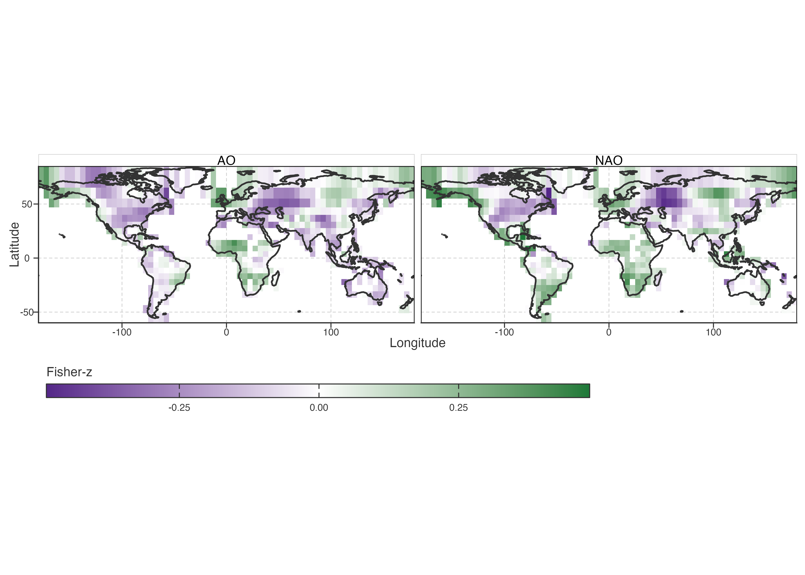
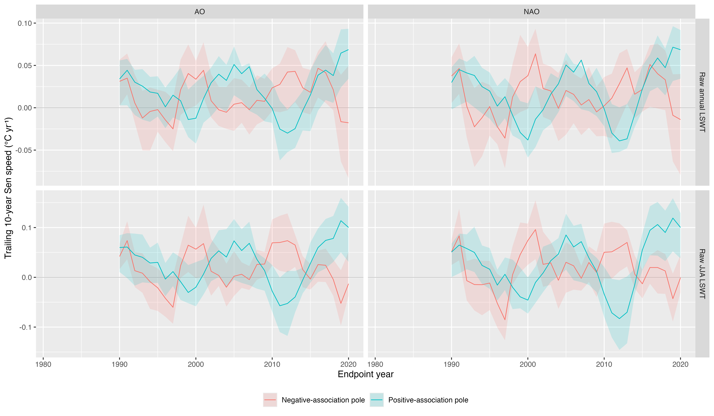

# Spatially Heterogeneous Teleconnection Sensitivity

This chapter asks where lake-temperature association with predeclared circulation indices differs, and whether that association field shares spatial structure with PCA scores. For each lake, raw JJA LSWT is regressed on calendar year using ordinary least squares after frozen 0 °C states are excluded; the residual JJA anomalies are then correlated with the declared index season. The 1981–1990 baseline used for PCA is not used in this detrending step. This is an association analysis, not teleconnection attribution.

> 本章考察湖温与预先定义环流指数的关联在哪里不同，以及该关联场是否与 PCA 分数共享空间结构。每湖 raw JJA 温度在排除冻结 0 °C 后，以年份做 OLS 线性去趋势；残差再与指定季节指数相关。PCA 的 1981–1990 baseline 不参与此步。这是关联分析，不是遥相关归因。

## Retained NAO/AO result

The strongest retained family pairs prior-summer NAO/AO with current-summer JJA LSWT. PC1 adds little held-out prediction; PC2 and the PC2–PC3 subspace add stable spatial skill across grids, continent omissions, and decade omissions.

> 最稳的关联族是上一年夏季 NAO/AO 与当年夏季 JJA LSWT。PC1 几乎不增加空间留出预测；PC2 与 PC2–PC3 子空间在格网、大陆删除、年代删除中保持稳定增益。

Figure 1: Signed Fisher-z association fields for JJA NAO/AO in year t−1 and JJA LSWT in year t. Purple/green encode sign, not warming/cooling: near-white cells are weak association, saturated cells are stronger signed association.

Read the maps as continuous signed association fields, not as classes: colour sign states whether a positive prior-summer index tends to accompany a positive or negative current-summer residual; saturation shows association magnitude. The fields are spatially continuous, and most visible sign changes are weak-field zero crossings rather than adjacent strong reversals. Positive and negative display poles differ in PC2 position and late local warming-speed evolution. PDO, MAM NAO, and DJF PDO remain bounded regional or coverage-limited comparisons.

> 读图应把它看作连续有符号关联场，不是类别：颜色正负表示上一年夏季指数为正时，当年夏季残差倾向正或负；饱和度表示关联强弱。场总体连续，大部分异号是弱场跨零，不是相邻强反向。正负展示端在 PC2 位置和后期局部速度演变上不同。PDO、MAM NAO、DJF PDO 仅作区域敏感或覆盖受限比较。

## Spatial continuity and local boundaries

Across 908 east/north adjacent equal-area cell pairs, the NAO and AO fields have neighbour correlations of 0.71 and 0.73. Strong opposite-sign neighbours are rare: at `|Fisher-z| >= 0.15` on both sides, NAO has 5 of 213 pairs and AO has 3 of 193. The field is therefore spatially smooth with weak zero crossings, not a patchwork of locally opposite strong responses.

> 在 908 个东西/南北邻接等面积格网对中，NAO、AO 场的邻接相关分别为 0.71、0.73。两侧均满足 `|Fisher-z| >= 0.15` 的强异号邻接对很少：NAO 为 213 对中的 5 对，AO 为 193 对中的 3 对。因此该场总体连续，局部异号主要是弱场跨零，不是强反向响应的拼贴。

## Trajectory bridge

Positive-association and negative-association poles are display ends of a continuous signed field, not lake types or sensitivity magnitudes. PC1 remains the largest common low-frequency trajectory component, but it adds almost no skill in locating this association field. PC2 is the score dimension that separates the poles: for NAO, their mean PC2 scores are 0.392 and −0.342; for AO they are 0.267 and −0.238. This does **not** mean PC1 determines overall warming or that PC2 causes opposite lake responses. It means that, after the common trajectory background is represented, the timing structure captured by PC2 co-locates with contrasting raw JJA NAO/AO association and with different late local-speed histories. By 2020 the positive-association pole has annual 10-year speed near 0.069 °C yr⁻¹ for both indices, while the negative pole is near −0.014 (NAO) or −0.018 (AO).

> 正负关联端只是连续有符号场的展示端，不是湖泊类型，也不表示敏感性大小。PC1 是最大的共同低频背景，却几乎不能定位这个关联场；区分两端的是 PC2：NAO 两端为 0.392、−0.342；AO 为 0.267、−0.238。这不表示 PC1 决定总体增温，也不表示 PC2 造成相反响应；只表示在共同背景之外，PC2 所示的时间结构与 raw JJA NAO/AO 异质关联及后期局部速度历史共定位。2020 年正关联端约 0.069 °C yr⁻¹，负端约 −0.014/−0.018。

Figure 2: Trailing 10-year annual and JJA Sen-speed composites for negative and positive NAO/AO association poles.

This is a spatial co-location result. It does not show NAO/AO causes PC2, and it does not identify a circulation pathway. Candidate selection followed the broad lag screen; grid, LOCO, and LODO tests assess stability rather than independent discovery.

> 这是空间共定位结果，不表示 NAO/AO 造成 PC2，也不识别环流路径。候选来自宽 lag 筛查之后；格网、LOCO、LODO 检验稳定性，不构成独立发现。

Full validation, neighbour diagnostics, and trajectory composites are in [Selected Seasonal Teleconnection Candidates](../../../explorations/warming-acceleration/prose/pca-selected-seasonal-teleconnection.llms.md).

> 完整验证、邻接诊断和轨迹复合见 Selected Seasonal Teleconnection Candidates。

Back to top
