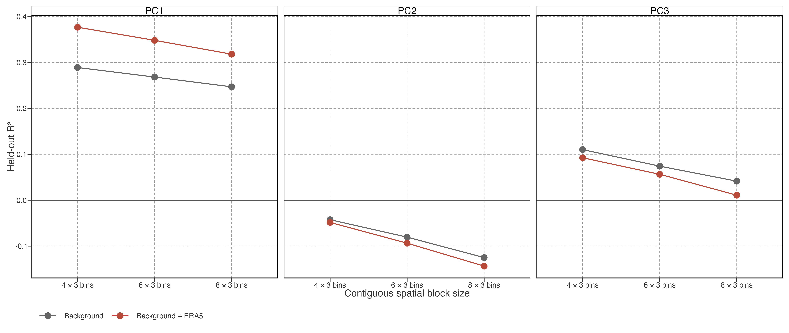

# Restricted PCA Association Diagnostics

> **Status:** Superseded by [External Interpretation of Spatially Balanced PCA](../../../explorations/warming-acceleration/prose/pca-external-interpretation.llms.md), which adds the rotation-invariant PC2–PC3 joint response, parallel raw outcomes, and predeclared seasonal contrasts. Retained for audit of the earlier annual-only restricted panel.

> **状态：** 已由 External Interpretation of Spatially Balanced PCA 取代；后者增加了不受旋转影响的 PC2–PC3 联合响应、平行 raw 结果与预先定义季节对比。本页仅保留为早期年尺度受限面板的审计记录。

## Restricted predictive question

This diagnostic asks only whether currently available wind-speed and precipitation summaries improve held-out spatial prediction of PC scores beyond continuous geography and lake-background variables. It uses 573 occupied equal-area PCA cells, not individual lakes. It is not a heat-budget model or an attribution analysis.

> 本诊断只检验：现有风速与降水汇总，能否在连续地理与湖泊背景变量之外，改善 PC score 的空间留出预测。单位为 573 个占据等面积 PCA 格网，不是单湖泊；它不是热收支模型或归因分析。

The background model contains a continuous spatial basis, elevation, log lake area, log depth, and log distance to coast. The restricted ERA5 block contains annual wind-speed mean/trend and annual precipitation mean/trend. Surface pressure is excluded because it is mainly an elevation/background proxy. Air temperature, radiation, humidity, and evaporation are unavailable, and ERA5-Land-driven FLAKE information participates in GLAST reconstruction.

> 背景模型包含连续空间基、海拔、湖面积/深度/距海距离对数。受限 ERA5 块仅含年风速均值/趋势与年降水均值/趋势。气压主要是海拔背景代理，故排除。气温、辐射、湿度、蒸发缺失；且 ERA5-Land 驱动 FLAKE 信息参与 GLAST 重建。

## Spatial-block sensitivity

Figure 1: Spatial-block cross-validated R² for background versus restricted-ERA5 models. Three contiguous equal-area block sizes test whether the result depends on a single spatial hold-out scale. Negative values indicate worse-than-mean held-out prediction.

For PC1, background-only held-out \\R^2\\ is 0.25–0.29 and rises to 0.32–0.38 after adding the restricted ERA5 block. PC2 has negative held-out \\R^2\\ at every block size, and PC3 has small positive background-only values (0.04–0.11); restricted ERA5 lowers both PC2 and PC3 performance at every tested scale. Thus the available ERA5 subset has no demonstrated predictive association with the two clearest secondary timing contrasts.

> 对 PC1，背景模型留出 \\R^2\\ 为 0.25–0.29；加入受限 ERA5 块后升至 0.32–0.38。PC2 在全部 block 尺度均为负留出 \\R^2\\；PC3 背景模型仅为 0.04–0.11；加入 ERA5 后二者在每个尺度均下降。因此现有 ERA5 子集未显示对两个最清晰次级时间对比的预测关联。

## Interpretation boundary

The PC1 increment is not attributed to wind or precipitation, because omitted atmospheric heat terms and product dependence remain. The PC2–PC3 null result does not rule out climatic controls; it only shows that these four available summaries add no stable predictive information beyond the specified background model. Future association work must add the missing heat-budget variables before expanding predictor sets.

> PC1 的增量不能归因于风或降水，因为关键大气热项缺失且产品存在依赖。PC2–PC3 的无增益也不排除气候调制；它只说明这四个现有汇总在指定背景模型外没有稳定预测信息。后续必须补充热收支变量后再扩展预测变量。

Back to top
