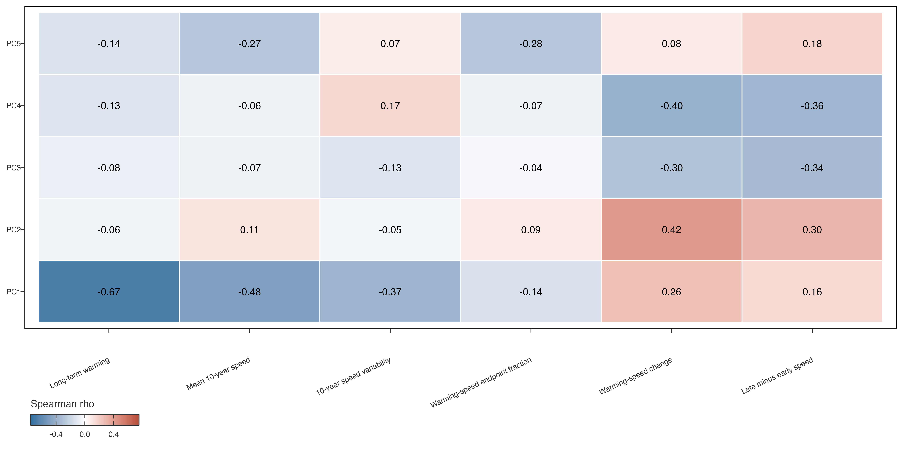
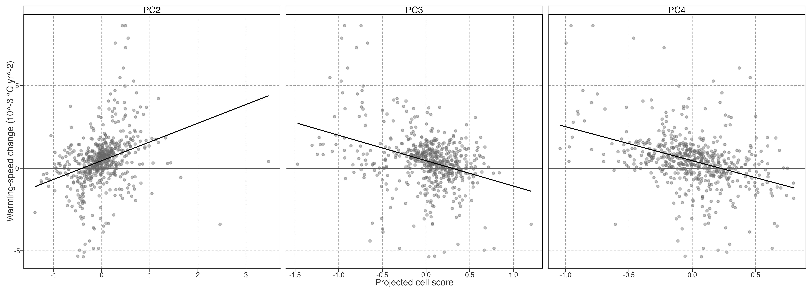
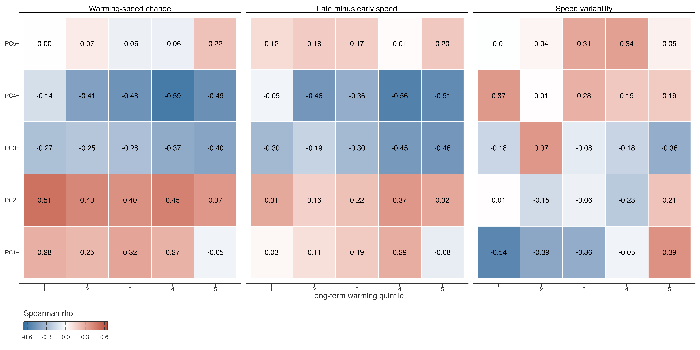
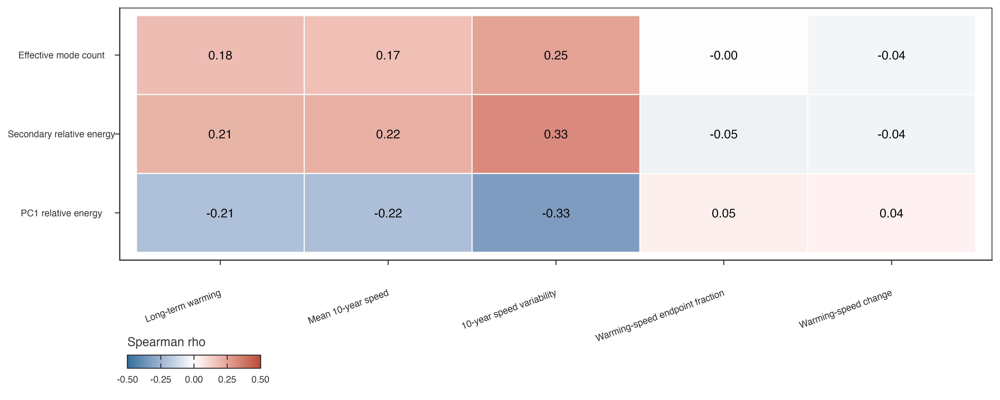

# PCA–Kinematics Bridge

## Purpose and scale

This diagnostic asks whether PCA scores encode only total raw warming magnitude or also the timing of warming. All quantities are first averaged within the same occupied 72 × 21 equal-area cells used to fit PCA. The comparison therefore gives each represented spatial cell one weight; it does not treat lake-dense regions as independent replication.

> 本诊断检验 PCA score 仅反映 raw 总增温幅度，还是也反映增温发生的时间结构。全部指标先在 PCA 的 72×21 占据等面积格网内汇总；每个空间格网一票，不把湖泊密集区当作独立重复样本。

Long-term warming is the raw annual 40-year-equivalent Theil–Sen slope. Warming-speed change is the Sen slope of valid trailing-10-year raw annual warming-speed values. The latter is an operational trajectory-change metric, not instantaneous physical acceleration.

> 长期增温为 raw annual 的 40 年等效 Theil–Sen slope。增温速度变化为有效 raw annual 10 年滑动速度序列的 Sen slope；它是轨迹变化指标，不是瞬时物理加速度。

## Overall descriptive alignment

Figure 1: Cell-level Spearman alignment between PC scores and raw-annual kinematics. Values are descriptive associations among equal-area cells, not independent-observation inference or causal effects.

PC1 is aligned with long-term warming magnitude, as expected for the dominant common trajectory. In contrast, PC2–PC4 have weak alignment with total warming but stronger, oppositely signed alignment with warming-speed change and late-minus-early local speed. This is descriptive evidence that these secondary contrasts encode timing beyond a simple warmer-versus-cooler ordering.

> PC1 与长期总增温幅度对齐，符合其主共同轨迹地位。PC2–PC4 与总增温关系弱，却与增温速度变化及晚期减早期局部速度有更强、且方向相反的关系。这描述它们可能表达超出“更暖／更冷”排序的时间结构。

Figure 2: Cell-level relation between PC2–PC4 scores and raw annual warming-speed change. Lines are least-squares visual summaries only; no independent-cell or causal interpretation is implied.

## Comparable-total-warming check

Cells are divided into quintiles of long-term raw warming. This is a descriptive restriction, not covariate adjustment: it asks whether a score–kinematics relationship persists among cells with broadly comparable total warming. Each quintile contains 114 or 115 cells.

> 格网按 raw 长期增温五分位分层。这不是协变量控制，只是描述性限制：在总增温大致相近的格网中，score–kinematics 关系是否仍存在。每层含 114 或 115 个格网。

Figure 3: Within-long-term-warming-quintile Spearman alignment of PC scores with raw annual kinematics. Persistence of sign across quintiles supports a timing distinction beyond total warming, but does not remove spatial confounding.

PC2 has positive warming-speed-change alignment in every long-term-warming quintile (rho 0.37–0.51); PC3 is negative in every quintile (rho -0.40 to -0.25). PC4 is predominantly negative but less uniform. PC5 has no consistent speed-change relation. This ranks PC2 and PC3 as the clearest temporal-heterogeneity contrasts after PC1; PC4 is a lower-stability candidate, and PC5 remains descriptive spatial detail unless another independent bridge emerges.

> PC2 在全部长期增温分位中均与增温速度变化正相关（rho 0.37–0.51）；PC3 在全部分位中均为负（rho -0.40 至 -0.25）。PC4 主要为负但一致性较弱；PC5 未见稳定速度变化关系。因此 PC2、PC3 是 PC1 之后最清晰的时间异质性对比；PC4 为低稳定性候选，PC5 暂保留为描述性空间细节，除非出现其他独立桥接证据。

## Archived descriptive composition diagnostic

> **Status:** This diagnostic is retained for audit and does not enter the Chapter 2 result hierarchy. Relative score energy and effective-mode count are algebraically coupled summaries; their association with speed variability adds limited scientific information beyond the continuous-score interpretation.

> **状态：** 本诊断保留供审计，不进入 Ch2 结果层级。相对 score energy 与有效模态数是代数耦合汇总；其与速度变异度的关联，在连续 score 解释之外增加的科学信息有限。

Because squared PCA scores are sign-invariant, their relative energy measures whether a cell trajectory is expressed mainly by PC1 or by a mixture of retained modes. This is distinct from the direction of any individual PC score.

> PCA score 平方不受正负号影响；其相对能量表示格网轨迹主要由 PC1 表达，还是由多个保留模态混合表达。这不同于任一单独 PC score 的方向。

Figure 4: Cell-level Spearman alignment between continuous PCA mode composition and raw annual kinematics. Relative-energy composition is sign-invariant. Associations are descriptive and do not identify a process causing warming-speed variability.

Cells with lower PC1 relative energy have more variable trailing-10-year warming speed (rho -0.33); secondary relative energy and effective mode count show the corresponding positive alignment (0.33 and 0.25). These composition measures have near-zero alignment with warming-speed change itself. Thus a more mixed trajectory is associated with less temporally steady local warming speed, not with a uniform tendency to accelerate or decelerate.

> PC1 相对能量较低的格网，其 10 年增温速度变异度更高（rho -0.33）；次级相对能量与有效模态数相应为正（0.33、0.25）。这些组成指标与增温速度变化本身接近零相关。故更混合的轨迹对应更不均一的局部增温速度，而不是统一地加速或减速。

## Boundary

These figures do not identify why the timing structures occur. Spatial autocorrelation, common geography, and the dependence of reconstructed GLAST LSWT on ERA5-Land-driven FLAKE information all preclude causal or independent-observation inference. A later association stage requires spatially blocked evaluation and reports associations only.

> 本页不识别时间结构为何出现。空间自相关、共同地理背景，以及重建 GLAST LSWT 对 ERA5-Land 驱动 FLAKE 信息的依赖，均排除因果或独立观测推断。后续关联阶段必须空间分块验证，且只报告关联。

Back to top
