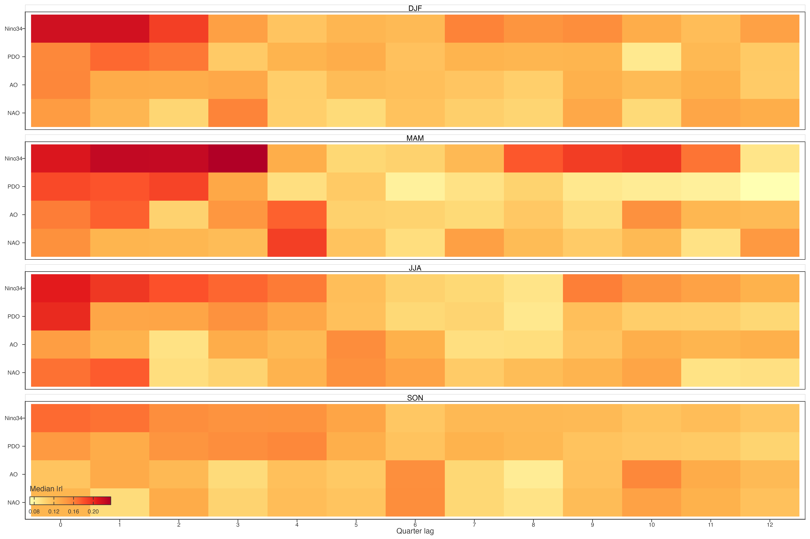
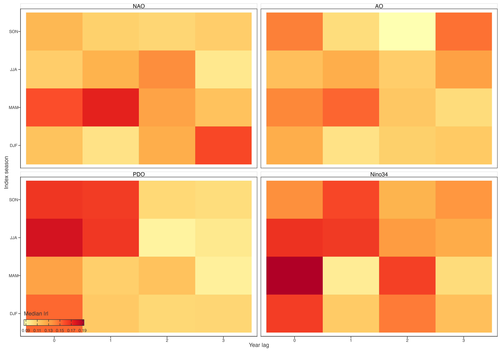
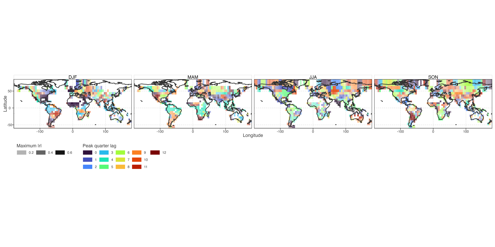
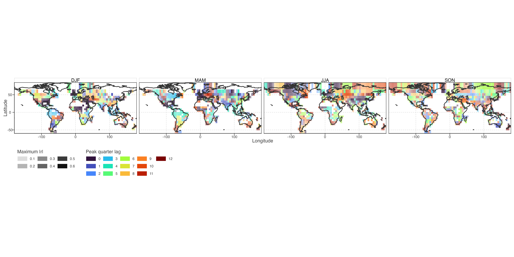
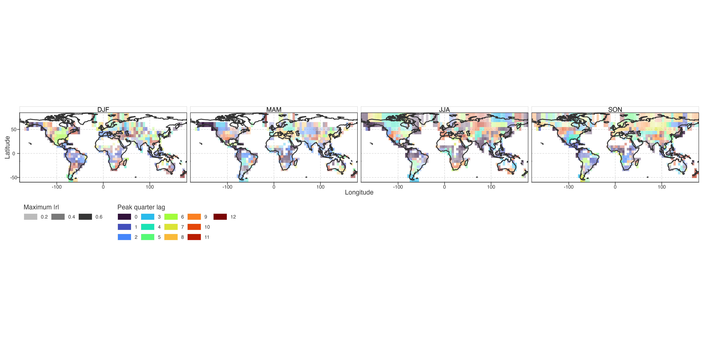
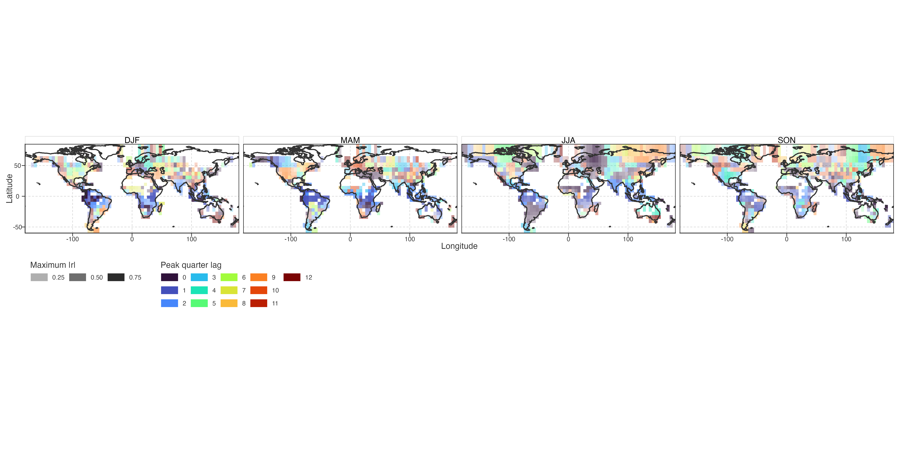

# Seasonal Teleconnection Lag Surface

## Descriptive lag landscape

Step 18 expands the fixed same-season screen into a complete temporal landscape. For each equal-area cell, it first averages lake-level linearly detrended residual LSWT, then correlates that cell-mean residual series with the index. Seasonal responses span quarter lags 0–12; annual responses pair annual LSWT with each predictor season at lags 0–3 years. This is not Step 17’s lake-level Fisher-z estimand.

> Step 18 将固定同季筛查扩展为完整时间图谱。每个等面积格网先平均逐湖线性去趋势 residual LSWT，再与指数相关。季节响应覆盖 0–12 个季度 lag；年均响应与每个指数季节做 0–3 年 lag。它不是 Step 17 的逐湖 Fisher-z estimand。

Figure 1: Median absolute equal-area-cell correlation across quarterly lags. Each panel is a response season; each row is an index. Lag 0 is matching season, lag 1 is preceding season, lag 4 is matching season in previous year. Magnitude does not establish direction, pathway, or an optimal physical lag.

The heatmap is a complete screen, not a ranking device. Broad ridges across adjacent lags indicate persistence or a seasonally extended association; isolated peaks require later lake-level validation. It is therefore used to identify temporal structures worth describing, not to claim that the largest cell correlation is a transport time.

> heatmap 是完整筛查，不是排行榜。相邻 lag 的连续高值可表示持续性或跨季关联；孤立峰值必须做逐湖验证。它用于识别值得描述的时间结构，不把最大相关直接解释为传播时间。

Figure 2: Median absolute equal-area-cell correlation of annual LSWT with each seasonal index at 0–3 year lags. Each panel is an index; predictor season remains explicit because annual LSWT has no single seasonal phase.

## Cell-wise descriptive peak lag

For each index and response season, each cell receives the quarter lag at which its absolute cell-mean association is largest. Colour marks this selected lag; opacity marks its magnitude. A low-opacity cell has no clear dominant lag even though a colour is assigned. Maps therefore reveal regional differences in the *descriptive peak* without treating every peak as a robust delayed response.

> 对每个指数、响应季节，每格取绝对格网关联最大的季度 lag。颜色表示该 lag，透明度表示其强度。低透明度格网没有清晰主导 lag，即使仍被赋色。地图展示区域间“描述性峰值”差异，不把每个峰值当作稳健延迟响应。

Figure 3: NAO descriptive peak quarter lag by response season. Opacity is maximum absolute cell correlation.

Figure 4: AO descriptive peak quarter lag by response season. Opacity is maximum absolute cell correlation.

Figure 5: PDO descriptive peak quarter lag by response season. Opacity is maximum absolute cell correlation.

Figure 6: Niño 3.4 descriptive peak quarter lag by response season. Opacity is maximum absolute cell correlation.

Back to top
