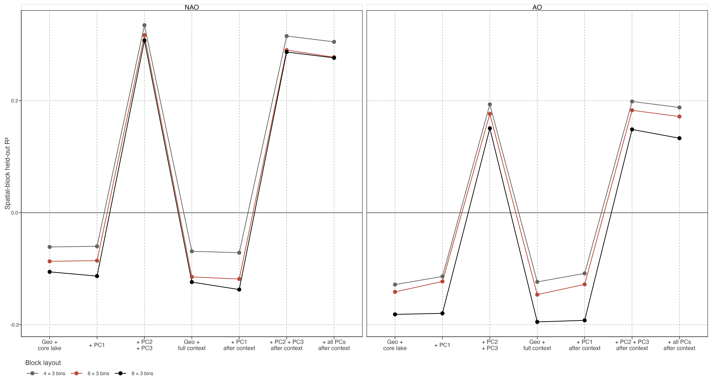
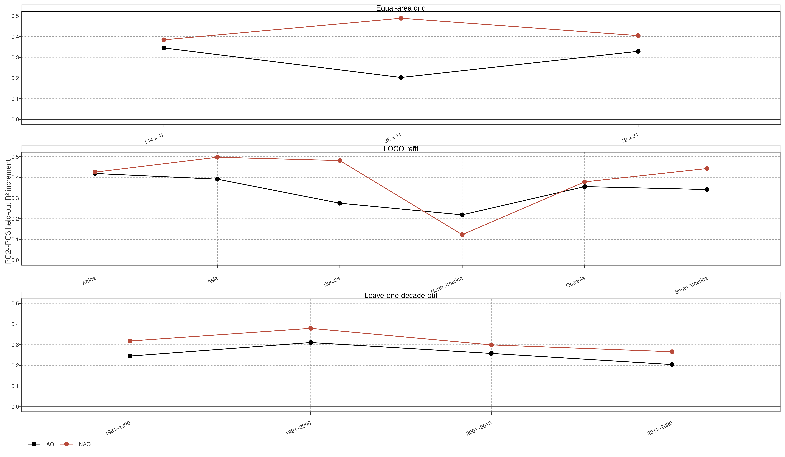

# Lake-Context Exclusion Check for Seasonal Teleconnection Association

## Question

The retained JJA NAO/AO lag-1 result already controls area, mean depth, elevation, and distance to coast. This check asks whether its PC2–PC3 association is instead a proxy for further static lake or watershed context already present in project metadata.

> 保留的 JJA NAO/AO 滞后一年结果已控制面积、平均深度、高程和离海距离。本检验问：PC2–PC3 关联是否只是项目元数据中其他静态湖泊/流域背景的代理。

The expanded context contains log residence time, discharge, watershed area, volume, shoreline development, local terrain slope, and reservoir fraction. `Res_time = -1` and `Slope_100 = -1` are metadata missing codes. Every model uses the same 568 equal-area cells with complete context, so differences cannot result from changing lake coverage.

> 扩展背景包括对数停留时间、流量、流域面积、体积、岸线发育度、局地坡度和水库比例。`Res_time = -1`、`Slope_100 = -1` 是元数据缺失编码。所有模型使用相同的 568 个 context-complete 等面积格网，差异不来自样本覆盖变化。

## Target-grid comparison

Figure 1: Spatial-block held-out R² after adding existing static lake and watershed context. Expanded context does not remove PC2–PC3 gain for either JJA NAO or AO lag-1 association field. All lines use 568 context-complete cells.

Expanded context alone does not predict either association field under spatial hold-out. At reference blocks, NAO changes from \\-0.087\\ with core lake context to \\-0.115\\ with expanded context; AO changes from \\-0.141\\ to \\-0.146\\. PC2–PC3 after expanded context remains positive: \\0.290\\ for NAO and \\0.183\\ for AO. PC1 still gives no gain.

> 扩展背景本身在空间留出下不能预测两种关联场。参考 blocks 中，NAO 从核心湖泊背景的 \\-0.087\\ 变为扩展背景的 \\-0.115\\；AO 从 \\-0.141\\ 变为 \\-0.146\\。扩展背景后 PC2–PC3 仍为正：NAO \\0.290\\、AO \\0.183\\；PC1 仍无增益。

## Stability of the exclusion

Figure 2: PC2–PC3 held-out R² increment over expanded lake context. Positive increments persist across three equal-area grids, leave-one-continent-out PCA refits, and leave-one-decade-out association calculations.

All expanded-context increments remain positive across grids, continent deletions, and decade omissions. Weakest case is NAO after North America is omitted: absolute held-out \\R^2\\ is slightly negative (\\-0.011\\), yet it exceeds expanded-context baseline by \\0.123\\. This excludes one specific alternative only: currently available static lake and watershed context does not reduce the retained association to a geography-plus-morphology proxy.

> 扩展背景后，所有格网、去大洲、去年代增益均为正。最弱是 NAO 去北美：绝对留出 \\R^2\\ 略负（\\-0.011\\），但仍比扩展背景高 \\0.123\\。它只排除一个特定替代解释：现有静态湖泊/流域背景不能将保留关联化约为地理加形态代理。

This remains an exclusion check, not a mechanism. Lake context has been averaged within cells and cannot represent seasonal inflow, mixing, or heat exchange. It does not establish that circulation is the missing cause; it narrows what the PC2–PC3 signal is not explained by.

> 这仍是排除检验，不是机制。湖泊背景已在格网内平均，不能代表季节入流、混合或热交换；它不证明环流是缺失原因，只缩小 PC2–PC3 信号不能被什么解释。

Back to top
