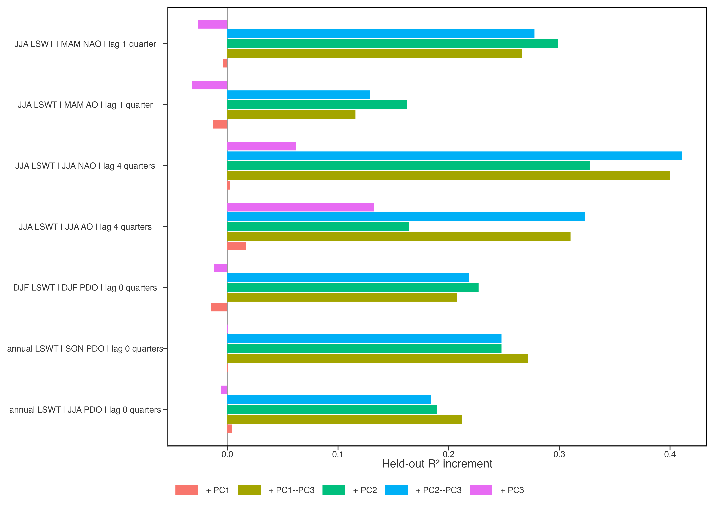
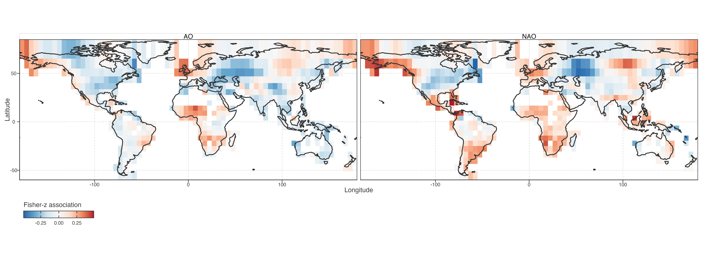
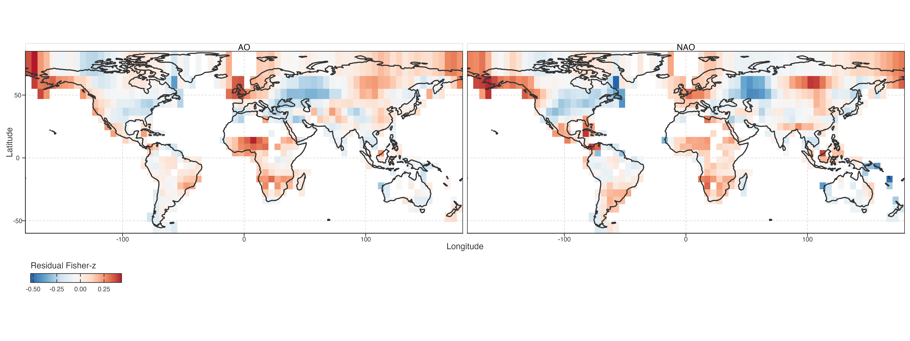
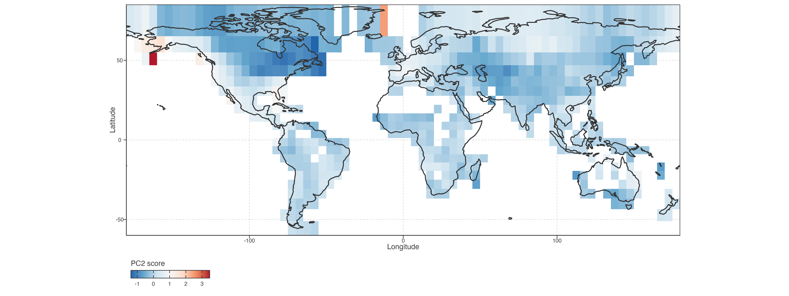
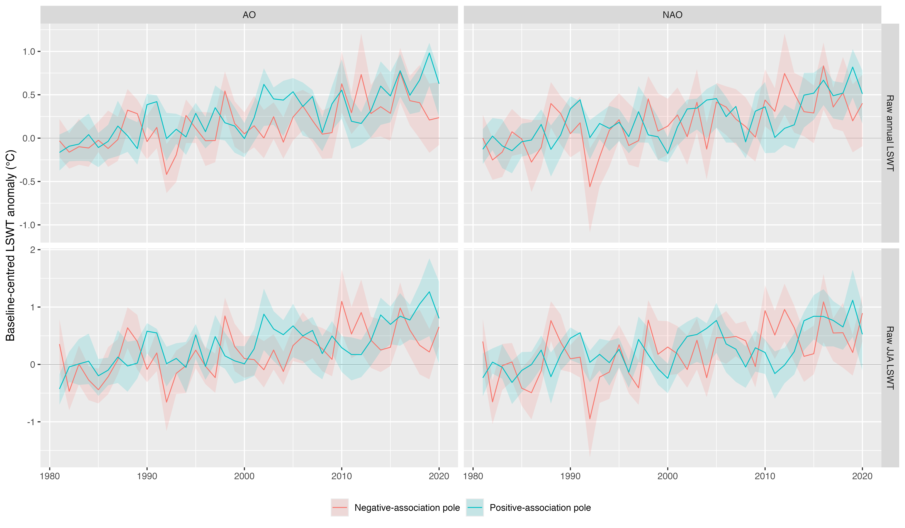

# Selected seasonal teleconnection candidates

## Why this validation exists

Step 18 maps a broad lag surface. Its median absolute cell correlation is a display statistic, not a candidate-ranking statistic: a modest local association can still have a spatial field that aligns strongly with PCA scores. Step 19 therefore fixes seven interpretable season/index/lag candidates and re-estimates lake-level detrended correlations before cell Fisher-z aggregation.

> Step 18 的中位绝对相关仅用于展示，不能用于候选排序。Step 19 固定 7 个具有明确季节和滞后含义的候选，在湖泊层面重算去趋势相关，再聚合为格网 Fisher-z 场。

For every candidate, held-out prediction compares geography and lake morphology alone with additions of PC1, PC2, PC3, and their combinations. A positive increment means that a PCA score pattern helps predict where the lake-temperature sensitivity field is stronger or weaker; it is not a causal effect of the index on lake temperature.

> 每个候选均比较仅地理/湖泊背景模型与加入各 PC 后的空间留出预测。正增量表示 PCA 空间格局有助于预测敏感性场的位置差异，不表示遥相关对湖温的因果效应。

## Baseline score additions

Figure 1: Held-out spatial-prediction increments at the reference equal-area grid.

## Stability checks

The full validation retains only the PC2–PC3 joint addition. It separates an association that stays positive after changing grid resolution and omitting individual decades from one that depends mainly on a single continent. This is a stability screen, not an independent replication because candidates were selected after inspecting Step 18. The heavy grid/LOCO/LODO panel is generated outside the render path because the underlying LODO table contains 2.58 million lake-candidate rows.

> 验证重点是 PC2–PC3 联合增量：跨格网、跨十年仍为正的关联，与主要依赖某一大陆的关联必须分开。候选来自 Step 18 之后，因此这不是独立重复验证。LODO 原表含 258 万行，完整稳定性图在页面外生成，避免渲染阶段反复读取大表。

## Spatial heterogeneity of retained NAO/AO fields

The retained NAO/AO family does not have one global sign. Adjacent cells can have opposite Fisher-z associations: a positive value means warmer detrended JJA anomalies tend to accompany a positive index in the prior JJA; a negative value means the reverse. Geography and lake morphology explain part of this layout, but the residual fields still align with PC2 and PC3.

> 保留的 NAO/AO 关联并非全球同号。相邻格网可有相反 Fisher-z：正值表示当年夏季去趋势湖温偏暖，往往对应上一年夏季指数为正；负值则相反。地理与湖泊形态解释部分格局，但残差场仍与 PC2、PC3 对齐。

### Apparent local sign reversals

Most visible sign boundaries are not neighbouring strong but opposite responses. Across 908 east/north adjacent cell pairs, raw-field neighbour correlations are 0.71 for NAO and 0.73 for AO. At the conservative threshold where both cells have `|Fisher-z| >= 0.15`, only 5 of 213 NAO pairs and 3 of 193 AO pairs have opposite signs. The map therefore contains spatially smooth sensitivity fields with weak-field zero crossings, plus a small number of genuine strong boundaries.

> 大部分颜色交界并非两个相邻区域出现强而相反的响应。908 个东西/南北邻接格网对中，原始场邻接相关：NAO 为 0.71，AO 为 0.73。当两格均满足 `|Fisher-z| >= 0.15`，NAO 仅 213 对中的 5 对、AO 仅 193 对中的 3 对异号。地图主要是连续敏感性场跨越弱零线，只有少数真正强边界。

Figure 2: Signed lake-temperature sensitivity fields for the retained prior-summer NAO/AO family.

The NAO and AO fields agree as a family rather than as identical indices: their cell-wise Spearman correlation is 0.68 for the raw fields and 0.69 after removing the geography/morphology baseline. Their positive and negative regions remain spatially mixed. This supports family-level replication of a heterogeneous sensitivity field, not a globally uniform NAO/AO response.

> NAO 与 AO 场作为同一环流家族具有一致性，但并非相同指数：原始格网场 Spearman 为 0.68；去除地理/形态背景后为 0.69。正、负区域仍相互交错，支持“异质敏感性场的家族复现”，不支持全球同向响应。

Figure 3: Residual NAO/AO sensitivity after continuous geography and lake-morphology adjustment.

Figure 4: PC2 score map on the same equal-area cells as the retained NAO/AO sensitivity fields.

## Trajectory context of the sensitivity field

The poles describe the ends of a continuous signed association field. They are not response classes and do not denote association magnitude. In both NAO and AO maps, positive-association cells have higher mean PC2 scores, while negative-association cells have lower PC2 scores. Their raw annual and JJA trajectories then separate mainly through changing local warming speed: the positive-association pole retains or increases positive late-period speed, whereas the negative-association pole approaches near-zero or negative late-period speed.

> 两端只是连续有符号关联场的展示，不是响应类别，也不表示关联强弱。NAO 和 AO 中，正关联端平均 PC2 更高，负关联端 PC2 更低。两端 raw 年均与 JJA 轨迹的主要分离来自局部增温速度变化：正关联端后期仍保持或提高正速度，负关联端后期接近零或转负。

Figure 5: Raw annual and JJA LSWT anomaly composites at negative and positive association poles of the NAO/AO fields. Lines are equal-cell means; ribbons show cell interquartile ranges.

Figure 6: Trailing 10-year Sen-speed composites at negative and positive association poles of the NAO/AO fields.

## Current interpretation boundary

The prior-summer NAO/AO to current-summer lake-temperature field is the strongest retained family: PC1 adds almost nothing, whereas PC2–PC3 adds positive held-out skill at every tested grid, continent omission, and decade omission. It supports a narrower result: the secondary low-frequency trajectory geometry, especially PC2, co-locates with heterogeneous sensitivity to the NAO/AO family. It does not show that NAO or AO produces PC2 or PC3.

> 上一年夏季 NAO/AO 与当年夏季湖温敏感性场，是目前最稳的关联族：PC1 几乎没有增益，PC2–PC3 在全部格网、剔除大陆、剔除十年测试中保持正增益。它支持“次级低频轨迹几何，特别是 PC2，与 NAO/AO 敏感性空间异质性共定位”；不支持 NAO/AO 产生 PC2 或 PC3 的因果结论。

The spring-to-summer NAO field and annual PDO fields also carry PC2-related signal, but both weaken sharply when North America is omitted. DJF PDO remains a cold-season exploratory observation because its lake coverage is restricted by frozen states. These branches remain descriptive and should not be elevated to the manuscript’s central claim.

> 春季到夏季 NAO 场和年均 PDO 场也有 PC2 信号，但剔除北美后显著减弱。DJF PDO 受冰期限制，有效湖泊覆盖较窄；都只能作为描述性结果，不能进入文章核心结论。

Back to top
