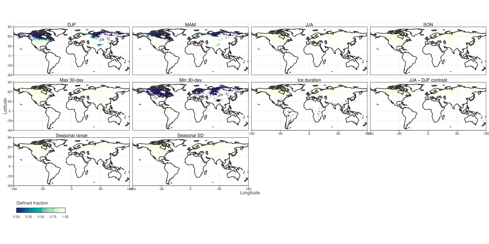
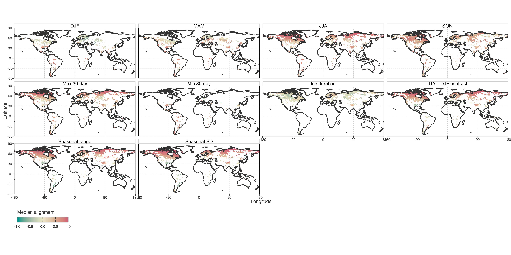
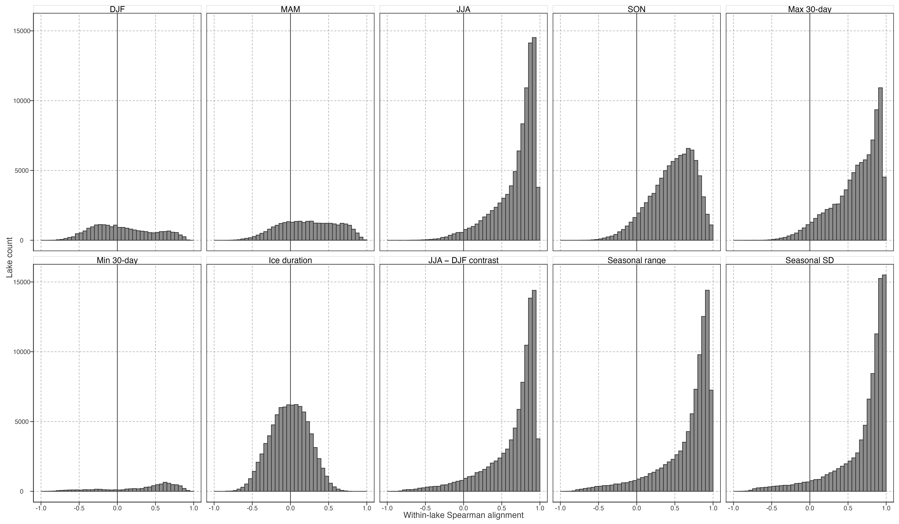
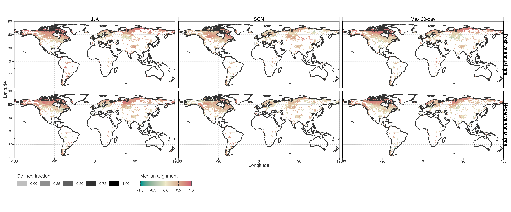
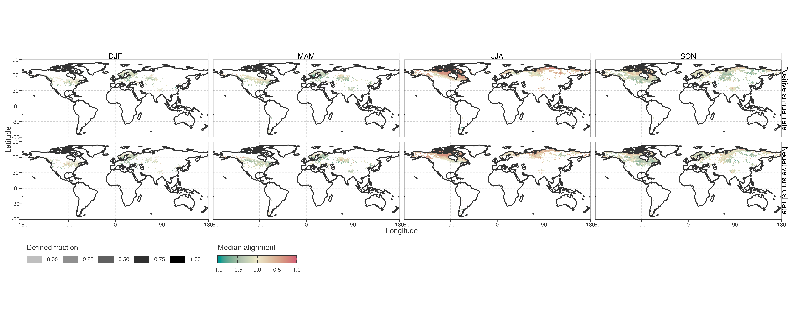
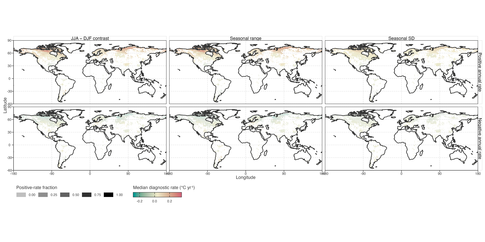
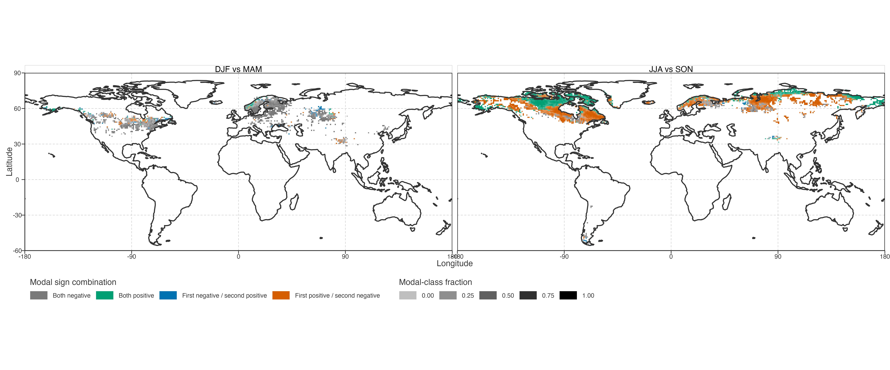
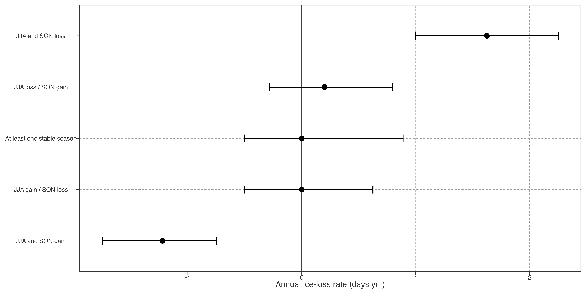

# Seasonal, Extreme-Temperature, and Ice Dynamics

## Question and boundary

This module asks how each lake’s changing local annual warming rate co-varies through time with seasonal rates, warm/cold 30-day temperature rates, and ice-duration state. It does not begin by classifying lakes as full-period, late-period, or decelerating cooling types.

> 本模块考察每个湖的局部年增温率如何随时间与季节速率、最暖/最冷 30 天温度速率及冰期状态共同变化。不以全期、末段或减速降温标签作为入口。

The module is descriptive. A synchronised seasonal rate is not a formal contribution to annual warming, because Theil–Sen slopes are not additive across annual and seasonal series. A temperature–ice correlation is not a causal response estimate, and neither pattern identifies glacier meltwater.

> 本模块是描述性的。季节 Sen slope 不能相加为年均 slope，故同步变化不是严格贡献；温度—冰期相关不是因果响应，也不能识别冰川融水。

## Common endpoint axis

All temperature series use a trailing 10-year Theil–Sen slope, indexed to its endpoint year. The 1981–1990 slope is stored at 1990, producing a common 1990–2020 local-rate axis for annual, DJF, MAM, JJA, SON, annual maximum 30-day temperature, and annual minimum 30-day temperature.

> 所有温度序列均用终点对齐的 10 年 Theil–Sen slope；1981–1990 窗口记为 1990。annual、四季、最暖 30 天和最冷 30 天因此共享 1990–2020 轴。

Annual ice days use a trailing 10-year arithmetic mean on that same endpoint axis. Ice duration is treated as a state background, not converted into a warming-speed analogue.

> 年冰日使用同一终点轴的 10 年滑动均值。冰期是状态背景，不被强行转为“增温速度”。

In the current producer, an all-ice / no-valid-nonfreezing aggregation period is recorded as finite `0.0 °C`; it is not an `NA`. Consequently, an undefined Spearman coefficient can arise from a constant rolling-rate sequence, especially for persistently frozen seasons. Step 14 records this separately from the number of endpoint pairs.

> 当前 producer 将全冰或无有效非冻结日时段记为有限的 `0.0 °C`，不记为 `NA`。因此 Spearman 不可定义可能来自恒定的滚动 rate，尤其是持续冻结季节；Step 14 将其与 endpoint 对数分开记录。

## Diagnostic layers

### Seasonal dynamics

For each lake and each season, retain the full local-rate sequence and calculate its cross-endpoint Spearman alignment with annual local rate:

\\ \rho_s=\operatorname{Spearman}(r\_{\mathrm{annual}}(t),r_s(t)). \\

Report all four values rather than assigning a single dominant season. Maps describe continuous spatial variation in seasonal alignment and in endpoint-rate change. A summer-associated pattern requires JJA to be distinct relative to DJF, MAM, and SON, not merely negative.

> 每湖、每季保留完整局部 rate 序列，并计算其与 annual rate 的跨终点 Spearman 对齐。四季均报告，不强制指定单一主导季节。夏季关联必须相对其他季节具有特异性，不能只看 JJA 为负。

### Extreme-temperature dynamics

The same analysis is applied to annual maximum and minimum 30-day temperatures. Their alignments with annual rate distinguish whether changing peak warmth or changing cold-period warmth more closely co-varies with a lake’s local annual-rate history.

> 对年最暖/最冷 30 天温度做同样分析。它们与 annual rate 的对齐可描述局部年速率历史更接近 peak warmth 还是 cold-period warmth 的变化。

The occurrence dates of those 30-day periods are retained for later circular-date analysis but are not part of the first-pass inference.

> 两个 30 天窗口的出现日期保留给后续环形日期分析，暂不进入首轮推断。

### Ice-duration dynamics

For each lake, calculate:

\\ \rho\_{\mathrm{ice}}= \operatorname{Spearman}(r\_{\mathrm{annual}}(t),\bar I\_{10}(t)). \\

Also retain baseline ice duration and 1990–2020 ice-state change. Interpret positive, negative, and near-zero values as distinct response patterns, not as evidence for a universal ice mechanism.

> 每湖计算 annual rate 与 10 年冰日均值的 Spearman 对齐，并保留基线冰期和 1990–2020 冰态变化。正、负、近零都是不同响应模式，不代表统一冰机制。

## Statistical boundary

All 31 endpoints share overlapping observations. Cross-endpoint correlations are therefore descriptive alignment measures: no ordinary correlation p-values, causal language, or strict seasonal contribution fractions will be reported. Spatial aggregation requires a minimum lake count per cell and reports distributional summaries rather than area-weighted global fields.

> 31 个 endpoint 高度重叠。相关性仅描述对齐结构：不报告普通相关 p 值、不作因果表述、不计算严格季节贡献比例。空间图需设置每格最小湖泊数，报告分布汇总，不作面积加权全球场。

## Warming- and cooling-state branches

Overall alignment can conceal different behaviour when annual local rate is positive versus negative. Step 14 therefore repeats each seasonal and extreme-temperature comparison using only endpoints with positive annual rate, and only endpoints with negative annual rate. Each branch requires at least eight finite endpoint pairs and non-constant ranked values.

> overall 对齐可能掩盖 annual rate 为正与为负时的不同表现。Step 14 因此分别只用 annual rate 为正、只用 annual rate 为负的 endpoint 重算季节与极值对齐。每个分支至少需 8 个有限 endpoint 对，且秩序列不能恒定。

These sign-conditioned coefficients quantify relative co-variation within warming or cooling states. They do not identify which season contributes an additive share of annual warming, because rolling Theil–Sen rates across seasonal series are not decomposable in that way.

> 这些条件相关量化增温或降温状态内的相对协变，不能识别某季节对 annual warming 的可加贡献；不同季节的滚动 Theil–Sen rate 不可这样分解。

## Seasonal ice branch

Monthly ice-day counts are summed into DJF, MAM, JJA, and SON series using the same DJF year convention as temperature. For each season, retain a trailing-10-year ice-duration mean and an ice-loss rate, defined as the negative trailing-10-year Sen slope of ice days. Positive ice-loss rate means fewer seasonal ice days per year.

> 月冰日按与温度一致的 DJF 年份规则汇总为四季冰日。每季保留 10 年冰期均值与冰损失 rate；后者为冰日 10 年 Sen slope 取负，正值表示该季每年冰日减少。

Annual-rate alignment with seasonal ice loss is a targeted descriptive test of synchronous thermal-rate and ice-loss change. It is more appropriate than treating a persistent winter/spring `0.0 °C` frozen state as a continuously varying thermal signal. It remains neither a glacier-meltwater test nor causal evidence.

> annual rate 与季节冰损失的对齐用于描述同步热速率与失冰变化；相比把持续冬春 `0.0 °C` 冻结状态当连续温度信号更合适。但它仍不是冰川融水检验或因果证据。

## Outputs and decision gate

Step 14 produces lake-by-endpoint rate/state files and a per-lake alignment summary. The first outputs are:

1.  multi-series trajectories for representative lakes and spatially aggregated dynamics;
2.  maps of seasonal, maximum/minimum-temperature, and ice-state alignment;
3.  continuous distributions of endpoint-rate and ice-state change.

> Step 14 输出逐湖逐终点 rate/state 文件和对齐摘要。首轮产物是代表湖多序列轨迹、空间汇总动态图、季节/极值/冰态对齐地图，以及 endpoint 变化的连续分布。

## First-pass spatial diagnostics

Before interpreting a correlation map, its availability must be shown. Figure [Figure 1](#fig-alignment-availability) gives the fraction of lakes in each occupied 1° cell for which the annual-rate comparison is defined. A low fraction normally indicates a constant seasonal, extreme-temperature, or ice-state sequence; it does not indicate missing temperature observations.

> 解释相关地图前，需先显示其可定义性。[Figure 1](#fig-alignment-availability) 给出每个有湖的 1° 格网中 annual-rate 比较可定义的湖泊比例。低比例通常表示季节、极值或冰态序列恒定，并非温度观测缺失。

Figure 1: Fraction of lakes per 1° cell with a defined annual-rate alignment. Cells contain at least three lakes.

Where at least three correlations are defined, Figure [Figure 2](#fig-alignment-strength) maps the within-cell median alignment. This is a descriptive spatial aggregation, not an area-weighted global field and not a causal seasonal contribution map.

> 对至少有 3 个可定义相关的格网，[Figure 2](#fig-alignment-strength) 显示其中位对齐。它是描述性空间汇总，不是面积加权全球场，也不是季节因果贡献图。

Figure 2: Median within-lake Spearman alignment between annual local warming rate and each rolling seasonal, extreme-temperature, or ice-state sequence, summarized within 1° cells.

Figure [Figure 3](#fig-alignment-distribution) retains the lake-level distribution behind these medians. It distinguishes a globally weak comparison from a geographically mixed comparison with positive and negative modes that cancel in the median.

> [Figure 3](#fig-alignment-distribution) 保留这些中位数背后的湖泊尺度分布。它区分“全球普遍弱”与“正负模式并存、在中位数中抵消”的情况。

Figure 3: Distribution of within-lake Spearman alignment between annual local rate and seasonal, extreme-temperature, ice-state, or thermal-asymmetry rate. Only defined correlations enter each panel.

At the lake level, JJA, SON, and maximum-30-day alignments are defined for 99.6%, 99.9%, and 99.3% of lakes, respectively. Their median alignments are 0.79, 0.51, and 0.68. Thus, across the broad set of lakes where a comparison is possible, local annual-rate dynamics most often co-vary with warm-season and warm-extreme dynamics.

> 湖泊尺度上，JJA、SON 与最暖 30 天对齐分别在 99.6%、99.9%、99.3% 湖泊中可定义；中位相关分别为 0.79、0.51、0.68。故在可比较湖泊中，annual rate 更常与暖季及暖极值动态协变。

DJF, MAM, and especially minimum-30-day comparisons are conditional branches, not globally comparable layers: their alignment is defined for only 24.1%, 32.8%, and 8.4% of lakes. Persistent `0.0 °C` frozen states make their local-rate sequences constant. These layers remain useful for the subset with temporal variation, but cannot be used to generalise about global cold-season control.

> DJF、MAM，尤其最冷 30 天是条件性分支，不是可全球比较的层：可定义比例仅为 24.1%、32.8%、8.4%。持续 `0.0 °C` 冻结状态使局部 rate 恒定。它们仍可用于有时间变异的子集，但不能外推为全球冷季主导结论。

The ice-state alignment is defined for 94.1% of lakes, but its median is -0.01. This does not support a single global ice-duration response. The spatial field should instead be used to locate contrasting response settings for later, explicitly conditional investigation.

> 冰态对齐在 94.1% 湖泊中可定义，但中位数仅为 -0.01。这不支持单一的全球冰期响应；空间图应只用于定位对比性响应环境，供后续有条件地深入调查。

## Sign-conditioned temperature alignment

Among endpoints with positive annual local rate, median alignment is 0.60 for JJA, 0.39 for SON, and 0.50 for maximum 30-day temperature. For negative annual-rate endpoints, corresponding values are 0.58, 0.29, and 0.50.

> 在 annual local rate 为正的 endpoint 中，JJA、SON、最暖 30 天的中位对齐分别为 0.60、0.39、0.50；annual rate 为负时分别为 0.58、0.29、0.50。

Figure [Figure 4](#fig-sign-conditioned-temperature) maps these two conditional profiles. Tile opacity is the fraction of lakes in the cell with a defined conditional correlation, preventing sparse branches from looking equally certain.

> [Figure 4](#fig-sign-conditioned-temperature) 显示两种条件 profile 的空间分布。格网透明度表示其中条件相关可定义的湖泊比例，避免稀疏分支看似同样可靠。

Figure 4: Median conditional Spearman alignment between annual local rate and warm-season or warm-extreme rate. Rows condition on the sign of annual local rate; opacity shows fraction of lakes with a defined conditional alignment.

## Seasonal ice-loss alignment

The seasonal ice-loss branch replaces frozen-season temperature rate with a directly interpretable ice-change sequence. For positive annual-rate endpoints, JJA ice-loss alignment has median 0.42; for negative annual-rate endpoints it is 0.35. Figure [Figure 5](#fig-sign-conditioned-ice) shows whether this and the winter/spring branches are geographically coherent.

> 季节冰损失分支以可解释的冰变化序列替代冻结季节 temperature rate。annual rate 为正时，JJA 冰损失对齐中位数为 0.42；annual rate 为负时为 0.35。[Figure 5](#fig-sign-conditioned-ice) 用于查看这一模式及冬春分支是否具有空间连贯性。

Figure 5: Median conditional Spearman alignment between annual local rate and seasonal ice-loss rate. Positive ice loss means fewer ice days yr⁻¹; opacity shows fraction of lakes with a defined conditional alignment.

## Seasonal thermal asymmetry

Correlation maps ask whether two local-rate sequences co-vary. They do not show whether a particular 10-year annual change is thermally concentrated in the warm or cold part of the year. Step 14 therefore adds three annual thermal-state diagnostics before calculating their endpoint-aligned 10-year Sen rates: fixed warm–cold contrast (`JJA − DJF`), four-season range, and four-season standard deviation. A positive contrast-rate means JJA warms relative to DJF; a negative value means the observable JJA–DJF thermal contrast contracts. Range and standard-deviation rates test whether the conclusion depends on fixing JJA and DJF as the warm/cold pair.

> 相关图回答两个 rate 是否协变，不能显示某个 10 年年均变化在暖季还是冷季更集中。故 Step 14 新增 JJA−DJF 热对比、四季极差和四季标准差，并对其计算终点对齐的 10 年 Sen rate。对比 rate 为正表示 JJA 相对 DJF 增温更快；为负表示可观测的 JJA−DJF 热差收敛。极差与标准差用于检验结论是否依赖固定 JJA/DJF。

These measures are seasonal asymmetry diagnostics, not additive seasonal contributions. For ice-covered lakes, winter temperatures can remain fixed at `0 °C`; a contracting contrast then describes the observed LSWT seasonal cycle, while seasonal ice-day changes retain the separate frozen-state information.

> 这些量是季节不均衡诊断，不是可加的季节贡献。冰湖冬季温度可固定在 `0 °C`；此时热差收敛描述的是可观测 LSWT 年内循环，冻结状态仍需由季节冰日单独表达。

For endpoints with positive annual rate, a positive thermal-asymmetry rate identifies warmer-season-relative amplification; a negative rate identifies cold-season-relative amplification. For endpoints with negative annual rate, signs reverse their interpretation: positive asymmetry means cold-season-relative cooling, while negative asymmetry means warm-season-relative cooling. The terms *relative* and *observed* are essential: both seasons can warm or cool in any quadrant.

> 对 annual rate 为正的 endpoint，热不均衡 rate 为正表示暖季相对强化，为负表示冷季相对强化；对 annual rate 为负的 endpoint，正值表示冷季相对降温更快，负值表示暖季相对降温更快。必须保留“相对”和“可观测”：每个象限中各季均可能同向变化。

Figure [Figure 6](#fig-thermal-asymmetry-space) maps the within-lake median thermal-asymmetry rate among positive and negative annual-rate endpoints. Tile fill is the median across lakes in each 1° cell, and opacity records the within-lake median fraction of endpoints with positive asymmetry. This separates spatial heterogeneity from a global median that can mix opposite response modes.

> [Figure 6](#fig-thermal-asymmetry-space) 显示正／负 annual-rate endpoint 内，每湖热不均衡 rate 的中位数，再按 1° 格网汇总。填色为格网内中位 rate，透明度为各湖“热不均衡为正” endpoint 比例的中位数。这样可避免全球中位数混合相反响应模式。

Figure 6: Seasonal thermal-asymmetry rates conditional on annual local-rate sign. Fill: within-cell median of each lake’s median endpoint rate; opacity: within-cell median fraction of positive diagnostic rates. Positive JJA − DJF change means warm-season-relative amplification.

At lake level, the positive-annual-rate branch has median JJA–DJF contrast rate 0.10 °C yr⁻¹; the negative-annual-rate branch has -0.06 °C yr⁻¹. These global summaries are only reference values; interpretation should follow the spatially organised sign mixtures in [Figure 6](#fig-thermal-asymmetry-space).

> 湖泊尺度上，正 annual-rate 分支的 JJA−DJF 热对比 rate 中位数为 0.10 °C yr⁻¹；负分支为 -0.06 °C yr⁻¹。这些全球汇总只作参照；解释应回到 [Figure 6](#fig-thermal-asymmetry-space) 中空间组织化的正负混合。

## Paired seasonal ice alignments

Different seasonal ice-loss medians can arise either because the same lakes have opposite seasonal alignments or because each seasonal comparison is defined for a different lake population. These alternatives are tested directly in the overlap set: pair JJA with SON, and DJF with MAM, only where both within-lake annual-rate alignments are defined.

> 不同季节冰损失的中位对齐差异，可能来自同一湖在不同季节相反，也可能只是不同季节的可定义湖群不同。故直接在重叠样本检验 JJA–SON 与 DJF–MAM：仅保留两季 annual-rate 对齐都可定义的湖泊。

The JJA–SON pair contains 70,078 lakes; its between-season Spearman association is 0.55, and 51.0% have opposite signs. The DJF–MAM overlap contains 15,236 lakes, with corresponding values 0.40 and 23.3%.

> JJA–SON 重叠样本有 70,078 湖；两季间 Spearman 为 0.55，符号相反比例为 51.0%。DJF–MAM 重叠样本有 15,236 湖，对应为 0.40 和 23.3%。

Figure [Figure 7](#fig-paired-ice-alignment-space) maps the modal sign combination within each occupied 1° cell. Opacity is the share of lakes belonging to that modal combination. It distinguishes genuinely mixed local seasonal responses from broad cells dominated by one paired response pattern.

> [Figure 7](#fig-paired-ice-alignment-space) 显示每个 1° 格网中最常见的季节冰对齐符号组合；透明度为该组合在格网中的湖泊比例。它区分同地混合的季节响应与被单一组合主导的格网。

Figure 7: Modal paired sign combination of annual-rate alignment with seasonal ice-loss rate within 1° cells. Only lakes with both seasonal alignments defined enter each pair; opacity is modal-class fraction.

For JJA–SON, opposite signs are not a minor tail: the modal cross-season pattern is positive JJA alignment and negative SON alignment. Thus the positive global JJA median and slightly negative SON median do not describe one uniform annual-ice response; they combine spatially organised seasonal phase differences. DJF–MAM is more often jointly negative, but its non-zero opposite-sign branch likewise prevents a universal winter/spring ice interpretation.

> 对 JJA–SON，异号不是小尾部：最常见模式是 JJA 对齐为正、SON 对齐为负。因此 JJA 的全球正中位数与 SON 的略负中位数并非单一统一冰响应，而是空间组织化的季节相位差。DJF–MAM 更常同时为负，但异号分支也排除了统一的冬春冰期解释。

## Direct JJA–SON ice-loss configurations

The preceding paired analysis compares *correlations with annual temperature rate*; it cannot determine whether JJA and SON ice days themselves change in opposite directions. This direct diagnostic instead classifies every lake-endpoint pair by the signs of its JJA and SON ice-loss rates, then reports the direct annual ice-loss rate in the same endpoint. Positive ice loss means fewer ice days per year; negative ice loss means more ice days per year. JJA and SON are calendar seasons: their warm/cold interpretation is Northern-Hemisphere-specific and must be stratified by hemisphere before phenological inference.

> 前述配对分析比较的是“与 annual temperature rate 的相关”，不能判断 JJA 与 SON 冰日本身是否反向变化。本节直接按每个湖—endpoint 的 JJA、SON 冰损失 rate 符号分类，并报告同 endpoint 的全年冰损失 rate。正值表示每年冰日减少；负值表示每年冰日增加。JJA/SON 是日历季节；在南半球其暖冷含义相反，任何物候解释必须先分半球。

The `JJA and SON loss` configuration has median annual ice loss 1.62 days yr⁻¹ (IQR 1.00 to 2.25). The opposite direct configurations are near annual balance: `JJA loss / SON gain` has median 0.20, and `JJA gain / SON loss` has median -0.00 days yr⁻¹.

> `JJA and SON loss` 的全年冰损失中位数为 1.62 天 yr⁻¹（IQR：1.00 至 2.25）。两种直接反向组合接近全年平衡：`JJA loss / SON gain` 中位数为 0.20，`JJA gain / SON loss` 为 -0.00 天 yr⁻¹。

Figure [Figure 8](#fig-direct-ice-phase) tests the proposed distinction without imposing an arbitrary annual-loss threshold. Joint JJA–SON loss is consistent with overall shortening; opposite direct signs are consistent with calendar-season redistribution. They do not by themselves prove a delayed freeze-up or earlier break-up, which requires monthly or daily transition-date analysis within hemisphere.

> [Figure 8](#fig-direct-ice-phase) 不设任意全年失冰阈值，直接检验上述区分。JJA–SON 同时失冰与全年缩短一致；两季直接异号与日历季节再分配一致。但它们本身不能证明冻结后移或融化提前，后者需要分半球的逐月或逐日转折日期分析。

Figure 8: Direct annual ice-loss rate conditional on the signs of JJA and SON ice-loss rates. Points are medians; intervals are interquartile ranges across lake-endpoint observations. Positive means fewer annual ice days yr⁻¹.

Back to top
