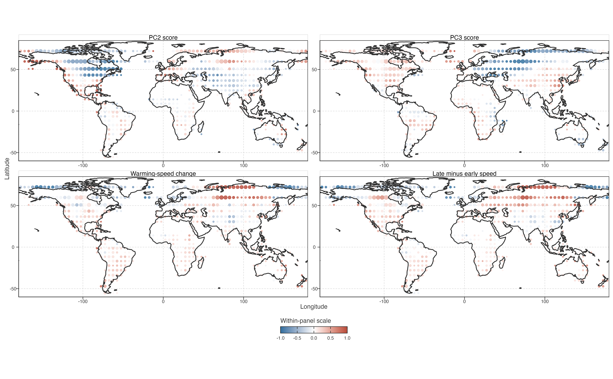
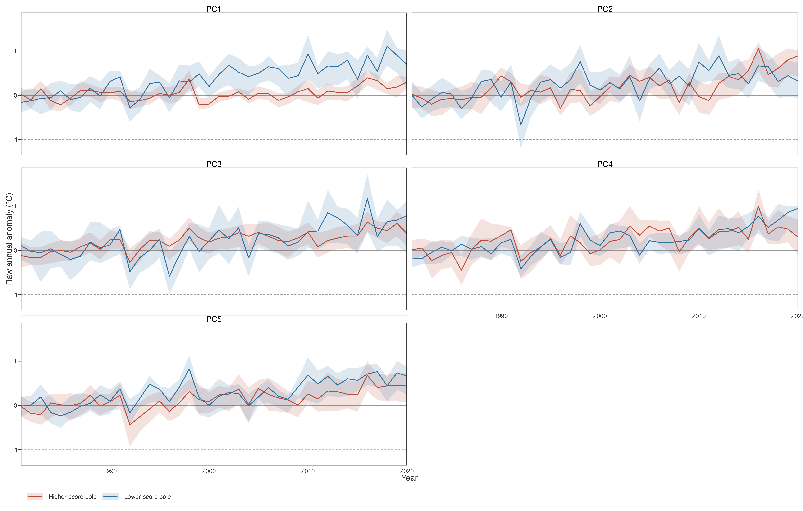
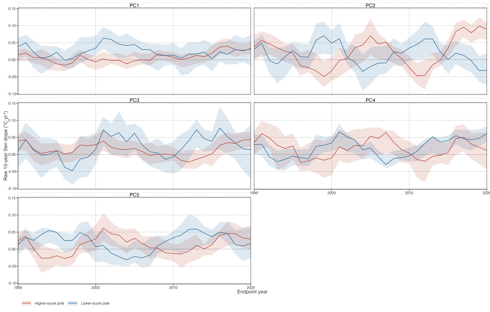
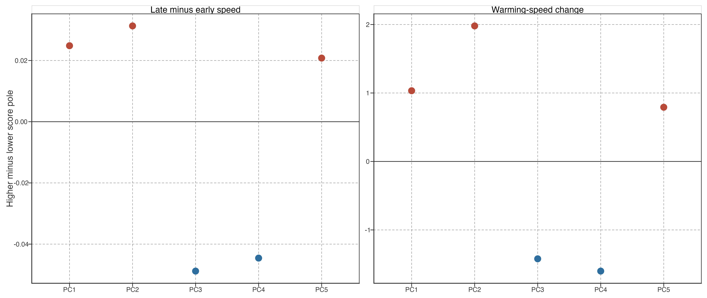

# PCA Pathways in Raw Local-Rate Space

## Purpose

This diagnostic places PCA scores and raw local-rate histories in the same equal-area cells. It asks a limited descriptive question: where cells express different low-frequency score contrasts, do their **raw** ten-year rate histories also differ? It does not test a mechanism, create trajectory types, or claim that a PC causes local acceleration, weakening, or stalling.

> 本诊断将 PCA score 与 raw 局部速度历史放入同一等面积格网。问题有限：低频 score 对比不同的格网，其 **raw** 十年速度历史是否也不同？不检验机制、不创建轨迹类型，也不称 PC 导致局地加速、减弱或停滞。

## Spatial co-location

Figure 1: Same-cell spatial context for PC2/PC3 scores and raw local-rate metrics. Every panel has its own symmetric 2nd–98th-percentile colour limit; colours are comparable only within a panel.

The four panels should be read as co-location, not as a pixelwise causal map. PC2 and PC3 organise broad but non-identical spatial contrasts. Raw warming-speed change and the direct late-minus-early rate contrast also have strongly patchy spatial structure. No one PC map is identical to either raw rate map. This is expected: a cell trajectory combines several score-loading terms, while raw rates retain unsmoothed annual variability.

> 四图应读作空间共定位，不是逐像元因果图。PC2、PC3 组织广泛但不相同的空间对比；raw 增温速度变化与早晚速度差也高度斑块化。任一 PC 图都不等同于任一 raw 速度图，符合预期：格网轨迹由多个 score–loading 项组合，而 raw 速度保留未平滑年际变化。

## Raw trajectories at continuous score poles

For each PC separately, its lower and higher score poles are the lowest and highest cell quintiles. These are display anchors on a continuous axis, not classes. The curves average baseline-centred raw annual LSWT in the selected cells; ribbons show the cell-level interquartile range.

> 每个 PC 分别取最低、最高格网五分位作为 score 两端。它们只是连续轴上的展示锚点，不是类别。曲线为选中格网的基线中心化 raw 年均 LSWT 均值，带状为格网四分位距。

Figure 2: Raw annual LSWT anomaly trajectories at lower and higher PCA-score poles. Poles are score quintiles within each component, not discrete lake types.

The pole curves recover the temporal contrasts already visible in PCA loadings, but in the unsmoothed raw representation. PC1 poles mainly separate the common warming background. PC2 and PC3 poles differ most clearly in the relative timing of their late-period rise. PC4 and PC5 also show raw differences, but their lower LOCO stability prevents elevating them to the same result level. This is representation agreement, not independent validation: both representations derive from the same GLAST record.

> pole 曲线在未平滑 raw 表征中重现 PCA loading 已显示的时间对比。PC1 两端主要分离共同增温背景；PC2、PC3 两端最清楚地表现为后期上升相对时机不同。PC4、PC5 也有 raw 差异，但 LOCO 稳定性较低，不提升至同一结果层级。这是表征一致，不是独立验证：两者均来自同一 GLAST 记录。

Figure 3: Raw trailing-10-year Sen-rate histories at lower and higher PCA-score poles. Poles are display anchors, not trajectory categories.

## What this does and does not establish

Figure 4: Higher-minus-lower score-pole differences in raw local-rate summaries. Positive values mean that the higher-score pole has a larger mean metric.

Within the reference global fit, PC2 and PC3 provide the clearest opposing score-pole contrasts in raw local-rate histories after PC1. This helps describe heterogeneity: cells sharing comparable broad warming can still follow different local-rate histories, and those histories are geographically organised. It does **not** establish a globally invariant PC2–PC3 decomposition of rate strengthening or stalling. The stricter LOCO rate-pole test fails after omitting Europe or North America; see [PCA–Kinematics Bridge](../../../explorations/warming-temporal-pathways/investigations/pca-kinematics-bridge.llms.md).

> 在参考全球拟合中，除 PC1 外，PC2、PC3 给出最清晰且相反的 raw 局部速度 pole 对比。这有助于描述异质性：广义增温相近的格网仍可经历不同局部速度历史，且这些历史具有空间组织。但它**不**建立 globally invariant 的 PC2–PC3 速度增强或停滞分解。更严格 LOCO rate-pole 检验在去欧洲或北美后失败，见 PCA–Kinematics Bridge。

Back to top
