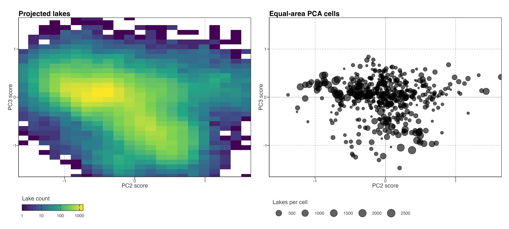
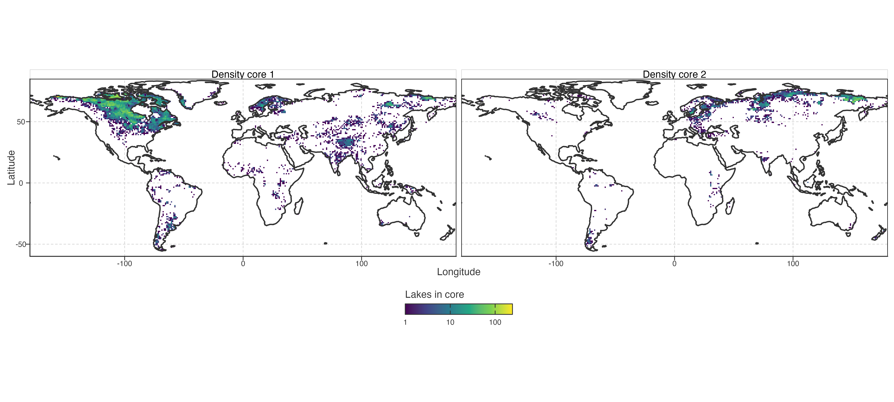

# PC2–PC3 Score-Space Density

## Lake count versus represented spatial cells

PCA is fitted to equal-area cell means, but each lake receives a projected score on the fixed cell-PCA axes. The left panel therefore shows where sampled **lakes** are concentrated in PC2–PC3 score space. The right panel shows the 573 represented equal-area cells, each with one vote in PCA fitting. Lake-count density is not an estimate of the fraction of global lake area or geography.

> PCA 拟合于等面积格网均值，但每个湖都投影到固定格网 PCA 轴。左图显示抽样**湖泊**在 PC2–PC3 score 空间中的集中位置；右图为 573 个参与 PCA 拟合的等面积格网，每格一票。湖泊计数密度不代表全球湖面积或地理面积占比。

Figure 1: PC2–PC3 score-space distribution of projected lakes and equal-area PCA cells. Lake bins encode log10 lake count; cell point area encodes the number of lakes represented by each cell. Axes are shared.

The figure is a distribution diagnostic. It can reveal dense cores, sparse tails, and whether lake abundance is concentrated in a limited part of the secondary score plane. It does not by itself define trajectory groups, select a cluster count, or identify a physical process.

> 此图是分布诊断：可观察致密核心、稀疏尾部，以及湖泊数量是否集中在次级 score 平面的局部。它本身不定义轨迹类别、不选择 cluster 数，也不识别物理过程。

## Density-topology check

At increasingly broad KDE bandwidths, projected lakes retain two density peaks: the secondary peak remains about 45% of the primary peak at the middle bandwidth. But this is not a stable two-group result. The equal-area cell distribution has 12 local peaks at a narrow bandwidth, 3 at the middle bandwidth, and only 1 at the broad bandwidth. Thus apparent islands depend strongly on smoothing once each represented spatial cell has equal weight.

> KDE 带宽加大后，投影湖泊仍保留两个密度峰，中等带宽下次峰约为主峰的 45%。但这不构成稳定的两组：等面积格网在窄／中／宽带宽下的局部峰数依次为 12、3、1。每个空间格网等权后，表观岛屿强烈依赖平滑尺度。

This argues against restoring K-means or treating the two lake-density humps as natural response types. They may still be useful display regions for a later continuous score-plane analysis, but their boundary is not data-defined.

> 因此不应恢复 K-means，也不应将两个湖泊密度隆起视为自然响应类型。它们可作为后续连续 score 平面分析的展示区域，但边界不是数据定义的。

## Three-dimensional density surface

Both surfaces use the middle KDE bandwidth and scale their own maximum to one. Height therefore compares shape within a distribution, not lake density against cell density. Drag to rotate; the PC2 and PC3 axes are shared with [Figure 1](#fig-pc23-score-density).

> 两个曲面均使用中等 KDE 带宽，并将各自最大值缩放为一。高度比较的是各自分布内部的形状，不能比较湖泊密度与格网密度的绝对大小。可拖拽旋转；PC2、PC3 坐标轴与 [Figure 1](#fig-pc23-score-density) 相同。

Figure 2: Interactive PC2–PC3 KDE surfaces. Lake and equal-area-cell KDE maxima are separately normalised to one; surfaces show score-space shape only.

### Equal-area-cell surface alone

This full-width view isolates the score-space density of the 573 represented cells. Black points are cell scores on the zero-density plane; their size is the number of lakes in a cell, shown only to expose sampling concentration.

> 此全宽视图单独展示 573 个代表性格网的 score 空间密度。黑点为零密度平面的格网 score；点大小为格网湖泊数，仅用于显示抽样集中程度。

Figure 3: Interactive equal-area-cell KDE surface in PC2–PC3 space. Surface height is relative cell density; base-plane point size shows lakes per cell and does not weight the density estimate.

## Geographic provenance of lake-density cores

The two lake-density maxima are at approximately PC2/PC3 = (-0.43, 0.10) and (0.24, -0.63). For display only, lakes above the KDE saddle (0.33 relative density) are assigned to their nearest maximum. This identifies geographic provenance of two dense score-space cores; it does **not** make them clusters or assign all lakes to a type.

> 两个湖泊密度峰约位于 PC2/PC3 = (-0.43, 0.10) 与 (0.24, -0.63)。仅为展示，将高于 KDE 鞍点（相对密度 0.33）的湖泊归到最近峰。它识别两个高密度 score 核心的地理来源，**不**把它们变成 cluster，也不为所有湖泊赋类型。

Figure 4: Geographic provenance of the two displayed lake-density cores in PC2–PC3 space. Core membership is a KDE-saddle display device, not a clustering result.

The geographic map is the required next check. If both cores are dominated by one lake-dense region, their two peaks are mainly a sampling-density feature. If each core recurs in several separated regions, it becomes a descriptive clue about recurring score combinations. Either outcome remains separate from a claim of discrete response types.

> 地图是下一步必要检查。若两核心均由单一湖泊密集区主导，双峰主要是抽样密度特征；若每个核心在多个远距区域重复，才可作为可重复 score 组合的描述线索。两种结果都不等于离散响应类型。

Back to top
