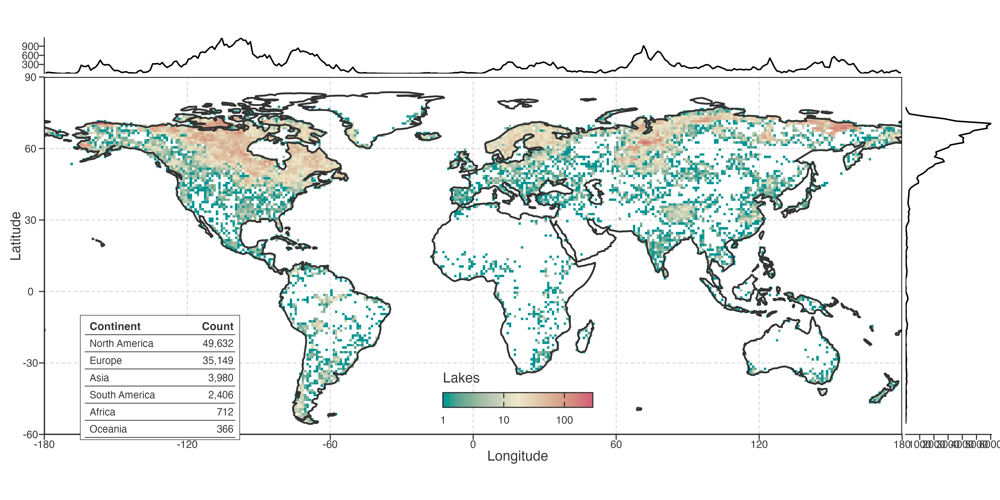

# Methods

## Data and scope

We analysed the 1981–2020 historical Global LAke Surface Temperature (GLAST) reconstruction for 92,245 lakes. GLAST combines satellite information with ERA5-Land-forced FLAKE simulations and calibration against observations; therefore, all temperature inferences concern reconstructed lake-surface conditions rather than direct in-situ observations ([Tong et al. 2023](#ref-tong2023)). Lake locations were linked to HydroLAKES attributes for geographic summaries and coverage diagnostics ([Messager et al. 2016](#ref-messager2016)).

> 后文“温度变化”均指 GLAST 重建的表层状态；HydroLAKES 提供空间与属性语境。

The analysis universe was fixed by the GLAST historical product: every result refers to its 92,245 lake records during 1981–2020. The raw reconstructed annual mean is the primary temperature input. It retains the annual values used for the long-term slopes and endpoint-aligned local rates. The low-frequency STL representation enters only at the later PCA stage. Geographic coordinates and lake attributes were used for spatial summaries, equal-area assignment and descriptive context; they did not enter temperature reconstruction.

> 数据范围由 GLAST 历史产品固定。raw 年均序列承担趋势和局地速率；STL 只在 PCA 阶段出现；地理与形态变量不参与温度重建。

Daily temperatures were converted from Kelvin to degrees Celsius. Annual and seasonal liquid-water means were calculated directly from finite daily values above 0 °C, so days at or below the freezing threshold did not enter those means. A year or season without valid liquid-water days was stored as a finite `0 °C` frozen state. This convention preserves an all-ice period as a physical state, but prevents it from being interpreted as an ordinary liquid-water temperature in the association analysis.

> `0 °C` 表示冻结状态。该规则保留全冰期，同时将其与液态水均值和 JJA 关联分析区分开来。

Records cover all inhabited continents but are spatially uneven, with dense coverage in northern North America and Europe (Fig. [../../../Figure 1](#fig-data-coverage)). Lake-equal summaries therefore describe the reconstructed lake population. Whenever sampling density could change a global spatial aggregate, we instead used equal-area cell summaries so that each occupied cell contributed one trajectory. Spatial sampling can materially alter global summaries ([Schutgens et al. 2016](#ref-schutgens2016)). This design therefore targets the covariance among represented occupied cells, rather than a field-wide area average that would implicitly assign information to lake-free cells.

> Fig. [../../../Figure 1](#fig-data-coverage) 展示偏密采样。lake-equal 与 equal-area 分别对应湖泊总体和代表性空间，属于不同 estimand。

Figure 1: Spatial coverage and lake-count density of the 92,245 reconstructed lake records. Insets show marginal lake counts by longitude and latitude, and counts by continent.

## Primary trajectory metrics

Long-term warming was the Theil–Sen slope of raw annual-mean LSWT across 1981–2020, reported in °C decade\\^{-1}\\. This is the primary measure of net thermal displacement over the record. We also calculated ordinary two-sided Mann–Kendall and trend-free prewhitened Mann–Kendall tests; the latter is the primary descriptive screen because annual LSWT is serially correlated. Neither test identifies a temperature driver.

> 长期 slope 是主效应量；两类 Mann–Kendall 只描述可检出性，均不用于识别驱动。

The trend-free procedure detrended each annual series using its Sen slope, estimated lag-1 autocorrelation on the residuals, prewhitened the residuals, and restored the estimated trend before Mann–Kendall testing ([Yue and Wang 2002](#ref-yue2002)). This screen acknowledges serial dependence in trend testing; it does not replace the raw-series Sen slope used as the primary effect-size estimand. Effective-sample size approaches provide a related correction framework ([Yue and Wang 2004](#ref-yue2004)).

> 长期 slope 表示净变化量；显著性描述序列相关校正后的可检出性。变化阶段和驱动由后续指标与独立数据处理。

For annual temperatures \\T_t\\, the long-term Theil–Sen estimate is the median of all pairwise slopes \\(T_j-T_i)/(j-i)\\ over 1981–2020, multiplied by ten for reporting in °C decade\\^{-1}\\. We use it as an effect-size summary. The Mann–Kendall screens are reported separately, with two-sided nominal \\P\\ values used only to describe lake-level detectability and to define hatching in the relevant maps. They do not select records for PCA or establish a field-wide spatial significance claim.

> Sen slope 取所有年份对斜率的中位数，表示净变化量。Mann–Kendall 仅服务可检出性描述和图中斜线，不参与 PCA 筛选。

Local warming rate was the trailing 10-year Theil–Sen slope of raw annual LSWT, indexed to the endpoint year. Thus, the 1981–1990 window is indexed to 1990 and the 2011–2020 window to 2020, giving 31 local-rate estimates per complete record. We calculated the Sen slope of each valid local-rate sequence and call it *warming-speed change* (10\\^{-3}\\ °C yr\\^{-2}\\). It is an operational summary of long-term change in local warming rate, not a resolved instantaneous physical acceleration.

> Fig. 2 横轴表示“截至该年”的十年速率。*warming-speed change* 用于空间比较；完整曲线保留非单调转折。

Every local-rate estimate uses the same ten annual observations. Adjacent windows share nine years, so the 31 endpoint values form a deliberately smooth history of local rate rather than 31 independent trend tests. The final Sen slope across the valid local-rate sequence supplies a common scalar for maps and distributions. The full histories remain visible in the Results because a near-zero tendency can arise from several opposing episodes.

> 相邻窗口共享九年数据，局地速率序列具有依赖性。最终 tendency 便于比较；完整曲线保留转折信息。

## Seasonal and ice-state diagnostics

We calculated the same endpoint-aligned 10-year Sen rates for DJF, MAM, JJA and SON LSWT, for annual maximum and minimum 30-day temperatures, and for annual and seasonal ice states. Seasonal thermal-asymmetry diagnostics were the JJA–DJF contrast, four-season range and four-season standard deviation. For ice, trailing 10-year means describe state, whereas the negative trailing Sen slope of ice days describes ice loss (positive values indicate fewer ice days per year).

> 季节和冰变量用于定位年均路径的背景。冰损失为正表示冰日减少，需与温度 slope 分开阅读。

These diagnostics quantify directional co-variation with annual local rates. Because adjacent 10-year windows overlap, they cannot be added to partition annual warming or treated as independent endpoint observations. They also do not test glacier-meltwater mechanisms or identify the season responsible for a long-term annual trend.

> 季节/冰同步变化提供背景信息；年度趋势贡献与机制需要独立设计检验。

## Spatially balanced trajectory decomposition

PCA was used only to represent low-frequency trajectory geometry, not to replace the raw annual series used for primary warming metrics. We extracted a monthly seasonal-trend decomposition by loess (STL) trend with period 12, `nt = 99`, robust = false, `ni = 5` and `no = 0` ([Cleveland et al. 1990](#ref-cleveland1990)), then annualised the trend. Each lake trajectory was centred on its own 1981–1990 mean.

> raw 年均序列用于趋势和速度；STL 仅构造 PCA 输入。两个层次在全文分开报告。

The STL configuration was fixed before the spatial decomposition. Monthly trend components were annualised after decomposition, baseline-centred within lake, and supplied as 40-year trajectories to the cell aggregation. The long trend window suppresses short-period fluctuations for a covariance description; it does not define an observed physical equilibrium trajectory. Every reported warming magnitude and local-rate metric remains tied to the raw annual reconstruction.

> STL 参数先固定，再进入空间分解。长窗口用于低频协方差描述；温度变化量和局地速率始终来自 raw 年均序列。

We divided the globe into 72 × 21 equal-area spherical cells, using equal longitude increments and equal increments of sine latitude. We averaged centred annual trajectories within each occupied cell and fitted PCA to the 573 resulting cell trajectories; PCA columns were centred but not variance standardised ([North et al. 1982](#ref-north1982)). This estimator describes covariance among represented spatial cells rather than among sampled lakes. We retained PC1–PC5 for common loading, spatial-score and score-pole diagnostics; explained variance was descriptive, not a retention threshold.

> PCA 样本为 573 条等面积格网轨迹。该汇总平衡区域湖泊数；PC1–PC5 一并检查，主论证聚焦 PC1 与 PC2–PC3。

Within every occupied cell, eligible lake trajectories were aggregated year by year after baseline centring. PCA was fitted by singular-value decomposition to the column-centred cell-by-year matrix. Each loading therefore represents a temporal contrast that maximises covariance across represented cells, and each cell score locates that cell along the contrast. The canonical fit contains 573 cells. A sensitivity refit excludes cells with fewer than five lakes; it tests whether extremely sparse cells determine the loading geometry and leaves the canonical geographic domain unchanged.

> 每个 cell 先逐年汇总轨迹，再对 cell×年份矩阵做 PCA。`n≥5` 分支检查极稀疏 cell 的影响；canonical 分析仍覆盖所有占据 cell。

Lake trajectories were projected onto the fixed cell-PCA loadings after centring with the cell-PCA reference mean. We did not refit PCA at lake level. PCA scores are therefore coordinates in a continuous low-frequency trajectory space, not membership labels for intrinsic lake types or physical mechanisms.

> 湖泊 score 投影到同一格网轴，可直接比较。坐标保持连续形式，避免过早形成湖泊类别。

Projection used the centring vector from the fitted cell matrix and the fixed temporal loading vectors. It places every lake in a shared coordinate system without allowing a lake-rich region to refit the axes. The sign of an isolated PCA axis is arbitrary, so maps state a display orientation for PC1. Spatial inference about the secondary structure uses the PC2–PC3 plane and its rotation-invariant magnitude where appropriate.

> 所有湖泊投影到同一时间轴。PC1 图示方向已固定；次级结果优先采用 PC2–PC3 平面和振幅，减少符号与换序影响。

## Stability and external association

We evaluated PCA robustness at the level of interpretation. PC1 was compared as a one-dimensional loading axis. Because PC2 and PC3 can exchange rank, we compared them as a two-dimensional subspace by principal angles after orthonormalising loading matrices on shared years. We refitted the PCA after omitting each continent, each of four contiguous decades, using raw annual input, centred 7-, 9- and 11-year moving-average inputs, median rather than mean within-cell aggregation, and two alternative equal-area grids. The median refit changes only the cell-level estimator, testing whether a small number of atypical lakes determine the mean cell trajectory. We also required at least five lakes per cell, excluding cells below that threshold before refitting. These are representation and stability checks; they do not turn components into mechanisms.

> PC1 按单轴复现；PC2–PC3 按平面复现。median 与 `n≥5` 分支分别检查异常湖和极稀疏 cell，时间端点敏感性保留为结果边界。

Loading agreement was quantified by absolute cosine similarity after matching a reference component to the most congruent refitted component. For PC2–PC3, we also calculated principal angles between orthonormal bases on the years shared by a refit and the canonical analysis. This separates recurrence of a two-dimensional timing structure from preservation of an arbitrary ordered axis. We report successful recurrence together with the limiting omissions, because those limits define the support for secondary interpretation.

> cosine 用于单轴对应；principal angle 用于 PC2–PC3 平面。最弱的遗漏结果与成功复现一同报告。

For the climate-context screen, we calculated lake-level correlations between linearly detrended raw seasonal LSWT anomalies and predeclared NAO, AO, PDO and Niño 3.4 indices for matching seasons at lags 0 and 1 year. Frozen JJA states were excluded, correlations required at least 30 valid season-years, and lake-level correlations were Fisher-z transformed before equal-area cell aggregation. The retained analysis compares prior-summer NAO/AO with current JJA LSWT. Spatial hold-outs, three grid resolutions, leave-one-continent-out PCA refits and leave-one-decade-out correlations assess stability. AO is a correlated NAO-family replication, not an independent mechanism.

> 候选先定义，再经过地理稳定性序列筛查。AO 用于检验 NAO-family 一致性，证据按同一关联族阅读。

These association analyses identify where sensitivity fields co-locate with trajectory geometry. They do not estimate a circulation-to-lake pathway, identify a causal driver, use lake-level nominal P values as evidence, or provide independent confirmation after candidate screening.

> 该筛查只定位关联场与路径几何的共现位置，不提供因果、独立验证或湖泊层面的显著性证据。

Geographic, continent and decade hold-outs limit the optimistic leakage that can arise when structured observations are evaluated with random splits ([Roberts et al. 2017](#ref-roberts2017)). We do not interpret lake- or cell-level nominal P values as field-wide discovery evidence, because collections of spatial tests require their own multiplicity treatment ([Wilks 2016](#ref-wilks2016)).

> Results 06 的上限为可重复 association。空间留出、LOCO 和 LODO 提供稳定性信息；候选筛查仍限制独立确认的表述。

Back to top

## References

Cleveland, Robert B., William S. Cleveland, Jean E. McRae, and Irma Terpenning. 1990. “STL: A Seasonal-Trend Decomposition Procedure Based on Loess.” *Journal of Official Statistics* 6 (1): 3–73.

Messager, Mathis Loïc, Bernhard Lehner, Günther Grill, Irena Nedeva, and Oliver Schmitt. 2016. “Estimating the Volume and Age of Water Stored in Global Lakes Using a Geo-Statistical Approach.” *Nature Communications* 7 (1): 13603. <https://doi.org/10.1038/ncomms13603>.

North, Gerald R., Thomas L. Bell, Robert F. Cahalan, and Fanthune J. Moeng. 1982. “Sampling Errors in the Estimation of Empirical Orthogonal Functions.” *Monthly Weather Review* 110 (7): 699–706. <https://doi.org/10.1175/1520-0493(1982)110%3C0699:SEITEO%3E2.0.CO;2>.

Roberts, David R., Volker Bahn, Simone Ciuti, et al. 2017. “Cross-Validation Strategies for Data with Temporal, Spatial, Hierarchical, or Phylogenetic Structure.” *Ecography* 40 (8): 913–29. <https://doi.org/10.1111/ecog.02881>.

Schutgens, Nick A. J., Edward Gryspeerdt, Natalie Weigum, et al. 2016. “Will a Perfect Model Agree with Perfect Observations? The Impact of Spatial Sampling.” *Atmospheric Chemistry and Physics* 16 (10): 6335–53. <https://doi.org/10.5194/acp-16-6335-2016>.

Tong, Yan, Lian Feng, Xinchi Wang, Xuehui Pi, Wang Xu, and R. Iestyn Woolway. 2023. “Global Lakes Are Warming Slower Than Surface Air Temperature Due to Accelerated Evaporation.” *Nature Water* 1 (11): 929–40. <https://doi.org/10.1038/s44221-023-00148-8>.

Wilks, Daniel S. 2016. “‘The Stippling Shows Statistically Significant Grid Points’: How Research Results Are Routinely Overstated and Overinterpreted, and What to Do about It.” *Bulletin of the American Meteorological Society* 97 (12): 2263–73. <https://doi.org/10.1175/BAMS-D-15-00267.1>.

Yue, Sheng, and Chun Yuan Wang. 2002. “Applicability of Prewhitening to Eliminate the Influence of Serial Correlation on the Mann–Kendall Test.” *Water Resources Research* 38 (7). <https://doi.org/10.1029/2001WR000861>.

Yue, Sheng, and ChunYuan Wang. 2004. “The Mann–Kendall Test Modified by Effective Sample Size to Detect Trend in Serially Correlated Hydrological Series.” *Water Resources Management* 18 (3): 201–18. <https://doi.org/10.1023/B:WARM.0000043140.61082.60>.
