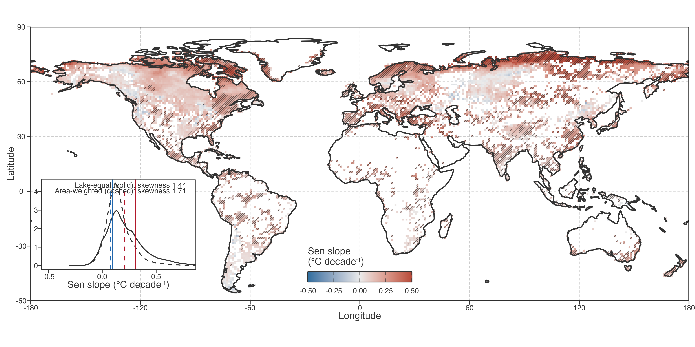
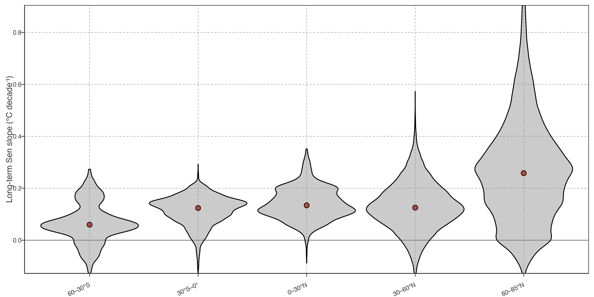
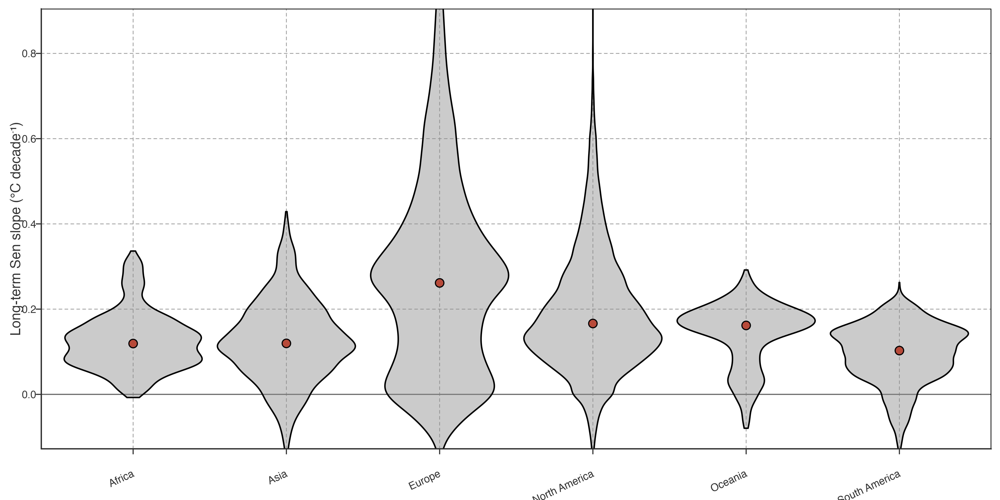

# Widespread but heterogeneous lake warming

## Long-term warming is widespread

> **TIP:**
>
> - Stress the spatial heterogeneity, since the warming states were already described in Tong et al. ([2023](#ref-tong2023)).
> - Here we use lake-equal mean, focusing on the lake individuals, but Tong et al. ([2023](#ref-tong2023)) used area-weighted (2 layers: every grid is lake-area-weighted, and global is grid-area-weighted), focusing on a reasonable global state. So it is natural we are stressing the heterogeneity, by showing the range, quantiles and so on.
> - Here we use Sen slope, but Tong et al. ([2023](#ref-tong2023)) used linear slope. In supplementary we can diff the results to check which regions are “not that stable”.

Lake warming was widespread during 1981–2020, although the magnitude of warming varied markedly among individual lakes ([Figure 1](#fig-long-term-warming-distribution)). Across all 92,245 lake records, 92.8% exhibited positive warming, and 33.8% of the trends were significant at \\p \< 0.05\\. The median warming rate was 0.18 °C decade⁻¹, with an interquartile range of 0.09–0.31 °C decade⁻¹; whereas the lake-equal mean was 0.22 ± 0.19 °C decade⁻¹. The distribution has a positive high-warming tail, in which a relatively small subset of rapidly warming lakes contributes disproportionately to the lake-equal mean.

Figure 1: Long-term lake warming, 1981–2020. Top: Lake-equal mean 40-year Sen slope in each occupied 1° grid cell. Diagonal hatching shows cells where at least half of lakes display a significant (p \< 0.05, Mann–Kendall) trend. Bottom: Comparison of the distribution of individual-lake Sen slopes (lake-equal, black) and a two-step area-weighted distribution, where annual temperatures are first lake-area weighted within each grid cell and cell slopes are then weighted by grid-cell area (blue).

Long-term warming rates were spatially organized. Relatively high warming rates occurred across Arctic Siberia, particularly central and eastern Siberia (approximately 100–140°E), with additional high-rate areas in northern Canada and Alaska. Slower warming, including the relatively rare cooling lakes, was concentrated across western Siberia and the adjacent Ural region, northern Fennoscandia, and western-to-northwestern Canada ([Figure 1](#fig-long-term-warming-distribution)). Notably, 89% of lakes with cooling trends were located in Europe and North America. These geographical patterns were strongly spatially autocorrelated and were unlikely to arise from a spatially random distribution (Moran’s I = 0.43, permutation P = 0.001; **?@tbl-spatial-autocorrelation**).

> 长期增温率具有明确空间组织。高增温集中在北极西伯利亚中东部、加拿大北部和阿拉斯加；慢增温和少数降温湖集中在西西伯利亚—乌拉尔、芬诺斯堪的纳维亚北部与加拿大西至西北部。89% 降温湖位于欧洲和北美。空间分布显著非随机。

| Statistic | Value |
|----|----|
| Spatial unit | Occupied 1° cells; lake-equal mean long-term Sen slope |
| Occupied cells | 7804 |
| Queen-neighbour pairs | 21446 |
| Moran’s I | 0.43 |
| Two-sided permutation P | 0.001 (999 permutations) |

Warming rates also differed markedly among latitude bands. Lakes at 60–85°N had a median warming rate of 0.258°C decade⁻¹, 0.133°C decade⁻¹ higher than lakes at 30–60°N (0.125°C decade⁻¹; bootstrap 95% CI of the median difference: 0.131–0.135°C decade⁻¹). Continental distributions were uneven: Europe had the highest median rate (0.261°C decade⁻¹), followed by North America (0.166°C decade⁻¹), whereas medians in Africa, Asia, Oceania and South America ranged from 0.103 to 0.162°C decade⁻¹. Full distributions are shown in [Figure 2](#fig-long-term-warming-latitude-bands) and [Figure 3](#fig-long-term-warming-continent-distributions).

Figure 2: Long-term lake warming rates by latitude band. Violin width shows the within-band distribution; points show medians. Values are lake-equal and each lake contributes one observation.

Figure 3: Long-term lake warming rates by continent. Violin width shows the distribution of sampled lakes; points show medians. Continental categories are descriptive geographic summaries, not causal groups.

Trend significance broadly followed warming magnitude. Of lakes in the upper quartile of warming rates, 79.5% showed significant warming trends, compared with 18.6% of remaining lakes. Thus, stronger net warming was more likely to yield a detectable long-term trend, although significant warming was not restricted to the fastest-warming regions.

Back to top

## References

Tong, Yan, Lian Feng, Xinchi Wang, Xuehui Pi, Wang Xu, and R. Iestyn Woolway. 2023. “Global Lakes Are Warming Slower Than Surface Air Temperature Due to Accelerated Evaporation.” *Nature Water* 1 (11): 929–40. <https://doi.org/10.1038/s44221-023-00148-8>.
