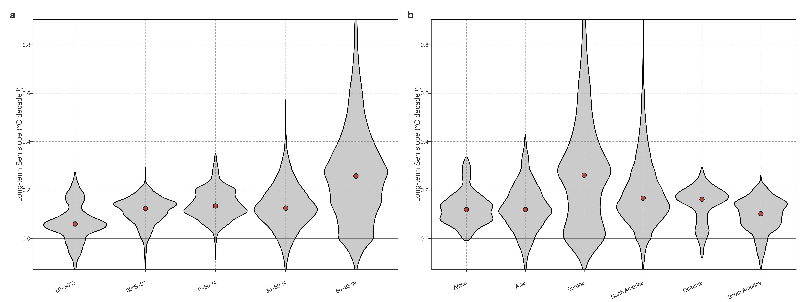

# Widespread but heterogeneous lake warming

## Long-term warming is widespread

Lake warming was widespread during 1981–2020, although the magnitude of warming varied markedly among individual lakes ([../../../../Figure 1](#fig-long-term-warming-distribution)). Across all 92,245 lake records, 92.8% exhibited positive warming, and 33.8% of the trends were significant at \\p \< 0.05\\. The median warming rate was 0.18 °C decade⁻¹, with an interquartile range of 0.09–0.31 °C decade⁻¹; whereas the lake-equal mean was 0.22 ± 0.19 °C decade⁻¹. The distribution has a positive high-warming tail, in which a relatively small subset of rapidly warming lakes contributes disproportionately to the lake-equal mean.

> Fig. [../../../../Figure 1](#fig-long-term-warming-distribution) 同时显示“92.8% 为正”和宽分布。正高值尾部抬高 mean，区域比较需说明所用汇总量。

Figure 1: Long-term lake warming, 1981–2020. Top: Lake-equal mean 40-year Sen slope in each occupied 1° grid cell. Diagonal hatching shows cells where at least half of lakes display a significant (p \< 0.05, Mann–Kendall) trend. Bottom: Comparison of the distribution of individual-lake Sen slopes (lake-equal, black) and a two-step area-weighted distribution, where annual temperatures are first lake-area weighted within each grid cell and cell slopes are then weighted by grid-cell area (blue).

Long-term warming rates were spatially organized. Relatively high warming rates occurred across Arctic Siberia, particularly central and eastern Siberia (approximately 100–140°E), with additional high-rate areas in northern Canada and Alaska. Slower warming, including the relatively rare cooling lakes, was concentrated across western Siberia and the adjacent Ural region, northern Fennoscandia, and western-to-northwestern Canada ([../../../../Figure 1](#fig-long-term-warming-distribution)). Notably, 89% of lakes with cooling trends were located in Europe and North America. These geographical patterns were strongly spatially autocorrelated and were unlikely to arise from a spatially random distribution (Moran’s I = 0.43, permutation P = 0.001).

> 地图显示连续区域的长期趋势异质性。降温湖的地理集中提示路径分析需要超出全球均值；成因留待独立过程研究。

The spatial unit, neighbour graph and permutation design underlying this descriptive autocorrelation result are recorded in the [supplementary core-result tables](../../../../explorations/warming-temporal-pathways/manuscript/supplementary/core-result-tables.llms.md).

> 补充表记录空间单元、邻接图和置换设定，使 Moran’s I 的适用范围可核查。

Warming rates also differed markedly among latitude bands. Lakes at 60–85°N had a median warming rate of 0.258°C decade⁻¹, 0.133°C decade⁻¹ higher than lakes at 30–60°N (0.125°C decade⁻¹; bootstrap 95% CI of the median difference: 0.131–0.135°C decade⁻¹). Continental distributions were uneven: Europe had the highest median rate (0.261°C decade⁻¹), followed by North America (0.166°C decade⁻¹), whereas medians in Africa, Asia, Oceania and South America ranged from 0.103 to 0.162°C decade⁻¹. Full distributions are shown in [../../../../Figure 2](#fig-long-term-warming-geographic-distributions).

> 纬度比较为描述性结果。阅读图时结合 median、分布重叠和 bootstrap 区间；大陆分类只作地理汇总。

Figure 2: Lake-equal long-term warming-rate distributions by latitude band and continent. Violin width shows within-group density; points show medians. The common vertical scale supports geographic comparison, while categories remain descriptive summaries rather than causal groups.

Trend significance broadly followed warming magnitude. Of lakes in the upper quartile of warming rates, 79.5% showed significant warming trends, compared with 18.6% of remaining lakes. Thus, stronger net warming was more likely to yield a detectable long-term trend, although significant warming was not restricted to the fastest-warming regions.

> 显著性随净 warming 增大而提高，符合累计信号的统计特征。该图不提供路径发生时间的信息。

Back to top
