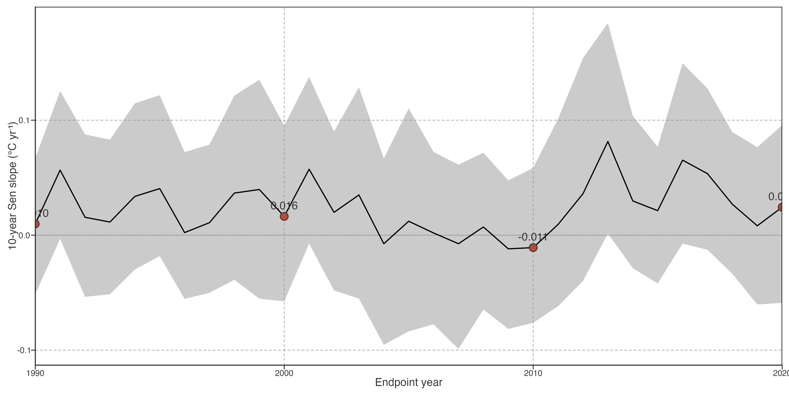
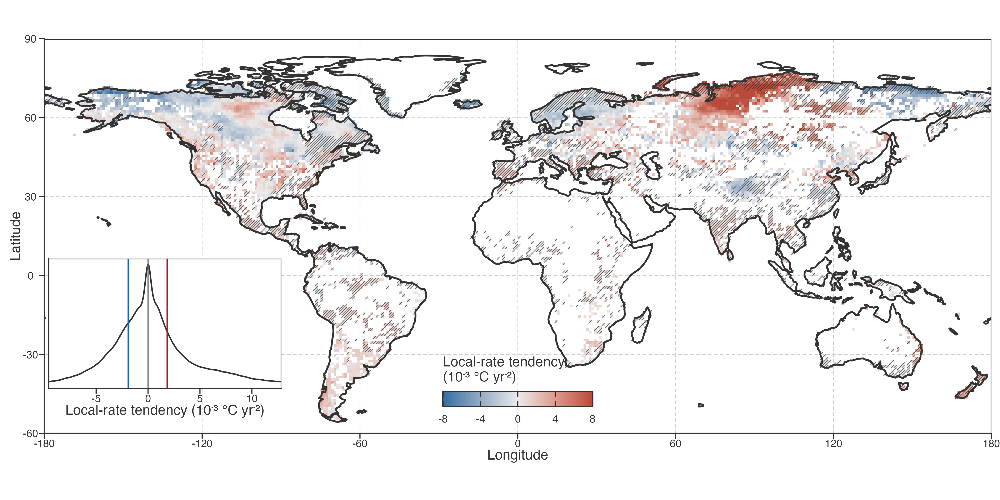
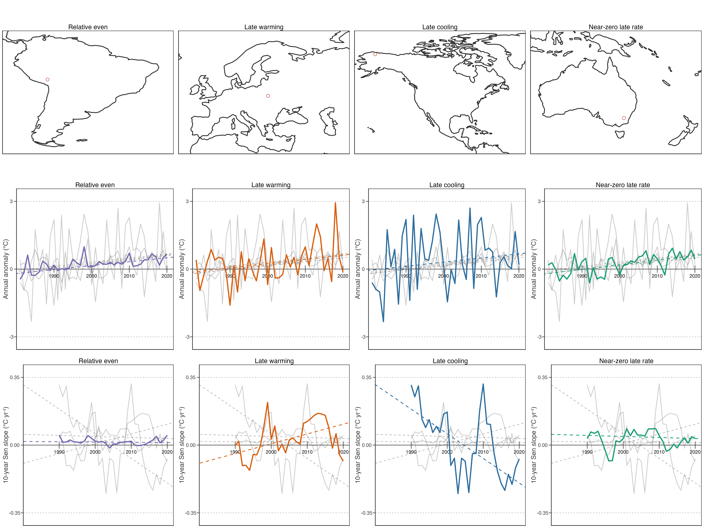

# Contrasting within-period pathways

## Long-term trends conceal contrasting within-period warming trajectories

To resolve changes within the 1981–2020 record, we calculated a trailing, endpoint-aligned 10-year Sen slope for each lake. This produced 31 local warming-rate estimates, indexed from the 1990 endpoint (1981–1990 window) to the 2020 endpoint (2011–2020 window). The lake-equal distribution changed over time, but not in one direction. Its median local rate was 0.010°C yr⁻¹ in 1990, 0.016°C yr⁻¹ in 2000, −0.011°C yr⁻¹ in 2010, and 0.024°C yr⁻¹ in 2020; the proportion of positive local rates ranged from 45.3% to 58.6% across these endpoints ([../../../../Figure 1](#fig-results-local-rate-history)). At every endpoint, the interquartile range included both warming and cooling rates.

Figure 1: Lake-equal median and interquartile range of endpoint-aligned trailing-10-year raw annual local warming rates. The ribbon is the lake-level interquartile range, not an uncertainty interval.

These distributions rule out a single temporal description for the global lake population. Neither universal acceleration, universal stalling, nor a shared hiatus describes all lakes: positive and negative local rates coexisted throughout the record.

> 这些分布排除单一全球时间描述。整个记录期内，增温和降温局地速度并存；不存在可描述全部湖泊的普遍加速、普遍停滞或共同 hiatus。

We next reduced each lake’s 31 local rates to their Theil–Sen trend, termed local-rate tendency. Positive and negative tendencies occurred in nearly equal proportions (47.8% and 52.2%, respectively), and the distribution was centred on zero (interquartile range: −1.89 to 1.86 × 10⁻³ °C yr⁻²; [../../../../Figure 2](#fig-results-local-rate-tendency)). This compact statistic identifies a net monotonic tendency only. A tendency near zero can still contain substantial strengthening followed by weakening, or the reverse.

> 随后将每湖 31 个局地速度压缩为其 Theil–Sen trend，称为局地速度倾向。正、负倾向比例接近（47.8% 与 52.2%），分布以零为中心（IQR：−1.89 至 1.86 × 10⁻³ °C yr⁻²）。该统计量只识别净单调倾向；接近零仍可包含先增强后减弱，或相反过程。

Figure 2: Spatial distribution and global density of local-rate tendency. Map: lake-equal mean tendency in every occupied 1° cell. Positive values indicate net strengthening of local 10-year warming rates; negative values indicate net weakening. Diagonal hatching marks cells where at least half of lakes have a significant full-period Mann–Kendall trend, using the same definition as Fig. 1. Inset: distribution of lake-level local-rate tendencies.

Local-rate tendency was also spatially heterogeneous. Net strengthening of local warming rates was concentrated across northern Siberia, whereas net weakening occurred in parts of Alaska, northwestern Canada, and far eastern Siberia ([../../../../Figure 2](#fig-results-local-rate-tendency)). These patterns describe the 40-year balance of local-rate evolution; they do not imply that all lakes in a region followed the same trajectory. Diagonal hatching marks cells where at least half of lakes had a significant full-period Mann–Kendall trend, using the Fig. 1 criterion. It is not a significance test of local-rate tendency. Indeed, 60.3% of hatched cells and 56.3% of unhatched cells had positive mean tendency; their medians were 0.384 and 0.309 × 10⁻³ °C yr⁻², respectively. Long-term trend detectability and the direction of local-rate evolution are therefore distinct descriptive properties.

At lake level, this difference from the long-term-slope result was equally clear. The fraction with a significant full-period trend was 36.2%, 33.3%, 36.4%, and 29.6% across increasing signed local-rate-tendency quartiles; the Spearman correlation between tendency and trend significance was −0.044. Even the largest absolute-tendency quartile had only 36.6% significant trends. Thus, the magnitude of net local-rate evolution did not determine whether a lake’s 40-year temperature trend was detectable.

This contrasts with Fig. 1, where larger long-term warming was much more often detectable as a significant full-period trend. The contrast is expected but important: long-term slope and its significance both concern cumulative, approximately monotonic change across the same 40-year record, whereas local-rate tendency describes whether the shorter-window rates changed through that record. Strong rate evolution can therefore cancel between earlier and later periods without producing a detectable net long-term trend.

> 局地速度倾向也具有空间异质性。北西伯利亚集中出现局地速度净增强；阿拉斯加、加拿大西北部和远东西伯利亚部分地区集中出现净减弱。斜线表示沿用 Fig. 1 标准、至少半数湖泊全期趋势显著的格网，不检验局地速度倾向本身。斜线与非斜线格网的正倾向比例为 60.3% 与 56.3%，median 为 0.384 与 0.309 × 10⁻³ °C yr⁻²；长期趋势可检出性与局地速度演变方向是不同描述属性。湖泊层级上，四个 signed tendency 四分位的显著比例为 36.2%、33.3%、36.4%、29.6%，与显著性的 Spearman ρ = −0.044；绝对 tendency 最大四分位也只有 36.6% 显著。局地速度演变幅度不决定 40 年趋势是否可检出。与 Fig. 1 对比，长期 slope 与显著性均针对同一 40 年累计、近似单调变化，故关联更直接；局地速度倾向描述短窗口速度是否改变，早晚变化可相互抵消而不形成显著净长期趋势。

Long-term warming magnitude and local-rate tendency were weakly related (Spearman ρ = −0.18). The two metrics answer different questions: long-term slope measures net displacement, whereas tendency measures whether local 10-year rates strengthened or weakened through the record. The weak relation therefore means that net warming alone did not constrain timing. In the central decile of long-term warming (0.162–0.203°C decade⁻¹; n = 9,225), late-minus-early local rate had an interquartile range of −0.038 to 0.032°C yr⁻¹. Comparable net warming thus included both late strengthening and late weakening histories. The corresponding interquartile width was 0.070°C yr⁻¹, while the median within-record local-rate standard deviation was 0.104°C yr⁻¹; these values quantify pathway diversity after holding net warming approximately constant.

> 长期增温幅度与局地速度倾向关系弱（Spearman ρ = −0.18）。两指标回答不同问题：长期 slope 表示净位移，tendency 表示记录内 10 年局地速度是增强还是减弱。故相近净增温不能约束变化时机。在长期增温 central decile（0.162–0.203°C decade⁻¹；n = 9,225）中，晚期减早期局地速度的 IQR 为 −0.038 至 0.032°C yr⁻¹；同等净增温同时包含后期增强与后期减弱。该 IQR 宽度为 0.070°C yr⁻¹，局地速度记录内 SD 的 median 为 0.104°C yr⁻¹；这些数值量化了固定净增温后仍存在的路径差异。

Figure 3: Geographically dispersed representative lakes with comparable net long-term warming but contrasting local-rate histories. All examples are restricted to the central decile of long-term warming, drawn from separate continents for visual comparison, and selected by pre-specified descriptors: minimum local-rate variability (relative even), maximum positive or negative local-rate tendency (late warming or cooling), and near-zero final local rate. Top: continental-scale locations. Middle: raw annual LSWT anomalies. Bottom: endpoint-aligned trailing-10-year Sen slopes. Dashed lines are Theil–Sen fits for each of the four displayed series. In each time-series panel, the focal lake is coloured and all other examples are light grey. Examples do not define lake classes; lake names are shown when present in source metadata.

Comparable net warming can show relatively even local rates, or can end in local warming, cooling, or near-zero rate. Together with the population-level spread quantified above, they establish the descriptive problem for the next section: whether this diversity is idiosyncratic to individual lakes or organised by a limited number of recurrent low-frequency trajectories.

Back to top
