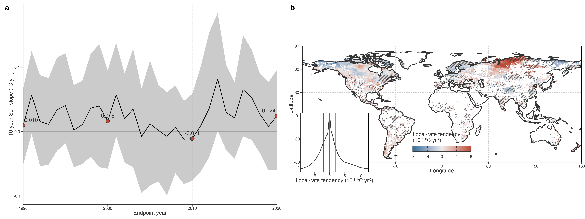

# Contrasting within-period pathways

## Long-term trends conceal contrasting within-period warming trajectories

To resolve changes within the 1981–2020 record, we calculated a trailing, endpoint-aligned 10-year Sen slope for each lake. This produced 31 local warming-rate estimates, indexed from the 1990 endpoint (1981–1990 window) to the 2020 endpoint (2011–2020 window). The lake-equal distribution changed over time, but not in one direction. Its median local rate was 0.010°C yr⁻¹ in 1990, 0.016°C yr⁻¹ in 2000, −0.011°C yr⁻¹ in 2010, and 0.024°C yr⁻¹ in 2020; the proportion of positive local rates ranged from 45.3% to 58.6% across these endpoints ([../../../../Figure 1](#fig-results-local-rate-dynamics)). At every endpoint, the interquartile range included both warming and cooling rates.

> 图 2a 以每个十年窗口终点排序。中位数随时间起伏，四分位范围持续跨越正负速率，提示总体变化并不代表每个湖泊同向变化。

The coexistence of positive and negative local rates throughout the record precludes a single temporal label for the global lake population, including universal acceleration, stalling or a shared hiatus.

> 速度分布表明全球不存在统一时间标签。总体长期趋势为正时，局地十年速率仍可在不同湖泊和年份朝相反方向变化。

We next reduced each lake’s 31 local rates to their Theil–Sen trend, termed local-rate tendency. Positive and negative tendencies occurred in nearly equal proportions (47.8% and 52.2%, respectively), and the distribution was centred on zero (interquartile range: −1.89 to 1.86 × 10⁻³ °C yr⁻²; [../../../../Figure 1](#fig-results-local-rate-dynamics)). This compact statistic identifies a net monotonic tendency only. A tendency near zero can still contain substantial strengthening followed by weakening, or the reverse.

> *warming-speed change* 是用于比较的轨迹摘要。正负几乎平衡；接近零可来自相反阶段的抵消。

Figure 1: Within-period dynamics of global lake warming. a, Lake-equal median and interquartile range of endpoint-aligned trailing-10-year raw annual local warming rates. The ribbon is the lake-level interquartile range, not an uncertainty interval. b, Spatial distribution and global density of local-rate tendency. Map: lake-equal mean tendency in every occupied 1° cell. Positive values indicate net strengthening of local 10-year warming rates; negative values indicate net weakening. Diagonal hatching marks cells where at least half of lakes have a significant full-period Mann–Kendall trend, using the same definition as Fig. 1. Inset: distribution of lake-level local-rate tendencies.

Local-rate tendency was also spatially heterogeneous. Net strengthening of local warming rates was concentrated across northern Siberia, whereas net weakening occurred in parts of Alaska, northwestern Canada, and far eastern Siberia ([../../../../Figure 1](#fig-results-local-rate-dynamics)). These patterns describe the 40-year balance of local-rate evolution; they do not imply that all lakes in a region followed the same trajectory. Diagonal hatching marks cells where at least half of lakes had a significant full-period Mann–Kendall trend, using the Fig. 1 criterion. It is not a significance test of local-rate tendency. Indeed, 60.3% of hatched cells and 56.3% of unhatched cells had positive mean tendency; their medians were 0.384 and 0.309 × 10⁻³ °C yr⁻², respectively. Long-term trend detectability and the direction of local-rate evolution are therefore distinct descriptive properties.

> 地图的正负 tendency 表示四十年内局地速度的净增强或净减弱。斜线沿用长期趋势显著性，用于对照两个属性。

At lake level, this difference from the long-term-slope result was equally clear. The fraction with a significant full-period trend was 36.2%, 33.3%, 36.4%, and 29.6% across increasing signed local-rate-tendency quartiles; the Spearman correlation between tendency and trend significance was −0.044. Even the largest absolute-tendency quartile had only 36.6% significant trends. Thus, the magnitude of net local-rate evolution did not determine whether a lake’s 40-year temperature trend was detectable.

> 四个 tendency 四分位的显著趋势比例接近，Spearman ρ 接近零。可检出长期变化与速度变化大小属于不同维度。

This contrasts with Fig. 1, where larger long-term warming was much more often detectable as a significant full-period trend. The contrast is expected but important: long-term slope and its significance both concern cumulative, approximately monotonic change across the same 40-year record, whereas local-rate tendency describes whether the shorter-window rates changed through that record. Strong rate evolution can therefore cancel between earlier and later periods without producing a detectable net long-term trend.

> 长期 slope 与显著性基于累计量；局地速度倾向允许早晚阶段相互抵消。“无显著长期趋势”仍可能包含明显时间结构。

Long-term warming magnitude and local-rate tendency were weakly related (Spearman ρ = −0.18). The two metrics answer different questions: long-term slope measures net displacement, whereas tendency measures whether local 10-year rates strengthened or weakened through the record. The weak relation therefore means that net warming alone did not constrain timing. In the central decile of long-term warming (0.162–0.203°C decade⁻¹; n = 9,225), late-minus-early local rate had an interquartile range of −0.038 to 0.032°C yr⁻¹. Comparable net warming thus included both late strengthening and late weakening histories. The corresponding interquartile width was 0.070°C yr⁻¹, while the median within-record local-rate standard deviation was 0.104°C yr⁻¹; these values quantify pathway diversity after holding net warming approximately constant.

> 固定在相近长期增温量后，晚期相对早期的局地速度仍横跨正负。这构成路径异质性的直接证据。

Figure 2: Geographically dispersed representative lakes with comparable net long-term warming but contrasting local-rate histories. All examples are restricted to the central decile of long-term warming, drawn from separate continents for visual comparison, and selected by pre-specified descriptors: minimum local-rate variability (relative even), maximum positive or negative local-rate tendency (late warming or cooling), and near-zero final local rate. Top: continental-scale locations. Middle: raw annual LSWT anomalies. Bottom: endpoint-aligned trailing-10-year Sen slopes. Dashed lines are Theil–Sen fits for each of the four displayed series. In each time-series panel, the focal lake is coloured and all other examples are light grey. Examples do not define lake classes; lake names are shown when present in source metadata.

Comparable net warming can show relatively even local rates, or can end in local warming, cooling, or near-zero rate. Together with the population-level spread quantified above, they establish the descriptive problem for the next section: whether this diversity is idiosyncratic to individual lakes or organised by a limited number of recurrent low-frequency trajectories.

> 这些示例服务于逻辑过渡：它们展示个体层面的差异，下一节检验这种差异是否具有可重复的低频空间结构。

Back to top
