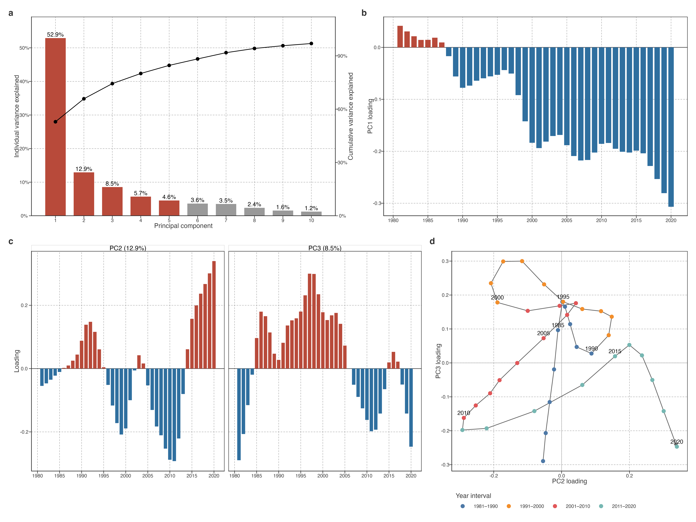

# Low-frequency warming trajectories

## A low-dimensional trajectory space separates net change from timing

We next asked whether the heterogeneous local-rate histories described above could be represented by a small number of recurrent low-frequency trajectories. We fitted PCA to annualised monthly STL trends after centring each lake on its 1981–1990 mean and averaging trajectories within occupied equal-area cells (Methods). The fitted rows were therefore 573 represented spatial cells, not 92,245 lakes, preventing lake-dense regions from dominating the covariance structure solely through sample count.

> 本节承接 Results 02：局地速度历史能否形成可重复低频结构。PCA 样本为 573 个代表性格网，结果服务空间结构描述。

| PCA input detail | Active specification |
|----|----|
| Source representation | Annualised monthly STL trend (`nt = 99`) for 1981–2020 |
| Lake-level centring | Each lake minus its own 1981–1990 mean |
| Spatial estimator | Mean trajectory in each occupied 72 × 21 longitude-by-sin(latitude) equal-area cell |
| Fitted rows | 573 occupied cells representing 92,245 lakes |
| PCA preprocessing | Columns centred across cell trajectories; no variance standardisation |
| Completeness rule | Input annual representation must be finite for every lake-year used by the fit |
| Lake scores | Lake trajectories projected onto fixed cell-PCA loadings; no lake-level PCA refit |

> 表格列出 PCA estimand 与 score 生成方式。湖泊 score 使用共同轴，结果保持连续坐标。

The decomposition was strongly low-dimensional. PC1 explained 52.9% of the between-cell variance; PC2, PC3, PC4, and PC5 explained 12.9%, 8.5%, 5.7%, and 4.6%, respectively. Together, the first five modes explained 84.6% of the cell-trajectory variance. The remaining components each explained less than 3.7%, so they were retained for diagnostic completeness but not used to define the main trajectory geometry.

> 低维性表明 573 条轨迹存在组织。前五轴用于完整诊断；主论证聚焦 PC1 与 PC2–PC3 平面。

| Component | Variance explained | Cumulative variance explained |
|-----------|--------------------|-------------------------------|
| PC1       | 52.9%              | 52.9%                         |
| PC2       | 12.9%              | 65.8%                         |
| PC3       | 8.5%               | 74.4%                         |
| PC4       | 5.7%               | 80.1%                         |
| PC5       | 4.6%               | 84.6%                         |
| PC6       | 3.6%               | 88.3%                         |
| PC7       | 3.5%               | 91.8%                         |
| PC8       | 2.4%               | 94.1%                         |
| PC9       | 1.6%               | 95.7%                         |
| PC10      | 1.2%               | 96.9%                         |

> 该表给出完整谱。主文使用具有清晰解释和稳健性边界的 PC1、PC2–PC3。

PC1 evolved broadly in one direction through the record: its loading declined from a small positive value in 1981 to its most negative value in 2020, with smaller departures around this low-frequency progression. Its sign is arbitrary. The substantive result is that one smooth, record-spanning temporal contrast accounts for more than half of the represented spatial variation. Cells differ in the signed score with which they express this basis; PC1 is therefore not a spatially uniform warming history.

> PC1 为全期平滑主对比，解释超过一半的 cell 间低频差异。符号可整体翻转，图示方向已固定。

PC2 and PC3 described different departures from the leading trajectory. PC2 was negative around 1997–2013, reached its deepest value in 2011, and then rose rapidly to its maximum in 2020. PC3 instead had its largest positive excursion in the late 1990s, followed by a shift to negative loadings after the late 2000s. The modes therefore emphasise different parts of the record. Their signs and ordering should not be interpreted as two physical mechanisms: the stable descriptive object is their two-dimensional span.

> 次级结构以 PC2–PC3 平面阅读，记录不同阶段的偏离组合。单轴符号与排序会随重拟合变化。

The phase path shows why PC2 and PC3 are considered jointly. It traces an early-record PC3 excursion, a later movement toward strongly negative PC2, and a final movement toward positive PC2. This is a compact description of how secondary low-frequency contrasts changed through time. It does not construct a new component or imply that the path itself is a climate driver.

> 相图说明 PC2 与 PC3 应联读：早期先出现 PC3 方向偏离，之后走向强负 PC2，末期再转向正 PC2。图件紧凑呈现次级低频对比的时间变化；气候驱动需要单独检验。

Figure 1: Low-dimensional trajectory space of equal-area lake-warming histories. a, Individual and cumulative variance explained by the first ten components. b, PC1 temporal loading, whose sign is arbitrary. c, PC2 and PC3 temporal loadings, displayed separately while interpreted as a joint plane. d, temporal path through the PC2–PC3 loading plane. Each phase-path point is one year; arrows connect consecutive years.

PC4 and PC5 together added 10.3% of variance. Their temporal structure is retained for diagnostic completeness, but their lower explained variance and weaker omission stability exclude them from the main pathway argument. Their loadings are retained in the [supplementary PCA diagnostic](../../../../explorations/warming-temporal-pathways/manuscript/supplementary/pca-diagnostics.llms.md).

> PC4–PC5 保留用于完整诊断。图件和 input/grid sensitivity 证据集中于 Results 05 与补充材料。

Back to top
