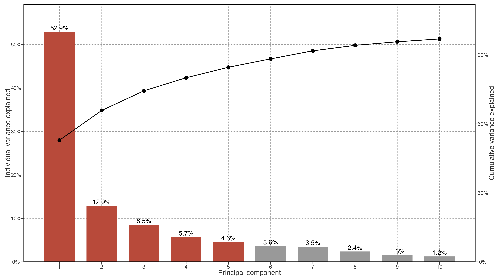
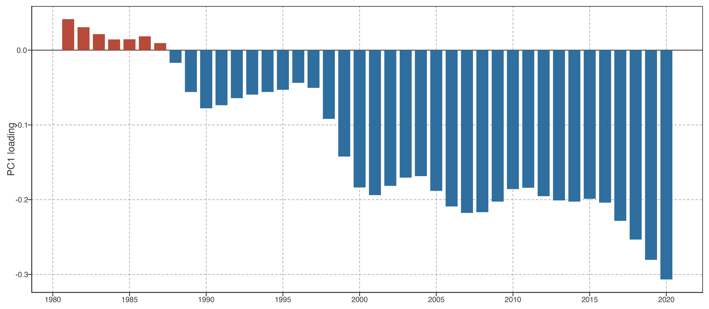
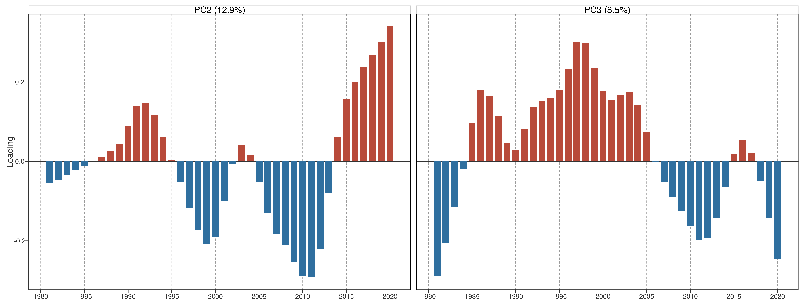
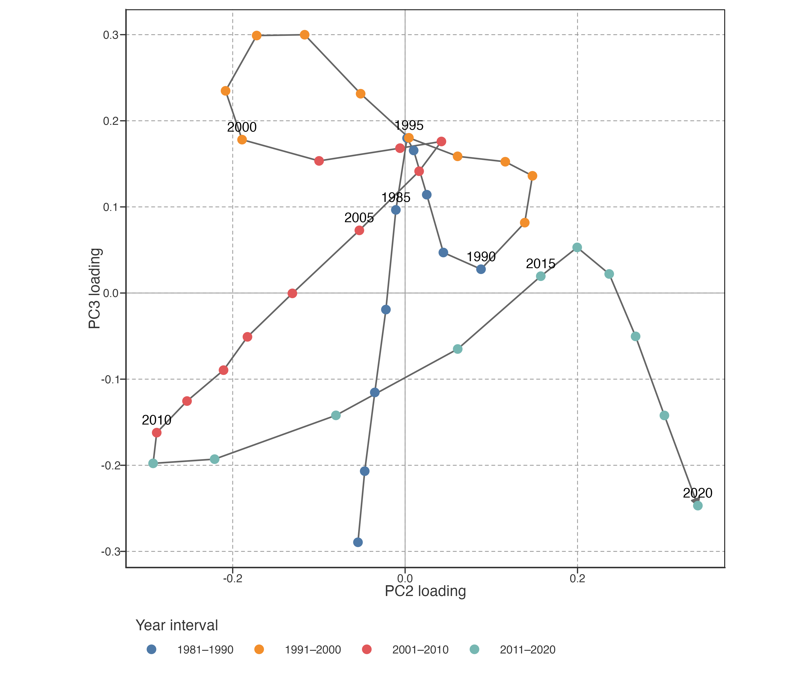
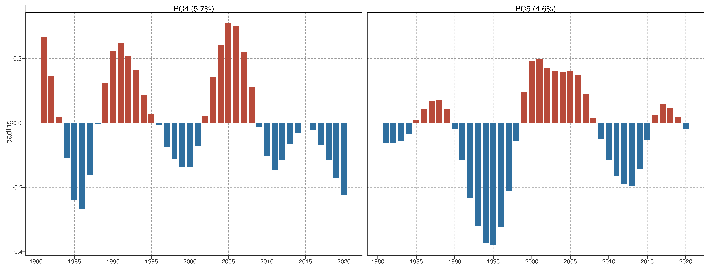
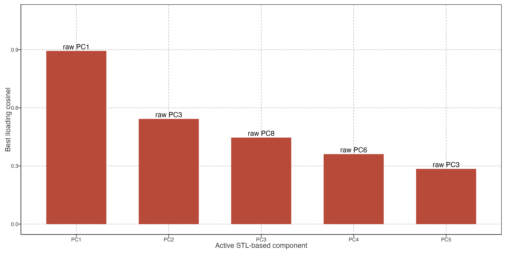
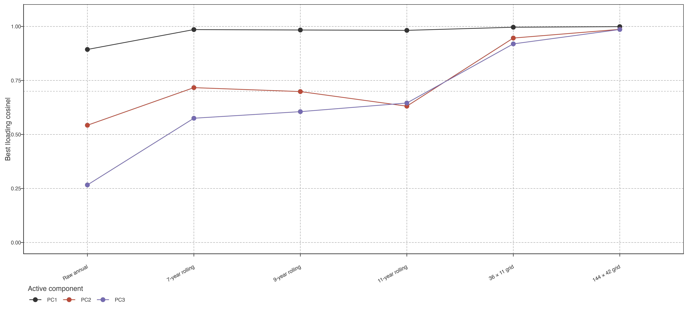
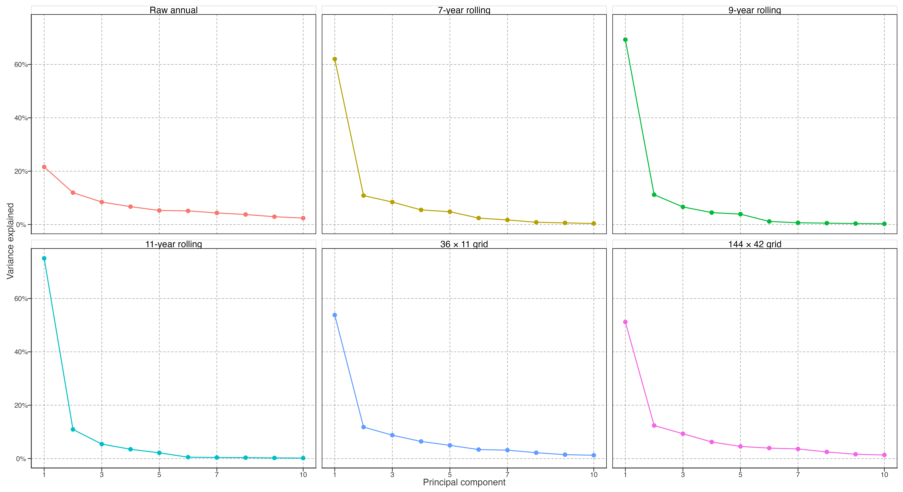

# Dominant warming trajectories

## A small number of temporal modes capture the dominant lake-warming trajectories

To identify recurrent low-frequency structures, we first extracted the monthly STL trend for each lake (`nt = 99`) and annualised that trend. Each annual trajectory was centred on its 1981–1990 mean. The centred lake trajectories were then averaged within occupied equal-area spherical cells, and PCA was fitted to the resulting 573 cell trajectories (Methods). Thus, the PCA estimates covariance among represented spatial cells, rather than giving lake-dense regions more weight simply because they contain more lakes.

> 先对每湖月温度做 STL（`nt = 99`）并年化，再按 1981–1990 均值中心化；之后在占据的等面积球面格网内平均，最后对 573 条格网轨迹做 PCA。目标是代表空间格网的协变，而不是让湖泊密集区因样本数多而主导结果。

| PCA input detail | Active specification |
|----|----|
| Source representation | Annualised monthly STL trend (`nt = 99`) for 1981–2020 |
| Lake-level centring | Each lake minus its own 1981–1990 mean |
| Spatial estimator | Mean trajectory in each occupied 72 × 21 longitude-by-sin(latitude) equal-area cell |
| Fitted rows | 573 occupied cells representing 92,245 lakes |
| PCA preprocessing | Columns centred across cell trajectories; no variance standardisation |
| Completeness rule | Input annual representation must be finite for every lake-year used by the fit |
| Lake scores | Lake trajectories projected onto fixed cell-PCA loadings; no lake-level PCA refit |

> PCA 输入、中心化、格网估计器、完整性规则与分数投影方式如表所示。这里 PCA 的行是 573 个等面积格网，不是 92,245 个湖泊；湖泊只投影到固定格网 PCA 轴。

Figure 1: Explained and cumulative variance for the first ten principal components of the equal-area cell trajectories. Bars show individual explained variance; the line shows cumulative variance.

The decomposition was strongly low-dimensional. PC1 explained 52.9% of the between-cell variance; PC2, PC3, PC4, and PC5 explained 12.9%, 8.5%, 5.7%, and 4.6%, respectively. Together, the first five modes explained 84.6% of the cell-trajectory variance. The remaining components each explained less than 3.7%, so they were retained for diagnostic completeness but not used to define the main trajectory geometry.

> 分解具有明显低维性。PC1–PC5 分别解释 52.9%、12.9%、8.5%、5.7% 与 4.6%，累计 84.6%。其后每个 PC 均不足 3.7%，保留用于诊断，不进入主要路径几何的定义。

| Component | Variance explained | Cumulative variance explained |
|-----------|--------------------|-------------------------------|
| PC1       | 52.9%              | 52.9%                         |
| PC2       | 12.9%              | 65.8%                         |
| PC3       | 8.5%               | 74.4%                         |
| PC4       | 5.7%               | 80.1%                         |
| PC5       | 4.6%               | 84.6%                         |
| PC6       | 3.6%               | 88.3%                         |
| PC7       | 3.5%               | 91.8%                         |
| PC8       | 2.4%               | 94.1%                         |
| PC9       | 1.6%               | 95.7%                         |
| PC10      | 1.2%               | 96.9%                         |

> 前十个 PC 的解释方差与累计解释方差见表；保留前五个是预先规定的描述维度选择，不以达到 95% 累计方差为目标。

Figure 2: PC1 temporal loading. Bar direction is the loading sign; the PCA sign convention can reverse without changing the fitted mode.

PC1 evolved broadly in one direction through the record: its loading declined from a small positive value in 1981 to its most negative value in 2020, with smaller departures around this low-frequency progression. Its sign is arbitrary. The substantive result is that one smooth, record-spanning temporal contrast accounts for more than half of the represented spatial variation. Cells differ in the signed score with which they express this basis; PC1 is therefore not a spatially uniform warming history.

> PC1 在全记录内总体单向演变：1981 年略正，2020 年达到最负，中间只有较小偏离。正负本身可整体翻转；实质是一个平滑、贯穿全期的时间对比解释了超过一半的空间格网差异。各格网以不同正负分数表达它，因此不等于所有湖泊经历同一增温历史。

Figure 3: Temporal loadings for PC2 and PC3. Their separate ordered labels are shown for display, while the joint PC2–PC3 plane is the retained secondary object.

PC2 and PC3 described different departures from the leading trajectory. PC2 was negative around 1997–2013, reached its deepest value in 2011, and then rose rapidly to its maximum in 2020. PC3 instead had its largest positive excursion in the late 1990s, followed by a shift to negative loadings after the late 2000s. The modes therefore emphasise different parts of the record. Their signs and ordering should not be interpreted as two physical mechanisms: the stable descriptive object is their two-dimensional span.

> PC2 与 PC3 强调主轨迹之外的不同时间段。PC2 在 1997–2013 年多为负，2011 年最负，之后快速升至 2020 年最大；PC3 在 1990 年代末最正，2000 年代末后转负。二者强调不同阶段；不把正负或排序解释成两个物理机制，稳定的描述对象是 PC2–PC3 二维平面。

Figure 4: Temporal path through the PC2–PC3 loading plane. Each point is one year and consecutive years are connected. The path displays the joint secondary contrast without treating either ordered coordinate as an invariant mechanism.

The phase path shows why PC2 and PC3 are considered jointly. It traces an early-record PC3 excursion, a later movement toward strongly negative PC2, and a final movement toward positive PC2. This is a compact description of how secondary low-frequency contrasts changed through time. It does not construct a new component or imply that the path itself is a climate driver.

> 相图说明 PC2 与 PC3 应联读：早期先出现 PC3 方向偏离，之后走向强负 PC2，末期再转向正 PC2。它紧凑描述次级低频对比如何随时间变化；不构造新 PC，也不表示该路径是气候驱动。

Figure 5: Temporal loadings for PC4 and PC5. These lower-variance modes are displayed for completeness but are not used as the primary pathway axes.

PC4 and PC5 together added 10.3% of variance. Their temporal structure is retained as descriptive detail, but the lower explained variance and weaker stability under omission mean that they are not used to organise the core interpretation. Their spatial expression is shown with the other score maps in the following section.

> PC4 与 PC5 合计增加 10.3% 方差。它们保留为描述细节；但解释方差较小、遗漏稳定性更弱，不用于组织核心解释。其空间表达放到下一节的分数地图中统一展示。

## Input and sensitivity displays

The following displays document the available boundary checks for the PCA representation. They are not alternative primary warming metrics: raw annual LSWT remains the representation used for the long-term and local-rate results in Sections 3.1–3.2.

> 下列图展示 PCA 表征的现有边界检查，不替代主增温指标。第 3.1–3.2 节的长期趋势和局地速度仍以 raw 年均 LSWT 计算。

Figure 6: Best temporal-loading match between the active STL-based PCA and PCA fitted to raw annual trajectories, after matching each active PC to its most congruent raw-input component. This compares representations, not independent datasets.

The raw-input comparison tests whether the dominant STL-based modes simply reappear when no low-frequency extraction is applied. PC1 has a strong raw counterpart, whereas the secondary modes are less congruent. This supports the limited role assigned to STL: it is a low-frequency representation for PCA, not a replacement for the raw temperature record or proof of a distinct physical process.

> raw 输入比较检验：不做低频提取时，STL PCA 模态是否仍会出现。PC1 有较强 raw 对应项，次级模态一致性较低。这支持 STL 的限定角色：仅用于 PCA 的低频表征，不替代 raw 温度，也不证明独立物理过程。

Figure 7: Available PCA input and grid sensitivity checks. Points give the best loading congruence for each active PC after component matching. Rolling windows are alternative raw-annual low-pass representations, not STL parameter branches.

Figure 8: Explained-variance spectra for available input, grid, and record-boundary branches. The display compares decomposition concentration; it does not establish component identity across branches.

Available checks cover raw annual input, 7/9/11-year rolling alternatives, three equal-area grid resolutions, and an end-trimmed 1985–2016 record. They do not include an independent STL-window branch, median aggregation, or an alternative centring/standardisation branch. Those uncomputed choices are therefore not presented as completed sensitivity tests.

> 现有检查包括 raw 年输入、7/9/11 年滑动替代、三种等面积格网分辨率和首尾裁剪的 1985–2016 记录。没有独立 STL 窗口、median 聚合或不同中心化/标准化分支，故不把这些未计算选择伪装成已完成的敏感性测试。

Back to top
