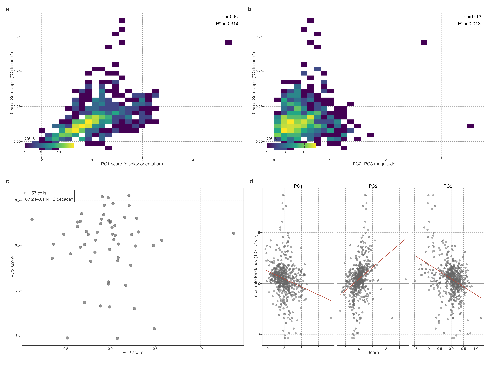

# Spatial organization of warming pathways

## Pathway coordinates form coherent spatial fields

PCA scores are coordinates of equal-area cell trajectories, not intrinsically positive or negative climate states. We therefore fixed the displayed PC1 orientation before mapping: its loading was multiplied, together with its scores, by a common sign so that it correlated positively with the equal-area global STL trajectory (r = 0.914). Under this convention, a positive PC1 score means that a cell is in phase with the displayed PC1 temporal loading; it does not inherently mean warming, and a sign reversal would leave the fitted PCA geometry unchanged.

> 先固定读图约定。PC1 正负表示与时间轴同相或反相，图示正值不等同于更暖。

Figure 1: Spatial organization of equal-area trajectory scores. PC1 uses the displayed orientation that is in phase with the equal-area global STL trajectory. PC2–PC3 magnitude is invariant to rotations or axis exchange within the secondary plane.

PC1 scores formed broad, geographically continuous fields rather than a scatter of isolated cells. Positive, same-phase scores dominated much of Europe, extending from the British Isles and Scandinavia through central and eastern Europe into western Asia. Opposite-phase scores were concentrated in southern South America and Maritime Southeast Asia, with additional patches in equatorial western South America. These transitions span national borders and occur over broad regional bands; they are descriptive spatial patterns, not evidence for a single driver.

> 图的重点是跨越行政边界的连续区域带，支持路径具有空间组织。区域带的物理过程留待独立研究。

The spatial continuity was confirmed by queen-neighbour Moran’s I values of 0.703 for PC1, 0.651 for PC2, 0.798 for PC3, and 0.556 for PC2–PC3 magnitude (all permutation P = 0.001; values and design in the [supplementary core-result tables](../../../../explorations/warming-temporal-pathways/manuscript/supplementary/core-result-tables.llms.md)). A binned correlogram gives the same descriptive result: PC1 standardized covariance remained positive through approximately 6,500 km before becoming negative at larger separations. This quantifies spatial organization only; it does not identify a causal geographic process.

> Moran’s I 与 correlogram 量化地图的连续性，支撑空间结构论证。

The full correlogram is retained as a [supplementary spatial diagnostic](../../../../explorations/warming-temporal-pathways/manuscript/supplementary/pca-spatial-autocorrelation.llms.md).

> correlogram 放入补充页，主文保留 Moran’s I 数值和对应的空间论证；两者共同说明连续性，均不指向具体机制。

PC2 and PC3 also formed coherent but partly complementary fields. PC2 had strong positive expression around the North Pacific and parts of subtropical North America, while negative scores were widespread across central and eastern Canada. PC3 showed a contrasting Eurasian structure, with positive areas in the North Atlantic fringe and eastern China but negative scores from eastern Europe through central Asia. Because either axis can rotate or exchange rank under resampling, these individual maps are displayed as coordinates, not as separate invariant mechanisms.

> PC2、PC3 地图定位次级平面的组成。单轴会旋转或换序，主结果转向旋转不变的振幅。

High PC2–PC3 magnitude identified where trajectories departed most strongly from the leading PC1 basis, irrespective of secondary-axis orientation. The largest values occurred around the North Pacific–Alaska sector, the subarctic North Atlantic, and parts of Europe–central Asia. Low magnitude occurred across much of southern South America and several tropical regions. Thus the magnitude map is the primary spatial result for the secondary subspace; it is invariant to any rotation or exchange of PC2 and PC3.

> 高 PC2–PC3 振幅表示轨迹偏离 PC1 主轴，数值不受 PC2、PC3 旋转或换序影响。区域位置作描述性呈现。

## Long-term magnitude and pathway coordinates retain different information

The 40-year Sen slope and the PCA coordinates overlapped selectively. Long-term warming was strongly associated with displayed PC1 score (Spearman ρ = 0.672; linear R² = 0.314), but it had little association with PC2–PC3 magnitude (ρ = 0.135; R² = 0.013). PC1 therefore retains a substantial part of the net long-term displacement, whereas the intensity of secondary pathway expression is largely not predicted by the same displacement.

> PCA 与 Result 01 在此衔接：PC1 部分承接净位移，次级振幅几乎不由净位移预测。同一变暖量仍对应不同路径。

Even cells with closely matched net warming were dispersed within the secondary plane. In the central decile of long-term warming (0.124–0.144°C decade⁻¹; n = 57 cells), the PC2 and PC3 interquartile ranges were 0.336 and 0.402, respectively. This is direct evidence that comparable forty-year displacement does not determine the low-frequency pathway by which it developed.

> 控制在长期增温中间十分位后，次级平面仍有宽分布。这为路径异质性提供直接证据。

The local-rate tendency index was linked differently: its strongest rank associations were with PC2 (ρ = 0.421) and PC3 (ρ = −0.305), compared with −0.260 for PC1 and −0.020 for PC2–PC3 magnitude. This is expected overlap between two summaries of the same records, not an independent validation. Its value is descriptive: net displacement, local-rate evolution, and secondary trajectory position cannot substitute for one another.

> 局地速度倾向与 PC2、PC3 的关联表明二者共享路径信息。所有量来自同一温度记录，相关性属于表征重叠。

Figure 2: Raw trajectory metrics and low-frequency pathway coordinates retain complementary information at equal-area cell level. a,b, Relationship of 40-year Sen slope to PC1 and rotation-invariant PC2–PC3 magnitude. c, PC2–PC3 coordinates among cells in the central decile of 40-year warming. d, Local-rate tendency in relation to PC1–PC3 scores. Associations are shared-record information overlap, not independent validation or mechanism evidence.

> [补充表](../../../../explorations/warming-temporal-pathways/manuscript/supplementary/core-result-tables.llms.md) 给出信息重叠的完整数值。大陆在此仅作地理汇总，主文不再重复展示其分箱分数。

Global lake-warming trajectories were therefore heterogeneous but not unstructured. A small number of low-frequency temporal coordinates described their dominant differences; these coordinates formed broad spatial fields, and the secondary PC2–PC3 geometry retained timing information not supplied by a single forty-year warming rate.

> 本节完成从路径差异到连续空间组织的逻辑推进。PC2–PC3 提供单一长期趋势之外的时序信息。

Back to top
