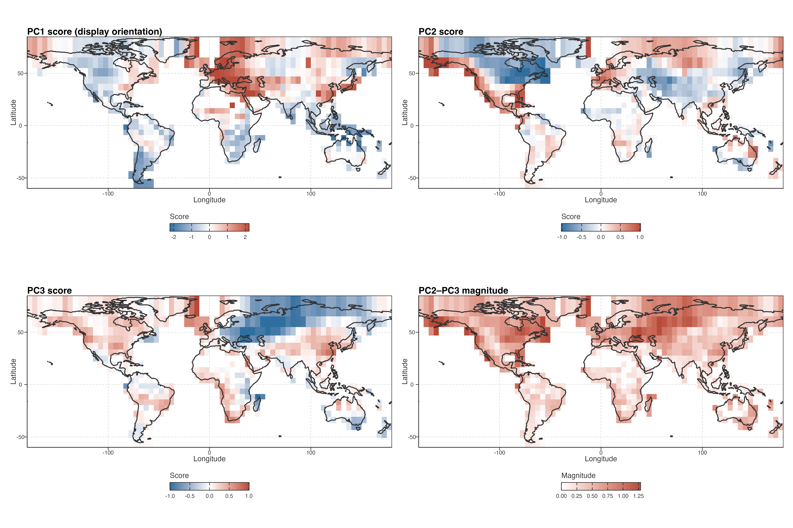
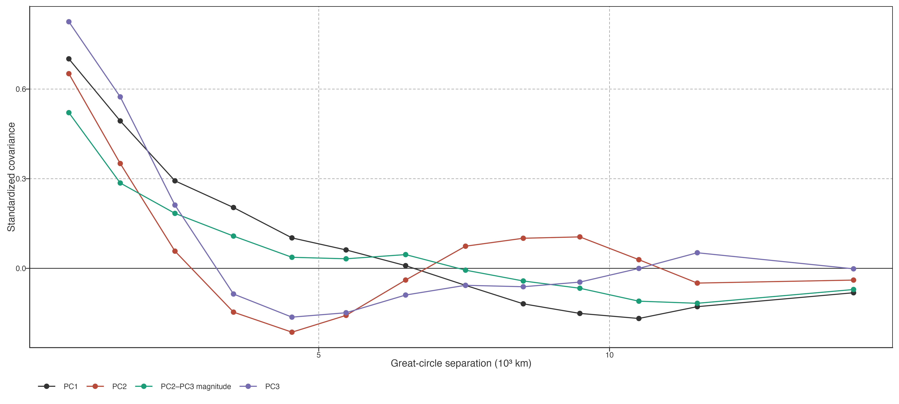
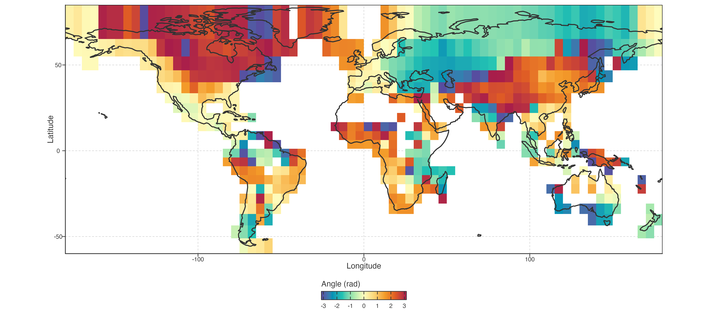
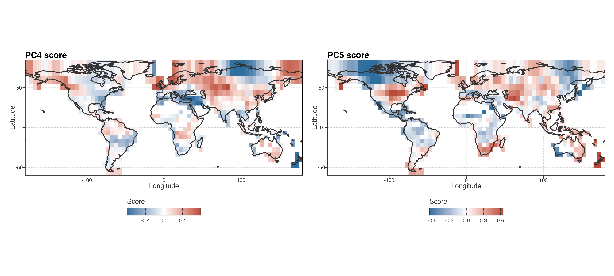
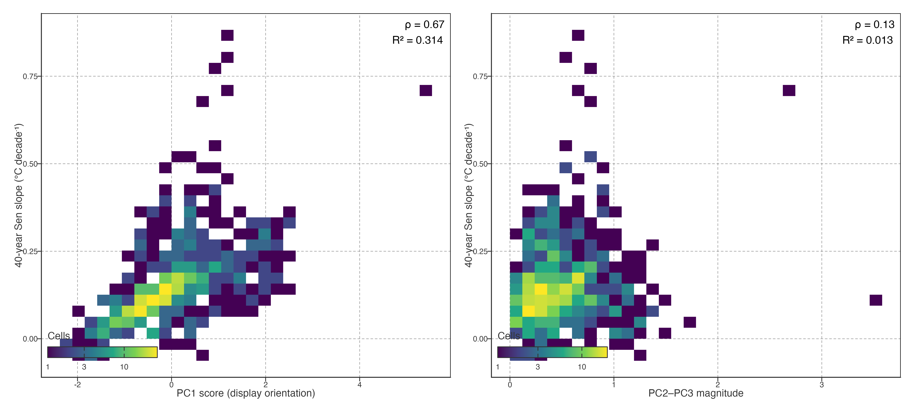
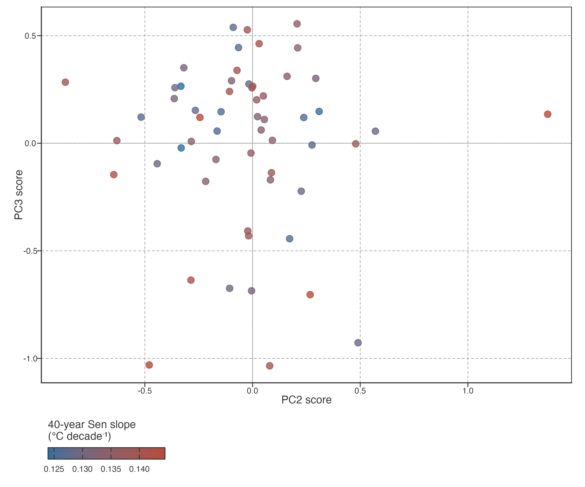
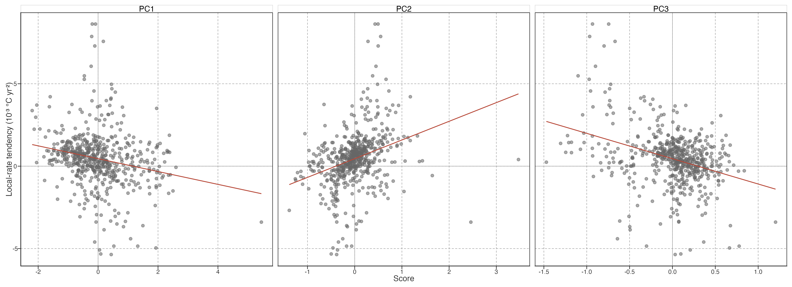
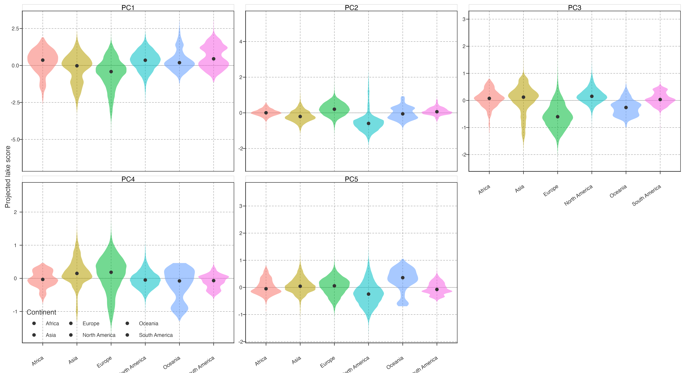

# Spatial organization of trajectory modes

## Temporal modes exhibit coherent spatial organization

PCA scores are coordinates of equal-area cell trajectories, not intrinsically positive or negative climate states. We therefore fixed the displayed PC1 orientation before mapping: its loading was multiplied, together with its scores, by a common sign so that it correlated positively with the equal-area global STL trajectory (r = 0.914). Under this convention, a positive PC1 score means that a cell is in phase with the displayed PC1 temporal loading; it does not inherently mean warming, and a sign reversal would leave the fitted PCA geometry unchanged.

> PCA 分数是等面积格网轨迹的坐标，不是天然的正负气候状态。绘图前统一翻转 PC1 的 loading 和 score，使其与等面积全球 STL 轨迹正相关（r = 0.914）。在此约定下，正 PC1 表示与图示 PC1 时间轴同相，不天然等于增温；整体反号不改变 PCA 几何。

Figure 1: Spatial organization of equal-area trajectory scores. PC1 uses the displayed orientation that is in phase with the equal-area global STL trajectory. PC2–PC3 magnitude is invariant to rotations or axis exchange within the secondary plane.

PC1 scores formed broad, geographically continuous fields rather than a scatter of isolated cells. Positive, same-phase scores dominated much of Europe, extending from the British Isles and Scandinavia through central and eastern Europe into western Asia. Opposite-phase scores were concentrated in southern South America and Maritime Southeast Asia, with additional patches in equatorial western South America. These transitions span national borders and occur over broad regional bands; they are descriptive spatial patterns, not evidence for a single driver.

> PC1 分数形成连续大区，而非孤立格网。与图示时间轴同相的正分数主要覆盖欧洲大部，从不列颠群岛、斯堪的纳维亚经中东欧延伸至西亚；反相分数集中在南美南部、东南亚海陆区，并见于赤道附近南美西部。边界常跨越国界、呈大区域带状；这是描述性空间格局，不证明单一驱动。

| Spatial field                   | Moran’s I | Permutation P (999 permutations) |
|---------------------------------|-----------|----------------------------------|
| PC1 score (display orientation) | 0.703     | 0.001                            |
| PC2 score                       | 0.651     | 0.001                            |
| PC3 score                       | 0.798     | 0.001                            |
| PC2–PC3 magnitude               | 0.556     | 0.001                            |

The spatial continuity was confirmed by queen-neighbour Moran’s I values of 0.703 for PC1, 0.651 for PC2, 0.798 for PC3, and 0.556 for PC2–PC3 magnitude (all permutation P = 0.001; accompanying spatial-autocorrelation table). A binned correlogram gives the same descriptive result: PC1 standardized covariance remained positive through approximately 6,500 km before becoming negative at larger separations. This quantifies spatial organization only; it does not identify a causal geographic process.

> Queen 邻接 Moran’s I 分别为 0.703、0.651、0.798 与 0.556（999 次置换均 P=0.001；见随附的空间自相关表）。PC1 的分箱 correlogram 在约 6,500 km 内仍为正，之后转负。它量化空间组织，不识别因果地理过程。

Figure 2: Distance-binned standardized covariance of equal-area score fields. The plot is a descriptive correlogram: positive values indicate more similar-than-average score values among cell pairs in that distance bin.

PC2 and PC3 also formed coherent but partly complementary fields. PC2 had strong positive expression around the North Pacific and parts of subtropical North America, while negative scores were widespread across central and eastern Canada. PC3 showed a contrasting Eurasian structure, with positive areas in the North Atlantic fringe and eastern China but negative scores from eastern Europe through central Asia. Because either axis can rotate or exchange rank under resampling, these individual maps are displayed as coordinates, not as separate invariant mechanisms.

> PC2 与 PC3 同样形成连续、部分互补的空间场。PC2 的正分数突出于北太平洋和北美部分副热带区域，负分数广布于加拿大中东部；PC3 在北大西洋边缘和中国东部偏正，从东欧至中亚偏负。由于两轴可在重采样中旋转或换序，这些图只显示坐标，不把单轴当作不变机制。

High PC2–PC3 magnitude identified where trajectories departed most strongly from the leading PC1 basis, irrespective of secondary-axis orientation. The largest values occurred around the North Pacific–Alaska sector, the subarctic North Atlantic, and parts of Europe–central Asia. Low magnitude occurred across much of southern South America and several tropical regions. Thus the magnitude map is the primary spatial result for the secondary subspace; it is invariant to any rotation or exchange of PC2 and PC3.

> 高 PC2–PC3 振幅表示轨迹显著偏离 PC1 主轴，不依赖次级轴方向。高值集中于北太平洋—阿拉斯加、亚北极北大西洋和欧洲—中亚部分地区；低值见于南美南部与若干热带地区。振幅图是次级平面的主要空间结果，因为它对 PC2/PC3 旋转或换序不变。

Figure 3: Direction within the PC2–PC3 score plane. Angle is useful for describing relative secondary expression but changes under rotations or axis exchange, so it is a supporting display rather than the primary secondary-mode result.

Figure 4: PC4 and PC5 score maps, shown for descriptive completeness. These axes explain less variance and have weaker omission stability than the PC1 and PC2–PC3 structures.

## Long-term magnitude and pathway coordinates retain different information

The 40-year Sen slope and the PCA coordinates overlapped selectively. Long-term warming was strongly associated with displayed PC1 score (Spearman ρ = 0.672; linear R² = 0.314), but it had little association with PC2–PC3 magnitude (ρ = 0.135; R² = 0.013). PC1 therefore retains a substantial part of the net long-term displacement, whereas the intensity of secondary pathway expression is largely not predicted by the same displacement.

> 40 年 Sen slope 与 PCA 坐标只选择性重叠。长期增温与图示 PC1 分数强相关（Spearman ρ=0.672；线性 R²=0.314），与 PC2–PC3 振幅关系很弱（ρ=0.135；R²=0.013）。PC1 保留较多净长期位移信息，次级路径表达强度则基本不能由同一位移预测。

Figure 5: Relationship of 40-year raw annual Sen slope to the primary PC1 coordinate and rotation-invariant PC2–PC3 magnitude at equal-area cell level. Correlations quantify representational overlap, not independent validation.

Even cells with closely matched net warming were dispersed within the secondary plane. In the central decile of long-term warming (0.124–0.144°C decade⁻¹; n = 57 cells), the PC2 and PC3 interquartile ranges were 0.336 and 0.402, respectively. This is direct evidence that comparable forty-year displacement does not determine the low-frequency pathway by which it developed.

> 即使净增温相近，格网仍在次级平面中分散。在长期增温 central decile（0.124–0.144°C decade⁻¹；n=57）内，PC2 与 PC3 的 IQR 分别为 0.336、0.402。相近的 40 年净位移不能决定其低频时间路径。

Figure 6: PC2–PC3 coordinates among equal-area cells in the central decile of 40-year warming. Comparable net warming occupies a broad secondary trajectory space.

The local-rate tendency index was linked differently: its strongest rank associations were with PC2 (ρ = 0.421) and PC3 (ρ = −0.305), compared with −0.260 for PC1 and −0.020 for PC2–PC3 magnitude. This is expected overlap between two summaries of the same records, not an independent validation. Its value is descriptive: net displacement, local-rate evolution, and secondary trajectory position cannot substitute for one another.

> 局地速度倾向则呈不同关系：与 PC2（ρ=0.421）和 PC3（ρ=−0.305）最强，与 PC1 为 −0.260、与次级振幅为 −0.020。这是同一记录两种表征的预期重叠，不是独立验证；其描述价值在于净位移、局地速度演变和次级路径位置不能互相替代。

Figure 7: Equal-area local-rate tendency in relation to PC1–PC3 scores. These shared-record associations describe information overlap and do not identify mechanisms.

| Response            | PCA coordinate                  | Spearman ρ | Linear R² |
|---------------------|---------------------------------|------------|-----------|
| 40-year Sen slope   | PC1 score (display orientation) | 0.672      | 0.314     |
| 40-year Sen slope   | PC2 score                       | -0.056     | 0.001     |
| 40-year Sen slope   | PC3 score                       | -0.077     | 0.019     |
| 40-year Sen slope   | PC2–PC3 magnitude               | 0.135      | 0.013     |
| Local-rate tendency | PC1 score (display orientation) | -0.260     | 0.049     |
| Local-rate tendency | PC2 score                       | 0.421      | 0.100     |
| Local-rate tendency | PC3 score                       | -0.305     | 0.122     |
| Local-rate tendency | PC2–PC3 magnitude               | -0.020     | 0.006     |

> 长期趋势、局地速度倾向与各 PCA 坐标的完整关联矩阵如表。它量化的是同一温度记录不同表征之间的信息重叠，不用于机制归因。

Figure 8: Projected lake-score distributions by continent. Continents are descriptive display bins, not spatial process units; this figure documents score composition rather than testing continent effects.

Global lake-warming trajectories were therefore heterogeneous but not unstructured. A small number of low-frequency temporal coordinates described their dominant differences; these coordinates formed broad spatial fields, and the secondary PC2–PC3 geometry retained timing information not supplied by a single forty-year warming rate.

> 全球湖泊增温路径具有异质性，但不是无结构噪声。少量低频时间坐标描述主要差异，且在空间上形成连续区域；PC2–PC3 次级几何还保留了单一 40 年增温率无法提供的变化时序信息。

Back to top
