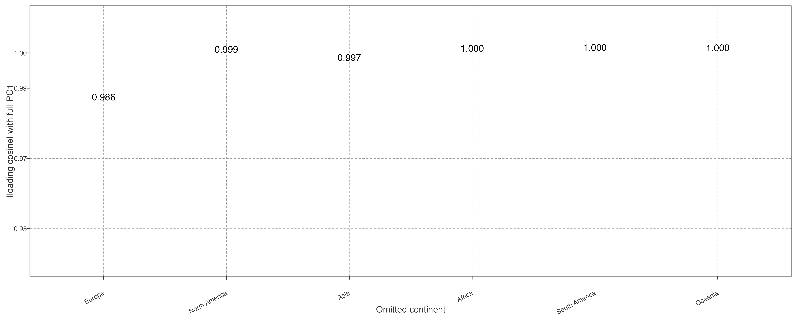
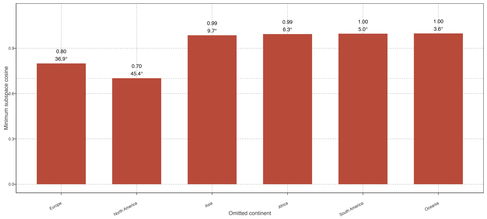
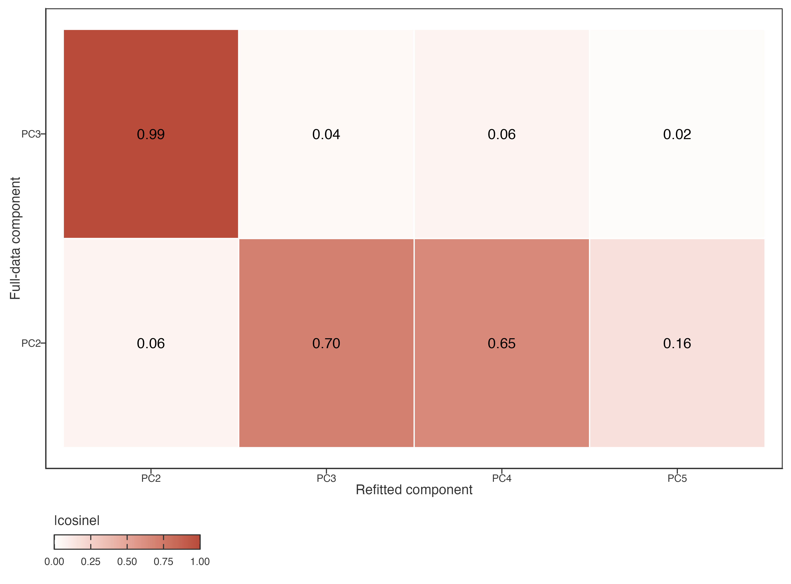
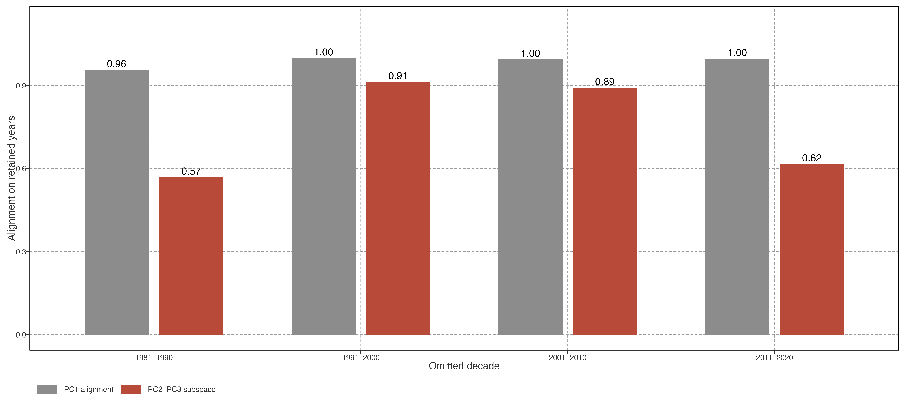
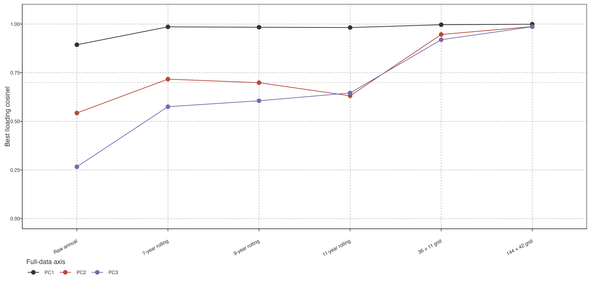

# Robustness of trajectory modes

## Dominant trajectory modes are robust to spatial and temporal perturbations

We evaluated robustness at the level at which each result is interpreted. PC1 was compared as an ordered temporal axis. PC2–PC3 was compared as a two-dimensional temporal subspace: on the years shared by the reference and a refit, both loading matrices were first orthonormalized and their principal angles were calculated. The minimum cosine of these angles is conservative: 1 denotes identical subspaces and 0 denotes orthogonal subspaces. This prevents a rank exchange from being mistaken for either loss or preservation of a mode.

> 稳健性必须按解释层级检验：PC1 是有序时间轴；PC2–PC3 是二维子空间。对共同保留年份上的 loading 先正交化，再以 principal angles 比较。最小余弦为 1 表示两个平面相同，0 表示正交；轴交换本身不能代替子空间证据。

### Spatial omission

PC1 was highly stable in leave-one-continent-out (LOCO) refits. Its direct temporal-loading cosine with the full-data PC1 ranged from 0.986 to 1.000 (median 0.999; Fig. [Figure 1](#fig-results-loco-pc1-alignment)). Thus, no individual continent supplied the leading low-frequency trajectory by itself.

> LOCO 中 PC1 与完整分析的直接 loading cosine 为 0.986–1.000，中位数 0.999。没有任何单一大陆独自制造这个主低频轨迹。

Figure 1: PC1 temporal-loading alignment after omitting each continent. Cosine is sign-invariant; values near one indicate the same one-dimensional temporal axis.

The PC2–PC3 plane also recurred across continental omissions, although less uniformly. Its minimum principal-angle cosine ranged from 0.702 to 0.998 (median 0.990; Fig. [Figure 2](#fig-results-loco-subspace-stability)). North America (0.702; maximum angle 45.4°) and Europe (0.800; 36.9°) were the two limiting omissions. The result supports a recurring secondary plane, with its weakest reproduction when a large, spatially coherent lake population is removed.

> PC2–PC3 平面在各大陆遗漏下也重复出现，最小 principal-angle cosine 为 0.702–0.998，中位数 0.990。去北美与去欧洲最弱，说明大而连续的湖泊样本被移除时，次级平面的复现会下降。

Figure 2: LOCO stability of the PC2–PC3 temporal subspace. Bars show the conservative minimum principal-angle cosine; labels give the maximum principal angle.

Axis order nevertheless changed under North-American omission. The full-data PC2 aligned best with refitted PC3 (\|cosine\| = 0.701), whereas full-data PC3 aligned best with refitted PC2 (0.995; Fig. [Figure 3](#fig-results-loco-axis-exchange)). This is why the secondary result is retained as a plane rather than presented as two independently fixed global modes.

> 去北美时，完整分析 PC2 最接近重拟合 PC3（0.701），完整 PC3 最接近重拟合 PC2（0.995）。因此次级结果应表述为 PC2–PC3 平面，不能把两个轴当作各自固定的全球模态。

Figure 3: Cross-component loading congruence after North-American omission. The off-diagonal maximum for reference PC3 demonstrates rank exchange; it does not itself establish subspace stability, which is quantified in Fig. [Figure 2](#fig-results-loco-subspace-stability).

### Temporal block omission

We then omitted each contiguous ten-year block and refit the same equal-area PCA to the remaining 30 years. These are temporal block-omission tests: the record contains a deliberate gap, so comparisons use only the 30 years common to the full and refitted analyses. Baseline centring was recomputed from the first ten retained years; no omitted observations entered the refit.

> 随后每次删除连续十年，并以剩余 30 年重拟合 PCA。这是 temporal block-omission test：记录有意保留缺口，因此只在完整与重拟合共同的 30 年上比较；基线也只用最早的十个保留年份重算，不使用被删除的观测。

PC1 remained close to the full-data axis under every omission (cosine 0.957–1.000; Fig. [Figure 4](#fig-results-lodo-stability)). The PC2–PC3 subspace was more sensitive to the two record edges: its minimum cosine was 0.569 after omitting 1981–1990 and 0.617 after omitting 2011–2020, but 0.914 and 0.893 after omitting the two central decades. Thus the leading mode is robust to this temporal perturbation, whereas the exact secondary plane depends partly on information at the beginning and end of the record. We therefore retain the secondary plane as a reproducible *spatial-omission* structure, but do not claim that it is fully insensitive to all temporal truncation.

> PC1 对四种十年删除均接近完整轴（0.957–1.000）。PC2–PC3 对首末十年更敏感：去 1981–1990 为 0.569、去 2011–2020 为 0.617；去两个中段十年则为 0.914、0.893。因此主模态通过时间扰动检验；次级平面对记录两端信息有依赖，不能声称其对所有时间截断都不敏感。

Figure 4: Temporal block-omission stability. Each refit omits one contiguous decade and is compared with the full analysis on its retained 30 years. PC2–PC3 values are minimum principal-angle cosines after orthonormalizing the restricted reference loading matrix.

### Input and grid sensitivity

The active representation also has identifiable limits. Across the two coarser or finer equal-area grids, PC1 remained the best-matched reference axis (\|cosine\| = 0.940–0.951); the first five components explained 83.7–85.7% of cell-level variance. Replacing STL trends with raw annual temperatures or centred 7-, 9-, or 11-year rolling means preserved a related leading contrast (PC1 \|cosine\| = 0.855–0.909), but changed the ordered secondary axes (Fig. [Figure 5](#fig-results-pca-input-sensitivity)). This supports the use of STL as a low-frequency PCA preprocessing choice, while making clear that PC2 and PC3 are not preprocessing-invariant labels.

> 两种替代等面积格网下，PC1 仍是最佳对应轴（0.940–0.951），前五 PC 解释 83.7–85.7% 方差。以 raw annual 或不同滑动均值替代 STL 后，主对比仍相关（PC1 为 0.855–0.909），但次级有序轴会改变。因此 STL 适合作为 PCA 的低频预处理；PC2、PC3 的轴标签不能被说成对预处理不变。

Figure 5: Best temporal-loading congruence of reference PC1–PC3 under alternative input representations and equal-area grid resolutions. Each point is matched to the most congruent refitted component, so this graphic tests recurrence rather than fixed rank.

No mean-versus-median aggregation, PCA standardization, lake-count threshold, or alternative STL-window refit is reported here because those branches have not been generated under the present spatially balanced pipeline. These are open sensitivity checks, not negative results. PC4–PC5 are retained in the supplementary robustness material only: their spatial-omission similarities are reported, but they are not needed for the paper’s main pathway claim.

> 目前没有生成 mean-versus-median、PCA 标准化、湖泊数阈值或替代 STL window 的同口径分支，因此不在这里假装完成。它们是待做敏感性检查。PC4–PC5 仅留补充材料：会报告空间遗漏结果，但不承担主线结论。

Back to top
