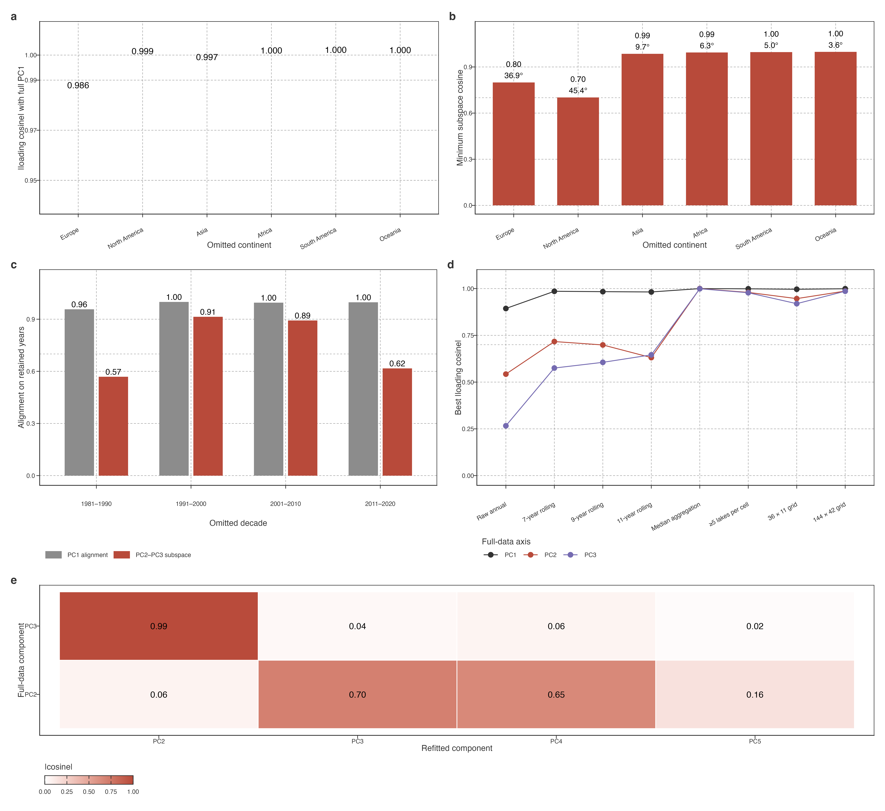

# Stability boundaries of trajectory modes

## The leading trajectory is stable, whereas the secondary plane has bounded robustness

We evaluated stability at the level at which each result is interpreted. PC1 was compared as an ordered temporal axis. PC2–PC3 was compared as a two-dimensional temporal subspace: on the years shared by the reference and a refit, both loading matrices were first orthonormalized and their principal angles were calculated. The minimum cosine is conservative, with 1 denoting identical subspaces and 0 orthogonal subspaces. This comparison prevents rank exchange from being mistaken for either loss or preservation of a mode.

> PC1 按单轴复现；PC2–PC3 按平面复现。端点遗漏的低相似度构成次级结论边界。

### Spatial omission

PC1 was highly stable in leave-one-continent-out (LOCO) refits. Its direct temporal-loading cosine with the full-data PC1 ranged from 0.986 to 1.000 (median 0.999; Fig. [../../../../Figure 1](#fig-results-robustness-envelope)). Thus, no individual continent supplied the leading low-frequency trajectory by itself.

> LOCO 中 PC1 与完整分析的直接 loading cosine 为 0.986–1.000，中位数 0.999。没有任何单一大陆独自制造这个主低频轨迹。

The PC2–PC3 plane also recurred across continental omissions, although less uniformly. Its minimum principal-angle cosine ranged from 0.702 to 0.998 (median 0.990; Fig. [../../../../Figure 1](#fig-results-robustness-envelope)). North America (0.702; maximum angle 45.4°) and Europe (0.800; 36.9°) were the two limiting omissions. The result supports a recurring secondary plane, with its weakest reproduction when a large, spatially coherent lake population is removed.

> PC2–PC3 平面在各大陆遗漏下也重复出现，最小 principal-angle cosine 为 0.702–0.998，中位数 0.990。去北美与去欧洲最弱，说明大而连续的湖泊样本被移除时，次级平面的复现会下降。

Axis order nevertheless changed under North-American omission. The full-data PC2 aligned best with refitted PC3 (\|cosine\| = 0.701), whereas full-data PC3 aligned best with refitted PC2 (0.995; Fig. [../../../../Figure 1](#fig-results-robustness-envelope)). This is why the secondary result is retained as a plane rather than presented as two independently fixed global modes.

> 去北美时，完整分析 PC2 最接近重拟合 PC3（0.701），完整 PC3 最接近重拟合 PC2（0.995）。因此次级结果应表述为 PC2–PC3 平面，不能把两个轴当作各自固定的全球模态。

### Temporal block omission

We then omitted each contiguous ten-year block and refit the same equal-area PCA to the remaining 30 years. These are temporal block-omission tests: the record contains a deliberate gap, so comparisons use only the 30 years common to the full and refitted analyses. Baseline centring was recomputed from the first ten retained years; no omitted observations entered the refit.

> 随后每次删除连续十年，并以剩余 30 年重拟合 PCA。这是 temporal block-omission test：记录有意保留缺口，因此只在完整与重拟合共同的 30 年上比较；基线也只用最早的十个保留年份重算，不使用被删除的观测。

PC1 remained close to the full-data axis under every omission (cosine 0.957–1.000; Fig. [../../../../Figure 1](#fig-results-robustness-envelope)). The PC2–PC3 subspace was more sensitive to the two record edges: its minimum cosine was 0.569 after omitting 1981–1990 and 0.617 after omitting 2011–2020, but 0.914 and 0.893 after omitting the two central decades. Thus the leading mode is robust to this temporal perturbation, whereas the exact secondary plane depends partly on information at the beginning and end of the record. We therefore retain the secondary plane as a reproducible *spatial-omission* structure, but do not claim that it is fully insensitive to all temporal truncation.

> PC1 对四种十年删除均接近完整轴（0.957–1.000）。PC2–PC3 对首末十年更敏感：去 1981–1990 为 0.569、去 2011–2020 为 0.617；去两个中段十年则为 0.914、0.893。因此主模态通过时间扰动检验；次级平面对记录两端信息有依赖，不能声称其对所有时间截断都不敏感。

### Input and grid sensitivity

The active representation also has identifiable limits. Across the two coarser or finer equal-area grids, PC1 remained the best-matched reference axis (\|cosine\| = 0.940–0.951); the first five components explained 83.7–85.7% of cell-level variance. Replacing the within-cell mean with a median retained the matched PC1–PC3 loading axes almost exactly (\|cosine\| = 1.000, 1.000 and 0.999, respectively). Thus, the leading and secondary temporal contrasts were not produced by a small number of atypical lakes within cells. Replacing STL trends with raw annual temperatures or centred 7-, 9-, or 11-year rolling means preserved a related leading contrast (PC1 \|cosine\| = 0.855–0.909), but changed the ordered secondary axes (Fig. [../../../../Figure 1](#fig-results-robustness-envelope)). Requiring at least five lakes per cell excluded 115 of the 573 occupied cells and retained the matched PC1–PC3 axes (\|cosine\| = 0.999, 0.980 and 0.978). This shows that the main temporal contrasts are not created by the sparsest cells. However, the PC2–PC3 plane after North-American omission was less similar in this refit (minimum cosine = 0.389), reinforcing that its spatial reproduction depends on the sampled continental geometry. This supports the use of STL as a low-frequency PCA preprocessing choice, while making clear that PC2 and PC3 are not preprocessing-invariant labels.

> 格网粗细、cell 中位数和 `n≥5` 均保留 PC1–PC3 对应结构。`n≥5` 后去北美的次级平面更弱（0.389），该值构成其空间支持边界。

Figure 1: Robustness envelope for the retained trajectory results. a, PC1 temporal-loading alignment after continental omission. b, PC2–PC3 subspace alignment after continental omission; labels show the conservative minimum cosine and maximum principal angle. c, temporal block-omission alignment. d, best matched loading congruence under alternate representations and grids. e, cross-component congruence after North-American omission, showing rank exchange within the secondary plane. PC1 is evaluated as a one-dimensional axis; PC2–PC3 is evaluated as a joint plane where indicated.

PCA standardization and alternative STL-window refits have not been generated under the present spatially balanced pipeline. They remain open sensitivity checks, rather than negative results. PC4–PC5 are retained in supplementary robustness material only: their spatial-omission similarities are reported, but they are not needed for the paper’s main pathway claim.

> 中位数和最低 cell 样本数检验已完成。PCA 标准化与替代 STL window 留待明确问题后的后续修订；PC4–PC5 不承担主线结论。

Back to top
