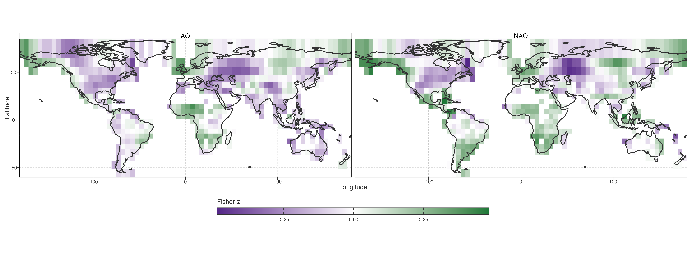

# Climate-variability links

## Exploratory screening retains a summer association family

For each lake, we linearly detrended raw liquid-water JJA LSWT and correlated the residual anomalies with predeclared circulation-index seasons. Candidate indices, seasons and lags were screened before this focused comparison. Most combinations were weak, region-limited, or did not persist through the geographic stability sequence. We therefore report the retained prior-summer NAO/AO family and leave the remaining combinations as exploratory comparisons.

> 筛查先于正文选择。保留 NAO/AO 关联族作为稳定性检查后的报告对象，其余候选留在探索层。

We ask where this association differs, and whether its spatial field co-locates with PCA scores. This is descriptive association, not teleconnection attribution.

> 问题是关联在何处变化，以及其空间场是否与 PCA 分数共定位。本节提供描述性空间证据；遥相关归因需要独立设计。

Figure 1: Signed Fisher-z association fields for JJA NAO/AO in year t−1 and JJA LSWT in year t. Purple/green encode sign, not warming/cooling: near-white cells are weak association, saturated cells are stronger signed association.

Prior-summer NAO/AO and current-summer LSWT form strongest retained family. Fields are spatially continuous: neighbour correlations are 0.71 and 0.73 across 908 pairs. Strong opposite-sign neighbours are rare: NAO 5 of 213, AO 3 of 193. PDO, MAM NAO and DJF PDO remain regional or coverage-limited comparisons.

> 上一年夏季 NAO/AO 与当年夏季 LSWT 是最强保留关联族。场在 908 个邻接格网对中的相关为 0.71、0.73；强异号邻接很少，NAO 为 5/213，AO 为 3/193。PDO、MAM NAO 和 DJF PDO 仍只是区域性或覆盖受限比较。

PC1 added little held-out predictive information beyond geographic and lake morphology covariates. PC2 and the joint PC2–PC3 representation retained positive increments across the grid, continental-omission and decade-omission checks. Association poles also differed in PC2 and in late local warming-rate history: by 2020, the positive pole was near 0.069 °C yr\\^{-1}\\, whereas the negative poles were near −0.014 °C yr\\^{-1}\\ for NAO and −0.018 °C yr\\^{-1}\\ for AO. The associated annual and summer local-rate composites are retained as a [supplementary descriptive check](../../../../explorations/warming-temporal-pathways/manuscript/supplementary/teleconnection-pole-trajectories.llms.md).

> 比较基线为 geography + morphology。PC1 增量很小；次级几何在多种留出设计中保留正增量。速度差异描述 association poles 的轨迹背景。

This co-location does not show that NAO/AO causes PC2–PC3 structure, nor does it identify a circulation pathway. Grid, LOCO and LODO analyses assess stability after screening; they do not provide independent discovery.

> 本节最强结论为：次级轨迹几何与异质夏季敏感性共定位。因果方向、能量收支环节与候选选择独立性仍待后续设计处理。

Back to top
