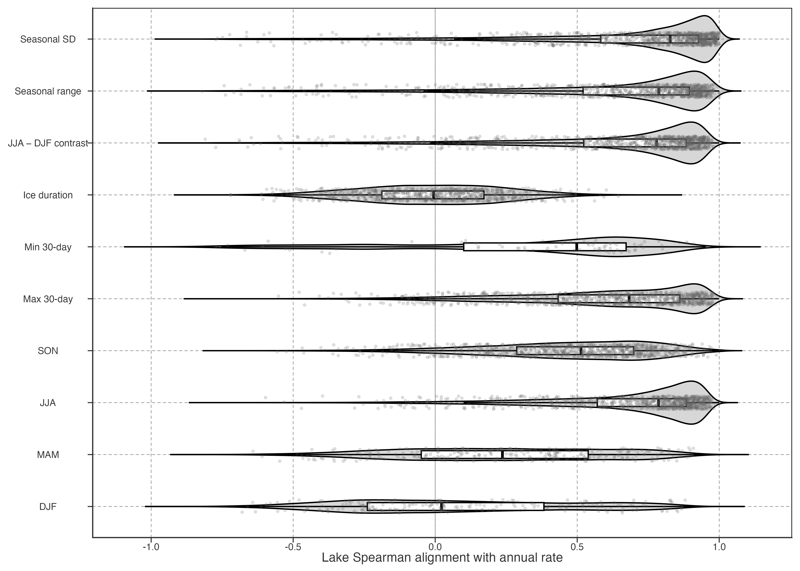

# Seasonal and ice-state context

Annual warming can follow different seasonal pathways. We compare endpoint-aligned trailing 10-year Sen rates for annual LSWT, seasonal LSWT, extreme-temperature and ice-day series. These are directional co-variation diagnostics, not additive contributions to annual warming.

> 年均增温可由不同季节路径构成。这里比较年均、四季、极端温度和冰日序列的端点对齐 10 年 Sen rate；它们描述方向性共变，不能相加为年均增温贡献。

Figure 1: Distribution of lake-level Spearman alignment between annual and diagnostic trailing 10-year Sen rates. Points are a deterministic visual sample of about one per 100 lakes; this is descriptive co-variation, not additive seasonal attribution.

Warm-season trends are most available and normally align more closely with annual local-rate histories. Winter and spring must be interpreted with ice state: repeated 0 °C days are a finite frozen state, not ordinary liquid-water observations. Therefore low cold-season alignment is an information boundary, not evidence that cold seasons are unimportant.

> 暖季趋势最完整，通常与年均局部速度历史更一致。冬春需结合冰状态：反复出现的 0 °C 对应冻结状态，与液态温度观测不同。冷季对齐较弱反映信息边界，冷季作用仍需独立研究。

Ice duration supplies a second state diagnostic. Its association with annual local rates varies among lakes and regions. It does not establish glacier-meltwater forcing or explain every cooling trajectory.

> 冰期长度提供第二种状态诊断。它与年局部 rate 的关系因湖泊和地区而异；冰川融水过程与各条降温轨迹需要额外证据。

Detailed sign-conditioned comparisons and frozen-state limitations remain in [Seasonal and Ice Diagnostics](../../../../explorations/warming-temporal-pathways/investigations/seasonal-ice-diagnostics.llms.md).

> 按增温/降温分支的比较与冻结状态限制见 Seasonal and Ice Diagnostics。

Back to top
