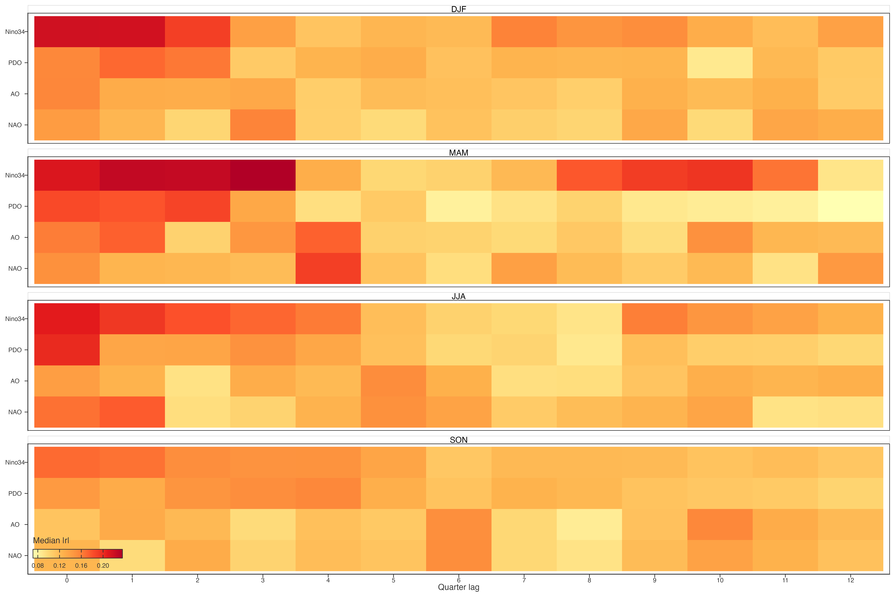
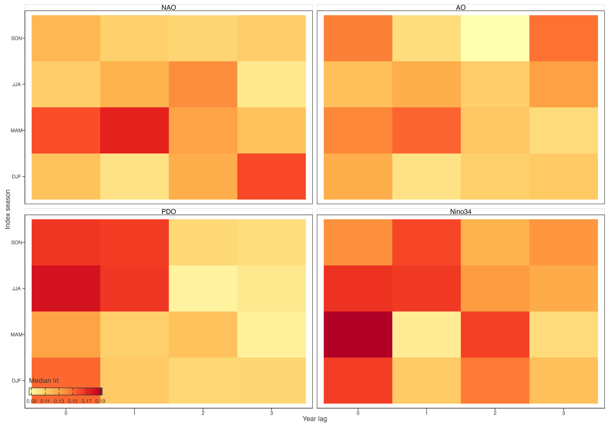
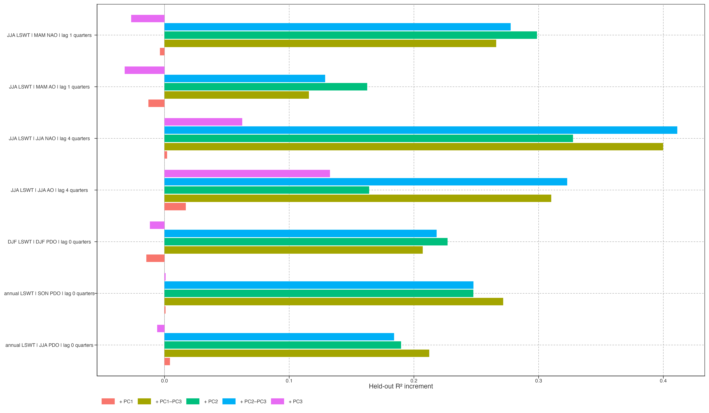

# Teleconnection candidate atlas

## Complete descriptive lag screen

This atlas retains every planned seasonal and annual lag display before manuscript selection. Cell-level median absolute correlation is a landscape description. It does not select an optimal physical delay and does not provide causal attribution.

> 本图集保留所有计划中的季节和年尺度 lag 图，供后续筛选。格网中位绝对相关只描述关联图景，不选择物理最优延迟，也不提供因果归因。

Figure 1: Median absolute equal-area-cell correlation across quarterly lags, by LSWT response season and climate index.

Figure 2: Median absolute equal-area-cell correlation of annual LSWT with seasonal climate indices at 0–3-year lags.

## Spatially varying descriptive peak lag

Peak-lag colour indicates the lag with largest absolute cell association; opacity indicates magnitude. Low-opacity colours have no clear dominant lag. These maps test the descriptive proposition that lag structure differs across space, without calling each colour a robust delayed response.

> 峰值 lag 颜色表示每个格网绝对关联最大处，透明度表示强度。低透明度颜色没有明确主导 lag。地图检验 lag 结构是否空间不同，不把每种颜色都称作稳健延迟响应。

Figure 3: Descriptive peak quarterly lag by response season and climate index. Opacity is maximum absolute cell correlation.

## PCA-coordinate additions across fixed candidates

The following comparison is a candidate screen, not a discovery replication: candidates were chosen after inspecting the lag landscape. It nevertheless shows explicitly whether PC1, PC2, PC3, their joint PC2–PC3 plane, or their full combination adds held-out spatial prediction beyond geography and lake morphology.

> 下图是候选筛查，不是独立发现重复，因为候选来自 lag 图景之后。它仍明确比较 PC1、PC2、PC3、PC2–PC3 联合平面及全组合，是否在地理和湖泊形态之外增加空间留出预测。

Figure 4: Held-out spatial-prediction increments for PCA-coordinate additions across all fixed seasonal climate candidates.

Back to top
