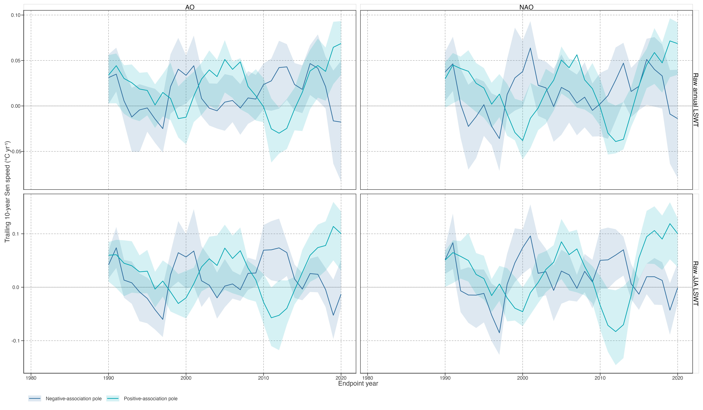

# Association-pole trajectory composites

## Local-rate histories at the retained association poles

The comparison groups below are defined from the retained NAO/AO sensitivity fields. They visualise contrasting trajectory histories after candidate screening; they are not an independent replication or a circulation-to-lake mechanism test.

> 本页以已保留的 NAO/AO 敏感性场定义两端群体，展示其轨迹历史。它不提供独立复现或环流到湖泊的机制证据。

Figure 1: Trailing 10-year annual and JJA Sen-speed composites for negative and positive NAO/AO association poles. Ribbons show the within-pole interquartile range, not an uncertainty interval.

By 2020, the positive pole was close to 0.069 °C yr\\^{-1}\\, while the negative poles were close to −0.014 °C yr\\^{-1}\\ for NAO and −0.018 °C yr\\^{-1}\\ for AO. These numerical contrasts describe the retained association family and should be read with its screening and stability boundary.

> 2020 年正关联极点约为 0.069 °C yr⁻¹；NAO 和 AO 的负关联极点约为 −0.014、−0.018 °C yr⁻¹。数值用于描述保留关联族，需与筛查和稳定性边界一起阅读。

Back to top
