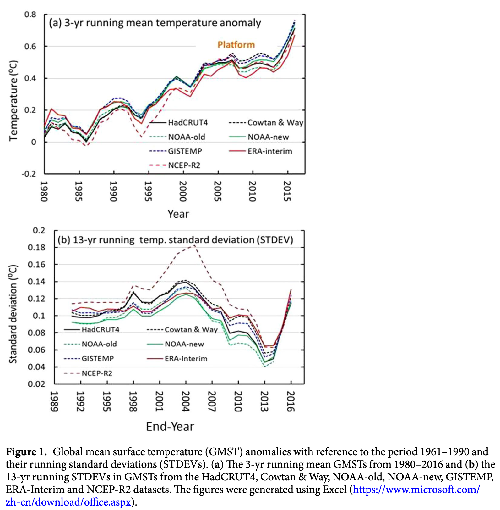

# dai2018: Identifying the Early 2000s Hiatus Associated with Internal Climate Variability

------------------------------------------------------------------------

- citation_key: dai2018 (Dai and Wang ([2018](#ref-dai2018)))
- title: Identifying the Early 2000s Hiatus Associated with Internal Climate Variability
- author: Xin-Gang Dai, Ping Wang
- journal: Scientific Reports
- year: 2018
- doi: 10.1038/s41598-018-31862-z

------------------------------------------------------------------------

> The hiatus is characterized as a near-zero trend on the decadal scale corresponding to the maximum P-value via an F-test in statistics.

> The GWH is often attributed to internal climate variability, external forcing, or both. Recent cooling in the middle and eastern regions of the tropical Pacific has seemingly involved a phase change of the *Interdecadal Pacific Oscillation (IPO)* accompanying intensified trade winds. The GWH may also be associated with an *increase in aerosols in the stratosphere* during the period 2000–2010 because aerosols can increase optical depth, which generates countervailing forces against global warming. The GWH may also be explained in part by *extensive heat uptake by the deep ocean* or *an extremely low number of sunspots* during the latest solar activity cycle.

> …, which indicates that *infilling and bias correction in the datasets increase the temperature*, especially during the early 2000s, probably due to rapid warming in the Arctic region. [Cohen et al. (2014)](./cohen2014.md)

dai2018f1

Back to top

## References

Cohen, Judah, James A. Screen, Jason C. Furtado, et al. 2014. “Recent Arctic Amplification and Extreme Mid-Latitude Weather.” *Nature Geoscience* 7 (9): 627–37. <https://doi.org/10.1038/ngeo2234>.

Dai, Xin-Gang, and Ping Wang. 2018. “Identifying the Early 2000s Hiatus Associated with Internal Climate Variability.” *Scientific Reports* 8 (1): 13602. <https://doi.org/10.1038/s41598-018-31862-z>.
