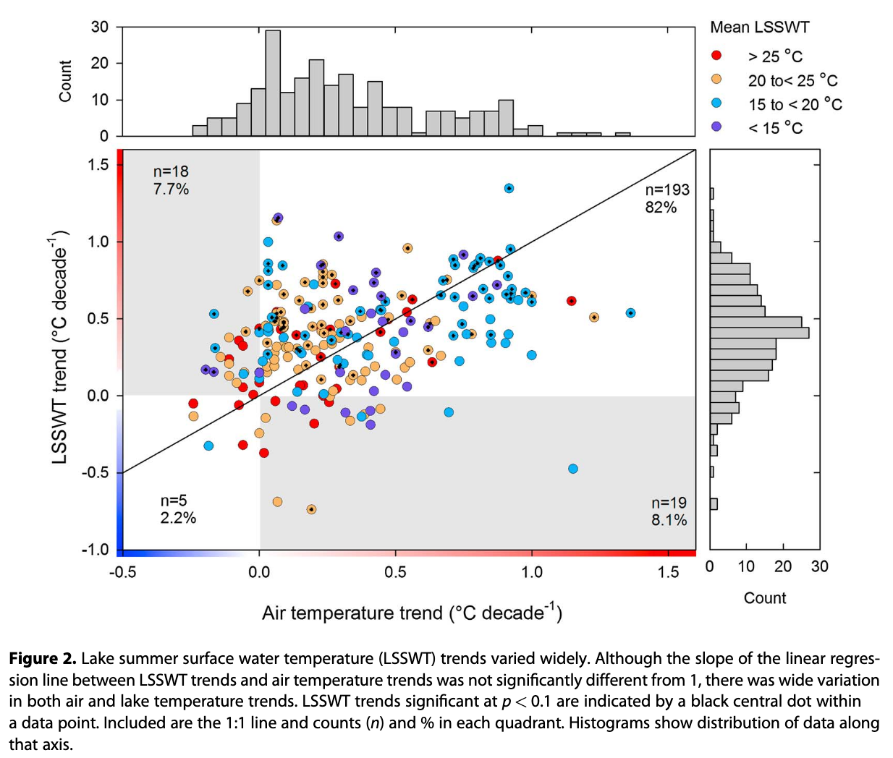

:::{.callout-note collapse="true"}
## Abstract

In this first worldwide synthesis of in situ and satellite-derived lake data,
we find that lake summer surface water temperatures rose rapidly
(global mean = 0.34$^\circ$C decade^-1^) between 1985 and 2009.
Our analyses show that surface water warming rates are dependent on combinations
of climate and local characteristics, rather than just lake location,
leading to the counterintuitive result that regional consistency in lake warming
is the exception, rather than the rule.
The most rapidly warming lakes are widely geographically distributed,
and their warming is associated with interactions
among different climatic factors--from seasonally ice-covered lakes in areas
where temperature and solar radiation are increasing
while cloud cover is diminishing (0.72$^\circ$C decade^-1^)
to ice-free lakes experiencing increases in air temperature and solar radiation
(0.53$^\circ$C decade^-1^).
The pervasive and rapid warming observed here signals the urgent need
to incorporate climate impacts into vulnerability assessments
and adaptation efforts for lakes.
:::

:::{.column-margin}
Citation key
: oreilly2015 (@oreilly2015)

Title
: Rapid and Highly Variable Warming of Lake Surface Waters around the Globe

Author
: Catherine M. O'Reilly, Sapna Sharma, Derek K. Gray, Stephanie E. Hampton, Jordan S. Read, Rex J. Rowley, Philipp Schneider, John D. Lenters, Peter B. McIntyre, Benjamin M. Kraemer, Gesa A. Weyhenmeyer, Dietmar Straile, Bo Dong, Rita Adrian, Mathew G. Allan, Orlane Anneville, Lauri Arvola, Jay Austin, John L. Bailey, Jill S. Baron, Justin D. Brookes, Elvira De Eyto, Martin T. Dokulil, David P. Hamilton, Karl Havens, Amy L. Hetherington, Scott N. Higgins, Simon Hook, Lyubov R. Izmest'eva, Klaus D. Joehnk, Kulli Kangur, Peter Kasprzak, Michio Kumagai, Esko Kuusisto, George Leshkevich, David M. Livingstone, Sally MacIntyre, Linda May, John M. Melack, Doerthe C. Mueller-Navarra, Mikhail Naumenko, Peeter Noges, Tiina Noges, Ryan P. North, Pierre-Denis Plisnier, Anna Rigosi, Alon Rimmer, Michela Rogora, Lars G. Rudstam, James A. Rusak, Nico Salmaso, Nihar R. Samal, Daniel E. Schindler, S. Geoffrey Schladow, Martin Schmid, Silke R. Schmidt, Eugene Silow, M. Evren Soylu, Katrin Teubner, Piet Verburg, Ari Voutilainen, Andrew Watkinson, Craig E. Williamson, Guoqing Zhang

Journal, year
: Geophysical Research Letters, 2015

Doi
: 10.1002/2015GL066235
:::

---

:::{.column-margin #fig-oreilly2015f2}

oreilly2015f2
:::

## Source scope

1985--2009, 235 lakes, in-situ/satellite, lake summer surface water temperature.
Dataset: @sharma2015.

## One-sentence contribution

Using in-situ and satellite,
find 1985--2009 global lake summer surface water temperature rapidly warming.
(0.34°C decade^-1^)
Warming rates varying by climate and local factors.

## Reusable claims

:::{.callout-important collapse=true #imp-warming-but-variation}
### Warming but variation

Type
: result

Claim
: Lakes are warming globally, but with rates varying in regions.

Evidance
: - Results and Discussion,
    mean 0.34°C decade^-1^, range -0.7--1.3°C decade^-1^.
  - @fig-oreilly2015f2, see y-axis for LSSWT trend.

Conditions
: Summer; 235 lakes;

Boundary
: .

Re-read trigger
: .
:::

## Method relevance

- Sen slope
- local spatial autocorrelation（Getis-Ord statistics）
- regression tree

## Limts and disagreement

## Open questions / re-read triggers

Ice and non-ice lakes comparison.
Regions warmed fast and slow.

